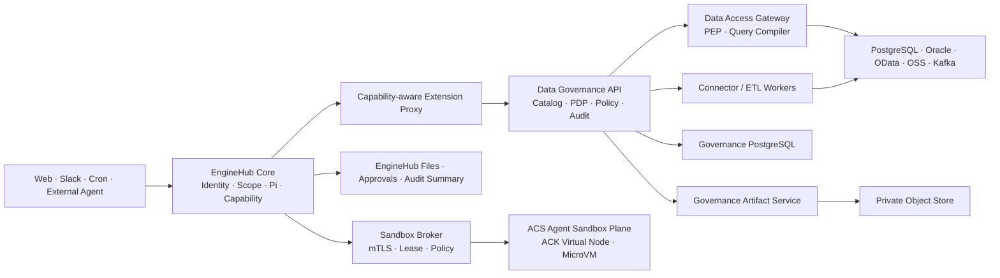
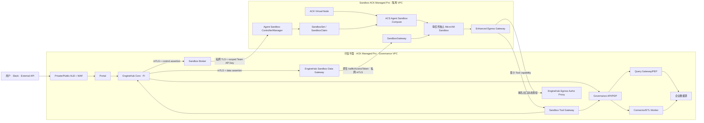
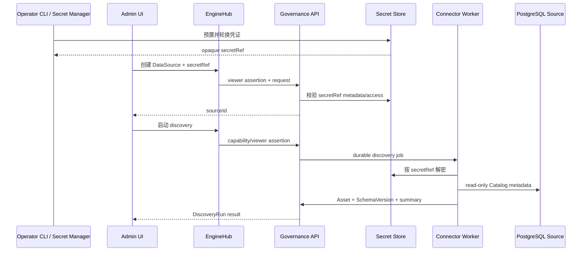
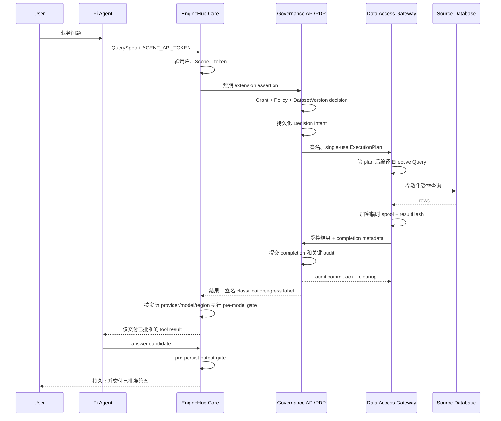
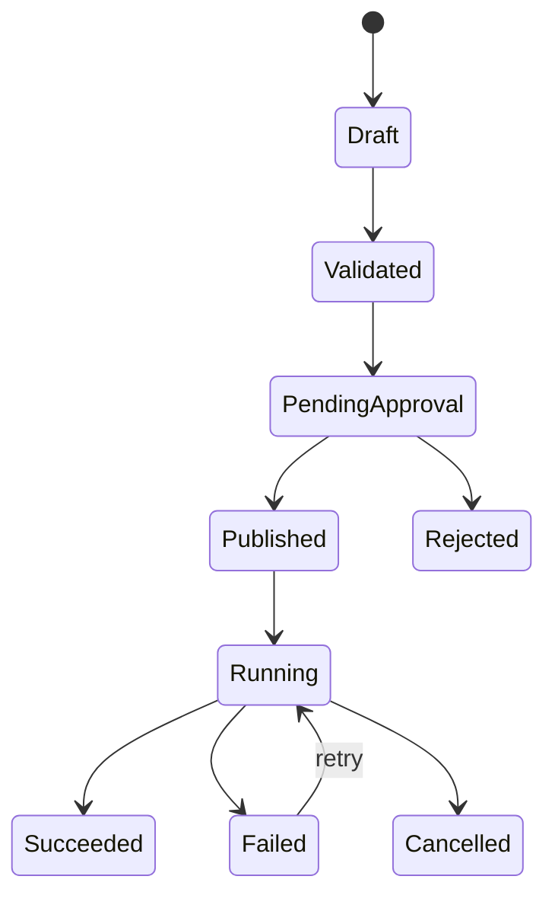

# EngineHub AIE 数据治理技术架构

- 状态：已版本化的设计提案，尚未进入功能实现或初始化 deployment layer
- 目标分支：`aie`
- 基线日期：2026-08-14
- EngineHub 基线：`d752485d44c26724e6c4e05a7a9acb6331db3455`
- AIE 基线：`317652a20250b29a7c57ad5bd2408c367fb83876`
- 来源系统：`/Users/wtong/git/gongs-claw`
- 目标系统：`/Users/wtong/git/enginehub`
- 生产目标：阿里云 ACK Managed Pro；不可信执行使用独立 MicroVM Sandbox 平面

本文保存在 `deploy/layers/aie/docs/` 便于评审；`aie` 仍是待最终确认的 organization slug，当前目录还不是有效 deployment layer。生产部署目标已确定为阿里云 ACK，但当前 qm 尚无 Kubernetes target。必须先在 M0 落地通用 Kubernetes deployment contract，再用新版 EngineHub CLI 初始化 layer、开始功能实现，并保留本文及其评审历史。

本文的目标架构决策高于旧 AIE 设计文档；当前实现代码是 as-built 事实来源。后续实现若改变本文契约，必须同步更新本文或建立新的 ADR，不能再次把蓝图和已落地能力混写。

## 1. 架构结论

AIE 数据治理采用渐进式 EngineHub-native 演进：保留 AIE 已验证的数据治理领域模型、产品流程、连接器探测逻辑和回归案例，使用 EngineHub 替换其身份、Agent、Scope、能力令牌、文件、审批、审计和多入口运行基座。

目标不是把 `gongs-claw` 整体嵌入 EngineHub，也不是继续维护两套平台，而是在同一个 EngineHub 产品中逐个增加治理能力，并以 Strangler 模式逐域替代旧 AIE。

产品上一体、进程上分层：

- EngineHub Core 是身份和 Agent 控制面。
- Data Governance API 是治理领域控制面和策略决策点。
- Data Access Gateway 是唯一业务数据访问执行点。
- Connector/ETL Worker 执行发现、Profile 和数据工程任务；受控查询只由 Data Access Gateway 执行。
- EngineHub Web/Admin/Portal 提供统一产品入口。
- Pi 与模型调用运行在可信 Core；只有命令、文件和进程工具进入独立 MicroVM Sandbox。
- `gongs-claw` 在迁移期间只作为旧实现、交互参考和回归基线。



## 2. 已确定的架构决策

| 编号  | 决策                                                  | 原因                                                            |
| ----- | ----------------------------------------------------- | --------------------------------------------------------------- |
| AD-01 | 采用 Strangler 渐进迁移，不做整体重写切换             | 可以按领域验证并执行回退或 forward recovery，避免同时切换       |
| AD-02 | `main` 只同步 upstream，AIE 开发在 `aie`              | 保持私有开发与 upstream 同步边界                                |
| AD-03 | AIE 专属实现放在 `deploy/layers/<org>/`               | 私有 fork 的 Core 必须与 upstream 保持一致；当前 `aie` 待确认   |
| AD-04 | 通用扩展契约提交 upstream                             | capability 代理和 UI 挂载是通用平台能力，不应成为 AIE 特例      |
| AD-05 | 数据治理作为独立领域服务接入 EngineHub                | 连接器依赖、数据库协议、策略和 ETL 生命周期不适合进入 Core 进程 |
| AD-06 | Agent 不获得数据源或平台数据库凭证                    | 防止绕过授权、事务、不变量和审计                                |
| AD-07 | 所有业务数据读取经过 typed governed query             | 形成可验证的资源、行、列、聚合、预算和导出边界                  |
| AD-08 | 确定性授权决定最大权限，LLM 只能收紧                  | LLM 语义判断不能成为唯一 allow authority                        |
| AD-09 | 每个迁移领域始终只有一个权威写入方                    | 禁止长期双向双写造成冲突和不可恢复漂移                          |
| AD-10 | 首个里程碑只支持 PostgreSQL Catalog，随后增加受控查询 | 先验证身份、凭证和目录主干，再把业务数据引入 Agent 链路         |
| AD-11 | 开发可共用 PostgreSQL 实例，但使用独立 Schema 和账号  | 方便本地运行，同时保持数据所有权和迁移隔离                      |
| AD-12 | 控制面管理员不自动拥有业务数据读取权限                | 平台运维权限与数据消费权限必须分离                              |
| AD-13 | 生产可信平面部署在阿里云 ACK Managed Pro              | 使用托管控制面、RRSA、KMS、Terway、SLS 和多可用区能力           |
| AD-14 | 不可信工具执行与可信平面强制分集群、分 VPC            | Namespace、RBAC 和普通 runC Pod 不是恶意代码安全边界            |
| AD-15 | ACS Agent Sandbox 是唯一生产 Sandbox 后端             | 原生提供 Agent MicroVM、CRD、Warm Pool、休眠和弹性能力          |
| AD-16 | Sandbox 不直接访问 Core、治理库、源库或云凭证         | 数据访问必须经过 Tool/Query/Artifact Broker                     |
| AD-17 | 选择 ACS，但正式接受 Public Preview 风险仍是上线门槛  | 不设计第二生产后端；准入失败时停止 Sandbox 功能上线             |
| AD-18 | M0 拆分为并行的 M0a 治理主干与 M0b Sandbox 平面       | 治理线不被 Public Preview Sandbox 依赖阻塞，两轴独立验收        |
| AD-19 | 通用变更先以无 AIE 语境的 upstream RFC 取得方向认可   | upstream 接受度是关键路径，先暴露风险再投入实现                 |
| AD-20 | 旧 AIE 已确认高危项在 Phase 0 显式签字处置            | 迁移长窗口内已知缺陷不得默认带病运行                            |
| AD-21 | 成本与运维承载力评估是 M0a IaC 与 M0b 进入门槛        | 双集群拓扑最现实的失败模式是超出团队运维承载力                  |

## 3. 文档状态和术语

本文同时描述现有能力与拟新增能力，使用以下标记：

- **现有**：当前 EngineHub 或 AIE 代码已经实现。
- **新增**：需要实现的目标能力。
- **迁移期**：只为逐步替换旧 AIE 存在，完成后删除。
- **后续**：不属于当前里程碑，但目标架构预留边界。

核心术语：

- **DataSource**：企业数据连接登记，不包含明文凭证。
- **Asset**：数据源内部的技术治理节点，例如表、视图、文件、Topic 或 API Endpoint。
- **Dataset**：经过发布、允许用户或 Agent 消费的数据产品入口。
- **Connector**：服务端连接数据系统的适配器和执行实现。
- **PDP**：Policy Decision Point，计算是否允许及必须施加的约束。
- **PEP**：Policy Enforcement Point，在访问数据前强制执行 PDP 决策。
- **Pipeline**：版本化、可审批、可重复执行的数据转换计划。
- **Run**：一次发现、查询或 Pipeline 执行实例。
- **Scope**：EngineHub 的 `personal/channel/team/org/group` 所有权和协作上下文。

## 4. 现状基线

### 4.1 EngineHub 可直接复用的能力

EngineHub 当前已经具备：

- Principal 和 internal/guest 身份分类。
- `personal/channel/team/org/group` Scope 标识；当前 Core 对受管 group 有实时成员资格校验，其他 Scope 类型尚未形成同等强度的通用实时撤权契约。
- Pi Agent 和 Web、Slack、cron、background 等运行入口。
- 每轮 `AGENT_API_TOKEN`，包含 actor、scope、scope version、live/triggered 和 thread 信息。
- 持久化 Session、Run、Task、Cron、Approval、File 和 Audit。
- 基于 PostgreSQL 的 durable store、advisory lock、lease、retry 和 idempotency 基础。
- 文件及分享能力。
- 加密 Keychain 和 HTTP Service Credential Broker。
- 组织 deployment layer 中的 plugin、tool 和 skill 部署能力。

当前还不具备：

- 普通 plugin 无法验证 `AGENT_API_TOKEN`，也不应获得 `CAPABILITY_SECRET`。
- Core API 和 `/v1/apis` 目前静态注册，plugin 不能动态注册 capability-aware API。
- Portal/Web/Admin 没有动态页面、路由和导航挂载契约。
- ACL 资源类型是封闭集合，权限只有 `read/write`，不足以表达数据查询、导出和策略发布。
- 身份属性不包含部门、区域、岗位、数据域和敏感级别。
- 当前 HTTP Credential Broker 不支持 PostgreSQL、Oracle、JDBC、Kafka 等多字段协议凭证。
- 普通 plugin 当前会获得 `CORE_SIGNING_SECRET`；它只能证明受信服务来源，不能代表最终用户授权，也不应作为治理 extension 的宽权限客户端身份。
- EngineHub Security Screen 处理提示词注入和外泄风险，不是数据授权器。
- Agent turn、会话 Task 和命令审批不等价于 ETL 工作流或长期数据访问审批。
- 当前 Core 的通用 Scope 校验在部分 Scope 类型上仍可能只验证格式或静态可达性；治理查询不得把它描述或使用为完整实时撤权能力。
- qm hosting target 当前只有 Docker、Fly 和 AWS，没有 Kubernetes/ACK deployment backend。
- SandboxBackend 当前有 `local/sprites/aws/smolmachines`；只有配置 egress proxy 的 Sprites profile 声明强制域名 egress，local、AWS 与 Smolmachines profile 都不能作为 ACK 生产隔离保证。
- Apps deployment 使用另一套 DeployProvider，当前也没有 Kubernetes 实现。
- Pi 与模型调用在 Core 进程，Sandbox 只承载命令、文件和进程会话；不能通过“把 Core Pod 调度到 ACS compute”替代真正 per-task SandboxProvider。

### 4.2 AIE 可迁移的产品能力

AIE 当前有以下值得保留的领域能力：

- `EnterpriseDataSource → DataAsset → Dataset` 三层治理模型。
- 数据源发现、Schema 记录、变化统计和失联资产标记。
- Dataset 发布、权限、预览、摘要、导出和删除审计。
- Streaming Source、Raw Event、Schema Version 和 Ingestion 状态。
- ETL Job、Run、Plan、Transform Spec 和 Lineage。
- PRE/POST 治理、shadow/enforce、决策日志、申诉和复核工作流。
- 用户文件、治理文档库和图像库的产品流程。
- 外部 Agent 的设备授权、API Key、Skill bundle freshness 和短期任务令牌思路。
- OData service document 与 `$metadata` 实时 Schema 发现。
- PostgreSQL、Oracle、目录和 OSS 等连接器中的纯探测逻辑。

### 4.3 不应原样迁移的实现

- `EnterpriseDataSource.credentialJson` 和 `DatasetSource.secret` 保存普通字段。
- Agent Skill 获得 `DATASET_DATABASE_URL` 后直接执行 `psql`。
- ETL Skill 可直接修改平台数据库中的 Job、Run、Asset、Dataset 和 Lineage。
- Dataset 授权主要停留在 Role 到 Dataset 的表级关系。
- PRE/POST 主要位于 WebSocket proxy，不能天然覆盖所有 EngineHub surface。
- judge 或相关内部调用失败时存在 fail-open。
- 管理员存在硬编码治理绕过。
- POST 拒绝时，原回答可能已经写入 OpenClaw 历史。
- system-management 使用长期管理员凭据执行高风险写操作。
- 大量领域状态由自由字符串和非版本化 JSON 表达。
- 核心治理逻辑集中在超大文件中，不适合直接复制。

### 4.4 已知文档与实现漂移

迁移必须以运行代码和验证结果为准，不能把旧文档当作已实现契约：

- 外部 Agent 文档仍描述带 `allowed_tables` 的 JWT；当前 AIE 代码签发的是 `subject/expiry/HMAC` 短令牌，权限由 OData 服务实时查询。
- OData 权限执行位于兄弟仓库 `demo-odata-service`，AIE 仓库内没有完整实现。
- 用户上传文档仍描述 import-to-Dataset 路径，但该实现已删除。
- 数据源页面展示的连接器类型多于真正可运行的连接器。
- 策略描述和管理员硬编码 bypass 存在冲突。
- 结构化访问指纹、行列权限和查询形态尚未成为当前主要执行路径。
- Webhook streaming 有部分实现，Kafka 等尚未形成完整 durable worker。
- system-management 和文档库增加后，威胁模型与审批设计尚未同步。

### 4.5 私有 fork 基线偏差

当前 checkout 是私有 fork。本次设计基线已将私有 `origin/main` 的 `d752485` 合入 `aie`；custom provider 主干能力已经进入同步下来的通用代码线，但 `aie` 仍保留协议感知、模型准入和 onboarding 刷新等少量 Core 差异，旧的固定提交数和文件数偏差结论不再成立。

任何 AIE 功能实现开始前，Phase 0 仍必须先 fetch 两个 remote，重新比较 `origin/main` 与 `upstream/main`，并审计 `aie` 相对 `origin/main` 的 Core tree：通用修复提交 upstream，组织专属内容迁入 `deploy/layers/<org>/`，再同步私有 `main`。不得依赖本文记录的历史提交数量判断边界是否干净。

### 4.6 目标环境约束

本仓库是公开仓库，具体环境清单、集群标识、容量、版本和运维投递坐标一律留在不入库的 ops overlay，不写入本文。以下只记录会改变通用设计的约束，实施前须对实际目标环境重新核实：

- 不得假设可以复用组织现有的 Kubernetes 集群。既有集群可能在版本、集群规格或租户隔离上不满足 AD-13/AD-14/AD-15，且跨越过多小版本时不存在原地升级路径。M0a 与 M0b 的集群按新建规划。
- 不得假设 ACK API Server 可从开发者机器或 CI 直连。托管集群可以只暴露内网端点，此时投递必须经由 VPC 内的带外通道执行。M0a 的 Kubernetes hosting target 必须支持这种形态，或在文档中明确要求开放端点。
- 不得假设镜像仓库与集群同地域，也不得假设可用的是企业版 ACR。镜像与 secret 契约按跨地域拉取和个人版能力下限设计。
- 共享多租户集群上不存在特权容器的安全部署方式：逃逸后果波及同节点其它租户。这与 AD-14 的分集群、分 VPC 要求一致，任何"先在现有集群上用特权 Sandbox 过渡"的方案都不成立。

## 5. 目标和非目标

### 5.1 目标

- 在 EngineHub 中形成统一的数据目录、受控查询、策略、审计、Pipeline 和血缘能力。
- Web、Slack、cron、background、外部 Agent 和 UI 直接查询使用同一授权入口。
- 让身份、Scope 撤销和数据授权变更及时生效。
- 让数据源凭证只在受信任 Connector/Worker 中短暂可见。
- 让 Dataset、Policy、Pipeline 和 Run 成为版本化、可审计、可恢复对象。
- 支持从 `gongs-claw` 按领域迁移，并在权威写入前回退、写入后 forward recovery。
- 保持 EngineHub Core 与 upstream 的清晰边界。

### 5.2 非目标

- M1 不迁移全部 AIE UI。
- M1 不支持全部二十类数据源。
- 首个 Query 里程碑不允许 Agent 提交任意 SQL。
- M1 不实现 Kafka/CDC、Oracle、图像库或完整 AI-ETL。
- 不用 LLM 替代数据库权限、行列策略或审批。
- 不把 EngineHub ACL 当前的 `read/write` 强行扩展成全部治理语义。
- 不默认迁移聊天全文、Raw Event payload 或数据样本。
- 不长期维持 AIE 与 EngineHub 双向同步。

## 6. 组件架构

### 6.1 EngineHub Core

职责：

- 认证用户并生成可信 Principal。
- 解析和实时验证 Scope 成员资格。
- 为 Pi turn 和 background 工作签发 capability。
- 承载统一 surface、Session、File、Approval 和审计摘要。
- 通过通用 extension proxy 将最小身份上下文传给治理服务。

禁止承担：

- 数据库驱动和连接池。
- 数据源元数据发现。
- SQL 编译和业务数据查询。
- 数据治理领域表和 ETL 状态机。
- AIE 特定的页面和 API 分支。

### 6.2 Capability-aware Extension Proxy

这是需要提交 upstream 的通用能力。

职责：

- 将 extension id 映射到明确的内部服务和允许的路径。
- 验证 `AGENT_API_TOKEN`、audience、有效期、当前用户状态和当前 Scope 成员资格。
- 对所有可撤销 Scope 类型执行同一实时成员资格契约；可撤销 Scope 必须带 `scopeVersion`，Core 无法验证时拒绝。
- 计算请求体 hash，并签发 extension 专用的短期 downstream assertion。
- 对 method、规范化 path/query、body hash、content type、`Idempotency-Key`、extension audience 和 correlation id 做绑定。
- 将 extension API 加入 `/v1/apis` 的 capability-aware 发现结果。
- 记录调用摘要，但不记录数据内容。

治理服务不得获得 EngineHub `CAPABILITY_SECRET` 或全局 `CORE_SIGNING_SECRET`。目标实现使用 Core 私钥签名，治理服务只持有 extension 专用验证公钥。Phase 1 必须同时让 plugin 可以明确退出全局 Core secret 注入；治理 API、Query Gateway 和 Worker 都不能借共享服务身份调用无关 Core 路由。

建议 assertion claims：

```json
{
  "iss": "enginehub-core",
  "aud": "data-governance",
  "sub": "principal-id",
  "org_id": "org-id",
  "scope_id": "team:analytics",
  "scope_version": "version",
  "live_actor": true,
  "live_author": true,
  "triggered": false,
  "thread_ref": "surface-thread",
  "surface": "web",
  "impersonator": null,
  "model_dispatch": {
    "provider": "deepseek",
    "model": "model-id",
    "region": "approved-region",
    "config_revision": "revision"
  },
  "method": "POST",
  "path": "/internal/v1/query",
  "request_hash": "sha256",
  "content_type": "application/json",
  "idempotency_key_hash": "sha256",
  "correlation_id": "uuid",
  "jti": "uuid",
  "iat": 0,
  "nbf": 0,
  "exp": 0
}
```

约束：

- TTL 不超过 60 秒，敏感查询建议 30 秒。
- 服务端验证 `iss`、`aud`、`org_id`、时钟窗口、method、path/query、content type、body hash 和关键 header hash。
- mutation 和数据查询要求 `Idempotency-Key`，并把它纳入 assertion 的规范化请求 hash。
- 治理服务在 durable replay store 中原子消费 `jti`。Mutation 的相同 idempotency key 返回持久化的同一响应。查询 key 永久绑定同一 QueryExecution：短期 result buffer 仍存在时返回相同结果，清理后只返回稳定 completion metadata 和 `RESULT_EXPIRED`，绝不重新访问源端；其他重复使用拒绝。
- replay 与幂等存储必须有界：`jti` 记录在 `exp` 加安全余量后清理，mutation 响应体超过 retention 后降级为稳定状态引用，查询 key 到 QueryExecution 的映射随 completion metadata 保留。清理策略属于 schema 设计的一部分，不得依赖无界表。
- 高风险 mutation 要求 `live_actor=true`，必要时引用 durable approval。
- assertion 只证明调用者上下文，不代替治理服务的资源授权。
- Agent 查询必须带 Core 当时的模型 dispatch 上下文；它只用于 PDP 预判，结果真正进入模型前仍由 Core 按实际 dispatch 重新执行 egress 校验。

### 6.3 Portal/Surface Extension Manifest

这是第二个需要提交 upstream 的通用能力。

Manifest 至少声明：

- extension id 和服务名。
- Portal 路径前缀与 upstream base path。
- 用户端、管理员端导航项。
- 页面所需身份模式和管理员条件。
- CSP、上传大小、超时和健康检查。
- 是否允许 WebSocket 或 streaming response。

浏览器只把登录会话交给 Portal；Portal 将请求送到 Core extension gateway，Core 重新验证用户、管理员条件和实时 Scope 后，签发 request-bound 的短期 viewer assertion。它与 Agent assertion 使用相同的 extension 专用非对称信任边界，治理服务只持有验证公钥，不获得 Portal 或 Core 的共享 HMAC secret。

不能把浏览器提交的用户 ID 当身份，不能仅依赖普通 cookie 转发，也不能复用当前全局 Portal identity/`CORE_SIGNING_SECRET` 作为治理用户授权。

### 6.4 Data Governance API

职责：

- Catalog、Dataset、Policy、Grant、Access Request、Pipeline 和 Lineage 的领域 API。
- 验证 extension assertion。
- 将 EngineHub Principal/Scope 映射到治理主体。
- 执行领域级管理权限和数据权限判断。
- 维护版本、不变量、幂等和结构化审计。
- 向 Connector/Worker 投递 durable job。

它是治理控制面和 PDP，不直接向 Agent 暴露数据库连接，也不允许 Agent 写领域表。

治理用户页面挂载在 `/data/*`，治理管理员页面挂载在 `/admin/data/*`。浏览器只访问 Portal 公开入口，不直接访问内部 API 或 Worker。

### 6.5 Data Access Gateway

Data Access Gateway 部署为独立 `data-governance-query` workload。Governance API 只做控制面和 PDP；只有 Query Gateway 能使用受限 query-execution identity 到达已登记的只读数据源，且不能获得 ETL target writer。

职责：

- 接受 Governance API 签名的单次 ExecutionPlan，不直接接受 Agent/UI 的 QuerySpec，也不自行调用 PDP。
- 验证 plan audience、短期有效期、single-use jti、Decision id、DatasetVersion/source binding、normalized query hash 和全部 revision。
- 编译参数化 SQL 或连接器协议请求。
- 强制行过滤、列掩码、聚合、Limit、超时和结果预算。
- 要求 ExecutionPlan 携带 Governance API 已提交 Decision intent 的签名证明。
- 将结果保存在受控内存或加密临时 spool，把 completion metadata 和受控结果送回 Governance API；收到 audit commit ack 前不销毁或对外暴露结果。
- 不访问治理数据库，也不持久化 Decision、QueryExecution 或 audit；这些提交职责只属于 Governance API。

首个 Query 里程碑禁止任意 SQL，也不开放 export 或 streaming。后续若开放高级 SQL，必须进行 AST 解析、对象解析和查询重写；无法证明安全时拒绝。Export 必须等 Governance Artifact Service 上线，并在每次读取、分享、fork 和 delivery 时在线重验 Grant/Policy。

唯一 handoff 协议是：Governance API 规范化 QuerySpec、执行 PDP、提交 Decision intent，再签发不可变的 ExecutionPlan；Query Gateway 只校验、编译和执行该 plan。Gateway 不接受调用方补充字段，plan 中的 source/schema/object、强制谓词和 limits 全部绑定 Decision 与版本，避免两边重复求值和 TOCTOU 漂移。

临时 spool 不是业务持久层：优先使用受限内存；落盘时每个 query 使用独立 ephemeral DEK 和受限 tmpfs/临时卷，设置容量与最长 TTL，禁止进入备份、snapshot、swap、日志或 trace。成功、拒绝、超时和失败都删除 ciphertext 并销毁 DEK；进程重启、lease 丢失或主机崩溃后的 orphan 由 durable sweeper 清理并审计。Phase 3 必须包含 crash/timeout/orphan 清理测试。

### 6.6 Connector Worker

职责：

- 测试连接和健康检查。
- Schema、表、列和约束发现。
- Schema diff 和失联资产判断。
- 在服务端使用 secretRef 解密短期连接信息。
- 使用最小权限源端账号和网络 allowlist。
- 通过 durable job、lease、heartbeat、retry 和 idempotency 运行。

首个 Catalog 里程碑仅实现 PostgreSQL metadata-only connector；不读取样本，不运行统计 Profile。

### 6.7 Governance Artifact Service

Phase 5 新增独立 `data-governance-artifact` workload：

- 管理加密 GovernedArtifact 的对象 I/O；Dataset/Decision/Grant provenance、状态和 retention metadata 由 Governance API 持久化并绑定对象 hash。
- 下载只接受 Portal/Core extension gateway 的 request-bound viewer/Agent assertion，并在每次访问时向 Governance API 在线重验 entitlement。
- 写入只接受 Query Gateway 专用 mTLS/service identity 和 Governance API 签名、single-use 的 `ArtifactWritePlan`，绑定 artifactId、Decision、QueryExecution、DatasetVersion、classification、media type、max bytes、retention、audience、expiry 和 jti。
- Phase 5 的 Query Gateway 可凭该 plan 将查询结果直接流向内部 ingest endpoint；Artifact Service 边接收边加密，计算 size/hash，未提交对象保持不可读 quarantine 状态。
- Artifact Service 以幂等 completion key 把 metadata 送回 Governance API；API 在同一事务提交 QueryExecution completion、Artifact active metadata、audit 和 outbox。重复 completion 若已 active，返回相同 committed ack；Artifact Service 收到 ack 后才开放兑换。
- Ack 丢失时对象保持 quarantine，Artifact Service 重试 completion 或查询 API 的权威状态，不能按本地超时删除。只有 API 以 expected revision 将 pending 状态 CAS 为 `aborted/expired` 并返回签名 abort authorization 后，Artifact Service 才删除对象。Orphan sweeper 使用同一 reconciliation 协议；API 不可用时保留 quarantine 并告警。
- 用户可见下载地址指向 Artifact Service 的单次兑换 endpoint，不直接暴露对象存储 presigned URL；服务在兑换时验证 jti、actor、scope、artifact、method 和 expiry，成功后代理流式读取 private object。
- 对象存储 URL 即使内部使用也只发给 Artifact Service，不能交给浏览器；Grant 撤销会使下一次兑换失败。
- 只访问 Governance API 和专用 private object bucket，不可访问数据源、Core 私有 API 或治理数据库。

当前 EngineHub File/Blob 没有动态 DataGrant 回调，因此不用于受治理导出。若未来要统一，先通过 upstream 增加 read-time provenance/authorization hook。

### 6.8 Pipeline Worker

后续职责：

- 执行已发布的 PipelineVersion。
- 分离源端只读账号和目标端最小写账号。
- 记录 checkpoint、输入输出版本、质量结果和 lineage evidence。
- 支持取消、重试、backfill 和幂等写入。

Agent 只能起草 Pipeline plan；发布与执行必须经过有类型的 API 和审批。

## 7. 仓库和部署边界

目标布局：

```text
deploy/layers/aie/
  docs/
    ENGINEHUB_AIE_DATA_GOVERNANCE_ARCHITECTURE.md
  plugins/
    data-governance-api/
      Dockerfile
      src/
      migrations/
      web/
    data-governance-query/
      Dockerfile
      src/
    data-governance-worker/
      Dockerfile
      src/
    data-governance-artifact/
      Dockerfile
      src/
  infra/
    ack/
      terraform/
      helm/
      policies/
  sandbox/
    tools/
      data-governance/
        tool.json
    skills/
      aie-data-analysis/
        SKILL.md
      aie-data-governance/
        SKILL.md
```

本文档所在目录当前只是设计资料，不表示 deployment layer 已完成初始化。进入实现阶段时，必须先完成 qm 的通用 Kubernetes target，再使用 EngineHub CLI 正式生成 deployment layer，把设计资料和实现迁入生成的目录，确保 `.gitignore`、secret contract、Helm/IaC 和部署配置完整。

网络边界：

- `data-governance-api` 只访问治理数据库、EngineHub、Secret Manager 的加密接口和 Phase 5 Artifact Service 的内部 control endpoint，不可达企业数据源网段。
- `data-governance-query` 只接受治理 API 的内部授权调用，可访问 Secret Store、已登记的只读数据源，以及 Phase 5 Artifact Service 的内部 ingest endpoint；不可直连 Core 或治理数据库。
- `data-governance-worker` 以最小数据库角色访问治理 queue、lease 和 discovery/run result 表，以执行身份访问 Secret Store 和已登记目标；不可访问 Core API 或无关治理表，也不暴露公开业务 API。
- Phase 5 的 `data-governance-artifact` 只访问 Governance API 和专用 private object bucket，不直连数据源或治理数据库。
- 各 workload 使用独立服务身份和独立 secret allowlist；Query Gateway 不复用 ETL target writer，Artifact Service 不获得 connector secret。

通用 Core 变更：

- `qm.config` 中版本化的 extension manifest contract。
- CLI 对 extension id、保留前缀、路由冲突、service 引用和 secret contract 的校验。
- 新增通用 Kubernetes hosting target，覆盖 service discovery、route、health check、secret wiring、workload identity、network policy 和 rollout/rollback；ACK 坐标与阿里云资源留在私有 layer。
- 新增通用 remote SandboxProvider contract 和阿里云 `AliyunAgentSandboxProvider`；ACK Virtual Node、Sandbox CRD 等阿里云细节留在 provider 与私有 layer，禁止散落在 orchestrator 调用点。
- Apps deployment 是独立 DeployProvider；ACK 首发显式禁用 Apps 发布，直到通用 `KubernetesDeployProvider` 落地并通过相同隔离验收。
- Portal reverse proxy、导航挂载，以及 Core 的 Agent/viewer identity gateway。
- extension API catalog registration 和 capability-aware discovery。
- extension 专用服务身份、验证公钥，以及 plugin 退出全局 `CORE_SIGNING_SECRET` 注入的能力。
- 必要的 pre-model egress 和 pre-persist output policy hook。

以上变更不包含 AIE 名称、业务 Schema、企业连接信息或策略，应通过 upstream PR 进入 qm。只有当这些通用能力已经合并、发布、同步到私有 fork，并通过通用 contract 测试和 ACS production profile 测试后，私有 layer 才能依赖它们。

### 7.1 阿里云总体拓扑

生产强制采用双集群、双 VPC 信任边界。两个集群都按新建规划，不复用既有集群（见 4.6）。可信业务与治理平面部署在主 ACK Managed Pro 集群；不可信工具执行固定部署在独立 Sandbox ACK Managed Pro 集群。Sandbox 集群通过 ACK Virtual Node 调度 ACS Agent Sandbox compute，每个任务获得独立 MicroVM。ACK Virtual Node、Agent Sandbox controller、manager、identity、SandboxGateway 和 egress 组件只安装在 Sandbox 集群，不能安装到主 ACK 后仍宣称完成了分集群隔离。



可信 ACK 集群和 Sandbox 集群必须使用不同 VPC、vSwitch、安全组、namespace、ServiceAccount、RAM Role、密钥域和审计索引；条件允许时进一步使用不同阿里云账号。两者之间只开放 Broker 到 Manager、EngineHub Sandbox Data Gateway 到原生 SandboxGateway、Sandbox egress 到 Tool Gateway/Egress Authz 所需的固定私网地址/端口，不建立任意东西向路由。Broker 只访问 Manager，Data Gateway 只访问 SandboxGateway，两者不得共用目的端身份。

分集群的首要理由不是 MicroVM 计算隔离——ACS 已提供内核级隔离——而是把 Manager、SandboxGateway、identity、controller 等 Public Preview 级组件自身的控制面与凭证爆炸半径隔离在可信平面之外。因此不得以“已有 MicroVM 隔离”为由合并集群；只有这些组件通过与可信平面同级的安全评审后，合并才可另立 ADR 讨论。

原生动态流量 JWT 由 `ack-agent-identity` 签发，Manager 只控制签发参数；启用时必须在创建请求设置 `security.agents.kruise.io/enable-jwt-auth: "true"`。`trafficAccessToken` 只从 Claim/create 响应取得，不写入 CR，SandboxGateway 使用 `E2B-Traffic-Access-Token` 校验并绑定 Sandbox ID/UID。该 token 官方默认有效期为 100 年且当前不会自动刷新，不能称为短期 EngineHub capability，也不能承担 actor/scope 授权。Broker 将其按 lease/generation 加密保存，Data Gateway 只有在独立的短期 EngineHub data assertion、live lease、revision、kill epoch 和幂等检查通过后，才在内存中兑换并注入原生请求；Core、Agent 和 Sandbox 永远看不到该 token。SandboxGateway 只负责原生 token 校验、路由和故障隔离，不理解 EngineHub actor/scope/lease。撤权时先由 Data Gateway 断流，再销毁对应 Sandbox ID/UID 并删除 token ciphertext。

ACK Virtual Node 以及 controller、identity、Poseidon 等托管侧组件按 ACK add-on 的实际控制面落点运行，不能把它们误算成 ECS worker workload。Sandbox ACK 集群只保留承载当前版本实际非托管组件所需的少量受信 ECS 系统节点，例如 Manager、SandboxGateway 和 egress 组件；不运行 EngineHub 业务服务。用户 Sandbox 只能调度到 ACS compute，使用独立不可信 vSwitch 和企业级安全组。每次组件升级都必须重新读取最终 chart/Pod 落点，系统组件与用户 Sandbox 的 node selector、taint/toleration、namespace、ServiceAccount 和网络分区由 admission 强制，禁止相互漂移。

### 7.2 ACS Agent Sandbox 固定选型

ACS Agent Sandbox 是唯一生产 SandboxProvider，不实现第二生产后端。固定技术栈如下：

| 层次     | 固定实现                                                  |
| -------- | --------------------------------------------------------- |
| K8s 控制 | 独立 ACK Managed Pro Sandbox 集群                         |
| 弹性调度 | ACK Virtual Node                                          |
| 隔离计算 | `alibabacloud.com/compute-class: agent-sandbox` MicroVM   |
| 生命周期 | `Sandbox`、`SandboxSet`、`SandboxClaim` CRD               |
| 数据面   | EngineHub Data Gateway → 原生 SandboxGateway              |
| 网络     | Enhanced Traffic + L4/L7 global/namespace policy          |
| 身份     | EngineHub assertions + 原生 `trafficAccessToken`          |
| 预热     | 只含签名基础镜像、无租户数据和凭证的 SandboxSet Warm Pool |

截至 2026-08-14，阿里云仍将 Agent Sandbox 标为 Public Preview。本项目已经做出产品选型，但正式风险接受仍是上线门槛。上线前必须取得目标 Region/AZ 可用性、服务开通、组件兼容版本、配额、合同 SLA/支持、数据驻留、安全删除、补丁响应和容量成本的肯定结论；负面或未知的安全、驻留、删除和 SLA 结论不能被风险签字覆盖。Public Preview 只可在 CISO、Data Owner 和合规责任人书面接受后处理 admission 明确允许的低敏分类，并设置到期日与复审；PII、高敏或监管数据保持禁用。任一门槛不满足时，暂停 Sandbox 相关功能上线，不切换到任何其他 Sandbox backend。go/no-go 与风险签字材料必须用产品语言写明推迟的具体代价：Sandbox 门槛失败时，Pi 的 command/file/process 工具、依赖 Sandbox 的 skill 执行和 `governed-data-compute` 全部不可用；chat、治理 UI/API、Catalog 与 UI/API 低敏查询不受影响。签字人必须清楚自己接受或推迟的产品能力范围。

组件版本以目标地域 ACK 控制台与阿里云支持确认为准。当前官方文档基线至少要求 ACK Virtual Node 支持 Agent Sandbox compute、`ack-agent-sandbox-controller` 和 `ack-sandbox-manager`；原生动态 JWT profile 至少要求 manager `0.6.8`、identity `0.4.1-rc.1` 并开启 token delegation。Enhanced Traffic 当前至少要求 controller `0.5.22`、manager `0.6.8`；TrafficPolicy 基础能力要求 Poseidon `0.7.0`，使用端口规则时要求 `0.7.3`。M0 PoC 必须记录实际安装版本、全局开关和兼容矩阵，不能只依赖文档中的最低版本。

主 ACK 集群不因 Sandbox 选型改变：Core、Portal、Governance API、Query Gateway 和 Worker 都运行在受控 runC 节点池。Pi/DeepSeek 调用留在 Core，MicroVM 只执行 EngineHub 的 command、file 和 process-session 操作。

### 7.3 `AliyunAgentSandboxProvider` 契约

当前 `Sandbox` 基础接口包含 `provision/run/readFile/writeFile/readFileBytes/writeFileBytes/listDir/removeDir/teardown`；blob staging/extraction、computer backup、process session 和 deep-idle reap 是可选能力。`AgentComputerProfile.writablePersistence` 只是能力描述，接口中没有 pause/resume 或持久化 lifecycle 方法，generation fencing 也不在接口内。M0 必须明确区分：

- 现有 `Sandbox` 接口，以及 M0 新增、并非当前接口已经具备的 ACS production profile 必选能力。
- 新增的 broker lifecycle/lease protocol；generation fencing 属于该协议，不伪装成现有方法。
- ACS provider protocol 可以描述 pause/resume，但 V1 production capability matrix 对全部 execution class 稳定拒绝；未来只有另立 ADR 后才可改变。
- 全部 execution class 对 backup、snapshot、hibernate、clone 和 persistent home 一律返回 policy deny。

M0 新增通用 remote contract、`AliyunAgentSandboxProvider` 和 broker，不把 Core 直接变成 Kubernetes 管理员：

- 通用 remote contract 必须通过中立性评审：对照至少一个非 ACS 的纸面后端设计（例如自建 Firecracker/Kata worker pool）验证抽象不漏；`trafficAccessToken`、`SandboxSet/SandboxClaim` 形态等 ACS 专有语义只能留在 provider 与私有 layer，不得进入通用接口、强类型 DTO 或 broker 协议。
- `enginehub-sandbox-broker` 是可信、无公网入口的控制服务。Core→Broker assertion 使用 Sandbox-control 专用签名 key，声明 `iss=enginehub-core/aud=enginehub-sandbox-broker/purpose=control/kid/org/actor/scope/scopeVersion/session/controlOperationId/nbf/iat/exp/jti/method/path/headerSha256/bodySha256`；Core 或 Tool Gateway→Data Gateway 分别使用 issuer 专用 key，`iss` 只能是 allowlist 中的 `enginehub-core` 或 `enginehub-sandbox-tool-gateway`，并固定 `aud=enginehub-sandbox-data/purpose=data`。Control/data verifier、audience、key ring 和 replay domain 完全分离，Broker 在创建 lease/quota reservation 的同一事务原子消费 control `jti`；assertion 不转发给任何阿里云组件。
- Broker 只通过私网 TLS 调用 Manager，并经 mTLS 前置代理将运行时 Team API key 限制到 provision/connect/status/kill 所需固定路由；显式拒绝 `/api-keys`、`/teams` 和全部密钥管理路径。JWT-enabled provision 必须走官方已文档化、会返回 `trafficAccessToken` 的 Manager create/claim API。Sandbox 集群内的 ACS-local adapter 只用 namespace-scoped ServiceAccount 观察/readback/清理 CR；除非专项 PoC 证明可调用官方 token 签发接口，否则不得直接创建将被置为 ready 的 Claim。Manager、SandboxGateway 和 E2B endpoint 不暴露公网，主 ACK/Core/Broker 不持有 Sandbox 集群 kubeconfig，RBAC 只授予 ACS-local adapter/controller。
- Broker 的 durable `SandboxLease` 固定记录 `provider=acs-agent-sandbox`，并保存 `leaseId/controlOperationId/controlRequestHash/sandboxId/crUid/runtimeIdentity/org/actor/scope/scopeVersion/session/generation/podUid/imageDigest/executionClass/workspaceVersion/policyRevision/managerKeyId/nativeTokenCipherRef/state/expiry/killEpoch`。状态为 `requested|claiming|ready|failed|terminating|destroyed`：`requested` 可进入 `claiming/failed/terminating`；`claiming/ready/failed` 均可进入 `terminating`；只有已证明从未 dispatch 且远端 absent 的 `requested` 可直接进入 `destroyed`；`terminating` 只有 observed absent 后才能进入 `destroyed`。每个转换带 expected state/generation CAS、审计和 outbox，quota/token 只在 `destroyed` 后释放/擦除。
- Provision 先以稳定 `controlOperationId`、canonical control request hash、确定性 Claim 名和唯一约束持久化 `requested` lease 与 quota reservation，再调用 Manager/ACS-local adapter。同 operationId 与同一 canonical org/scope/body/executionClass/workspaceVersion 返回同一 lease；任一字段不同则冲突拒绝。响应中的 CR UID、Sandbox UID 和 `trafficAccessToken` 只能通过 CAS 绑定同一 generation，不创建第二个 Claim。
- V1 不假设可以重新取得只随 create/Claim 响应返回的 `trafficAccessToken`。若 dispatch 后响应丢失，reconciler 查询确定性 Claim/UID：远端可能存在或 token 不可恢复时立即进入 `terminating(reason=token_unrecoverable)`，按 UID retry-until-absent，返回稳定 `PROVISION_OUTCOME_UNKNOWN`；完全删除后只能用新 controlOperationId 和新 generation 重建，tokenless Claim 永远不能进入 `ready`。Broker 崩溃、网络分区、Sandbox 实例消失、系统节点 drain 或 Core 重试时，以 Postgres desired state 为权威，Kubernetes label/CR status 只用于对账。
- Broker 在 Postgres 原子执行 organization/actor/scope 的并发、资源和成本 quota；ACS 原生 quota 只作为第二道上限。无法读取或提交权威 quota/lease 时拒绝创建，不能依赖云端 eventually-consistent 状态补偿超额执行。
- 扩展 `ProvisionOptions/SandboxHandle` 或定义强类型 remote DTO，显式传递 `org/actor/scope/scopeVersion/session/executionClass/generation/killEpoch/policyRevision/workspaceVersion/controlOperationId`；Broker 不从环境变量或路由标签推断安全字段。
- Provider 通过 `SandboxSet` 管理干净 Warm Pool，通过 `SandboxClaim` 为任务独占领取 MicroVM，通过 `Sandbox` status/operation 管理运行实例。ACS 三标签强制写入 approved `SandboxSet.spec.template.metadata.labels` 和最终 Sandbox/Pod；Claim 只允许 Broker 选择 approved `templateName`，并禁止 `inplaceUpdate`、`dynamicVolumesMount`、镜像/资源/危险 label 或 annotation 覆盖。Broker 在 Claim `spec.labels` 设置 JWT 开关；任一模板、标签或最终对象不一致时拒绝并销毁，禁止误调度到 ECI、普通 ACS compute 或 ECS 节点。
- V1 在 template 与 Claim 传递 `ops.alibabacloud.com/pause-enabled: "false"`；在最终 Sandbox 校验该值、`Sandbox.spec.paused=false` 且无 `pauseTime`。Manager pause/connect-to-paused 路径由前置代理拒绝。生产 profile 必须支持该 class 所需的 run/file/process/abort/teardown 能力；stage 按 execution class 显式授权，backup、pause/resume、hibernate、checkpoint、clone 和 persistence 稳定拒绝。
- Provider 必须适配并认证 versioned sandbox image/daemon protocol，包括 capability negotiation、exec、文件、长进程、stdin、signal、abort、超时和断线恢复；路径 canonicalization、root containment、symlink policy、最大帧和 backpressure 属于协议验收。不能暴露无认证 daemon，也不能假设 Kubernetes `pods/exec` 已覆盖全部语义。
- 每个 exec/file/process 数据面请求都先到可信平面的 Data Gateway，并携带 30–60 秒 data assertion，绑定 `org/actor/scope/scopeVersion/session/sandboxId/crUid/runtimeIdentity/podUid/generation/killEpoch/operationId/action/method/path/headerSha256/bodySha256/size/policyRevision/iat/nbf/exp/jti`。Governed 操作再绑定 `decisionId/dataGrantRevision`。Data Gateway 将 canonical request 交给 Broker；Broker 在同一 Postgres 事务中验证签名、audience、purpose、live lease/revision，原子消费 `jti` 并创建 operation。安全字段由可信 Core/Tool Gateway 生成或在线派生，不接受 Sandbox 自报，Data Gateway 不直连数据库。
- Broker 在 Postgres 按 `sandboxId+generation+operationId+action` 持久化 canonical request hash、dispatch permit、remote receipt、状态和结果引用。Data Gateway 通过固定私网 mTLS 调用 Broker 的 `begin/lookup/complete`，再在内存注入与该 Sandbox ID/UID 绑定的原生 `trafficAccessToken`；Data Gateway 不持有 Manager Team/admin credential。相同 operationId 与不同 body/path 冲突拒绝；read 可安全重试，分块文件使用 `uploadId/offset/chunkHash` 幂等。
- `run/startProcess/signal` 等副作用操作只有在 daemon/SandboxGateway 支持持久 remote receipt/lookup 时，才承诺 at-most-once 和相同结果重放。dispatch 后 Broker 崩溃且无法证明远端结果时，operation 固定为 `outcome_unknown`，返回稳定错误且绝不重新派发；`jti` 防 token replay，`operationId` 解决业务重试，两者不能互相替代。
- Teardown 不属于 at-most-once 命令，而是以 `generation+crUid` 为前置条件、反复执行直到 observed absent 的幂等终态收敛。`keepWarm=true && destroy!=true` 只有在同一 live lease/actor/scope/session、durable active-process/session policy 和短 TTL 同时成立时，才保留已 Claim 实例，绝不回到 Warm Pool；`destroy=true` 或 `keepWarm!=true` 进入 `terminating` 并删除 Claim/Sandbox；`keepWarm=true && destroy=true` 拒绝为歧义请求。删除确认后才转 `destroyed`、释放 quota 并擦除 token ciphertext。
- 生产路由层必须拒绝 `SANDBOX_SECONDARY_BACKEND` 和所有非 ACS default/secondary 配置；禁用 admin per-scope migrate API。启动前离线清理或迁移 durable Sandbox routes，任何非 ACS/stale route 都阻断生产启动。unknown/missing `handle.backend`、未构造 backend 和跨 generation handle 直接失败，禁止现有 router 静默落到 default backend。ACS 不健康只返回 `SANDBOX_UNAVAILABLE`。
- Provision 完成后读取并验证 runtime、Pod UID、image digest、ServiceAccount、网络策略、资源限制和 generation；configuration evidence 不一致即销毁并拒绝，不把普通 MicroVM 验证描述为密码学 remote attestation。
- 生产配置只允许 `acs-agent-sandbox` 一个 provider 路由值。Broker、Data Gateway、ACK Virtual Node、controller、manager、SandboxGateway、traffic policy 或 runtime identity 健康检查失败时拒绝 provision/exec，不尝试任何其他 backend；本地 Docker 仅用于开发测试，不能出现在生产配置。

当前 Core 只支持 `sprites/aws/local/smolmachines` SandboxBackend，CLI 只支持 `docker/fly/aws` hosting target，Apps DeployProvider 只覆盖现有后端；WorkspaceStore 只有本地实现，Blob/Object 只有 local/S3 路径，secret source 只有 env/AWS Secrets Manager。ACK 生产至少需要分别解决 hosting、ACS Sandbox/daemon、Apps、durable WorkspaceStore、OSS/object storage 和 Alibaba KMS secret source，不能把“增加 Helm chart”当作完成 ACK 支持。OSS 可以先验证 S3-compatible endpoint，也可以实现 native provider，但兼容性、并发和错误语义必须有契约测试；Apps 在其 KubernetesDeployProvider 完成前保持禁用。

### 7.4 Sandbox 类型与数据流

Sandbox 采用显式 execution class：

| execution class         | 网络                                                        | 可接收数据                                           |
| ----------------------- | ----------------------------------------------------------- | ---------------------------------------------------- |
| `offline-code`          | 无网络                                                      | 有签名 provenance 的用户自有公开/低敏或已脱敏数据    |
| `governed-data-compute` | 仅 Tool Gateway；Phase 5 后增加 Governance Artifact Service | Query Gateway 已按 Decision 限行、限列、脱敏后的结果 |
| `internet-research`     | 仅经 Egress Proxy 到批准域名                                | 公开信息，不接收企业原始数据                         |
| `trusted-build`         | 仅 CI 使用，不属于交互 Sandbox                              | 无租户数据；负责生成签名基础镜像                     |

前三类是交互 execution class；`trusted-build` 仅属于 CI，不进入用户 Sandbox 路由。“企业原始数据”和“任意互联网访问”不得同时出现在同一个 Sandbox。确需组合时拆成两个任务：第一阶段在 `internet-research` 获取外部公开资料，经过恶意内容检测与分类；第二阶段在 `governed-data-compute` 离线合并。

Execution class 由可信 Policy/PEP 根据 tool/action、输入 provenance、classification 和 provider policy 确定；Agent、模型、工具或请求 body 不能自选、降级或覆盖，unknown/unclassified 一律拒绝，不能用“最严格无网 class”代替分类。Broker 只接受签名的 `executionClass/inputManifestHash/classificationRevision/policyRevision`，并重新校验输入清单。`offline-code` 也只接受策略 allowlist 中有权威签名 provenance 的 classification；无网不代表可绕过 governed-data 持久化规则。

`internet-research` 从空 workspace 启动，只接收有权威 `public` classification 的 bounded input manifest。普通 WorkspaceStore restore、用户上传文件、任意 stdin/clipboard、prompt 附件和未分类 stage-in 一律禁止；DLP 只是第二道防线。错误 class、伪造标签、过期 classification、普通 workspace 和上传文件注入必须有拒绝测试。

Sandbox 不直接调用 Query Gateway、源数据库、Governance DB 或 Core 通用 API。现有工具依赖 `AGENT_API_URL/TOKEN` 直达 Core self-API；ACK 生产 provider 上线前必须将允许的最小 API 迁到独立 Sandbox Tool Gateway。Gateway 每次验证短期 lease-bound capability、在线 actor/Scope/policy revision 和请求绑定，只代理明确登记的 Tool/Core/Governance action；未迁移的工具不得在生产 Sandbox 中启用。

Phase 5 前，`governed-data-compute` 只接收 Query Gateway 经 Tool Gateway 发送的有上限 inline 加密流，落入短时 tmpfs；禁止普通 Artifact/Workspace stage-in、stage-out、backup、snapshot 和持久 home。输出进入受信侧加密短时 spool，只有通过 DLP 与 pre-persist 后的小结果可以返回，任务结束立即销毁。Phase 5 上线后，任何 governed data 的输入、输出和跨任务交换都只通过 Governance Artifact Service，并在每次兑换时在线重验 Decision/DataGrant；不得写入普通 EngineHub WorkspaceStore、Scope PVC 或通用 OSS snapshot。

### 7.5 计算与 Pod 安全基线

ACS Agent Sandbox 生产实例必须执行以下准入规则：

- 每任务或每个明确绑定的 session 独占一个 MicroVM；不同 actor/scope 不复用已分配实例。
- `automountServiceAccountToken: false`，不授予 RRSA、RAM Role、Kubernetes API、KMS、OSS、数据库或模型凭证。
- 非 root、只读 root filesystem、`allowPrivilegeEscalation=false`、drop all Linux capabilities；`seccompProfile=RuntimeDefault` 只有在目标 runtime 兼容性验证通过时启用，未通过安全基线认证的 runtime/镜像组合不得上线。
- 禁止 privileged、Docker-in-Docker、Docker/containerd socket、hostPath、hostNetwork、hostPID、hostIPC、device、NodePort、LoadBalancer 和未经认证的 Ingress。
- 仅任务级 `/workspace` 与 `/tmp` 可写，首发不提供 resident `/home`。CPU、内存和 ephemeral-storage 由 K8s/ACS 强制；PID、进程、文件描述符、文件数、日志、输出字节、执行时间和组织并发上限由 EngineHub runner/controller 强制，并把 runtime 自身限制作为第二道防线。
- Gatekeeper 或 Validating Admission Policy 对 `SandboxSet.spec.template`、直接 `Sandbox` 及最终 Sandbox/Pod 强制 ACS/compute-class/compute-qos 三个标签、安全上下文、镜像 digest、资源上限、policy 引用和 pause 禁令；对 `SandboxClaim` 强制 approved `templateName`、JWT 开关和禁止覆盖字段，而不是要求 Claim 自身携带三标签。策略控制器不可用时不创建 Sandbox。
- Sandbox 镜像只来自私有 ACR Enterprise，固定 digest 并生成 SBOM。签名验证 admission 拒绝未签名镜像；ACR 扫描/发布策略或独立 admission 集成拒绝未豁免高危漏洞和恶意样本，这两项不能混写成同一个控制。

Agent Sandbox 当前官方动态 CSI 挂载方案要求 privileged 容器并挂载宿主机 `/var/run/csi`，静态 OSS 挂载当前还可能需要 AccessKey。EngineHub 两种路径都禁用且不申请例外；Sandbox 只能通过 Workspace/Artifact Broker 交换文件。任何需要宿主机特权、共享父目录或把云凭证交给 Sandbox 的方案都必须重新安全评审。

ACS agent-runtime/traffic-proxy 与用户容器位于同一 Pod 并共享网络命名空间。必须枚举并攻击 localhost、Unix socket 和代理 admin/debug 接口：sidecar 使用独立 UID，不开放未认证管理端口，不共享敏感卷，Unix socket 使用最小权限，Sandbox 不能读取代理身份或修改规则。NetworkPolicy 无法阻断本 Pod loopback，不能把它写成网络控制承诺。

### 7.6 网络与 Egress

网络采用“VPC/安全组硬边界 + K8s/ACS policy + EngineHub 动态 Egress Proxy”三层防护：

1. Sandbox VPC/vSwitch 与可信 VPC 隔离；企业级安全组启用组内隔离，按 source role 分别放行官方网络规划所需的 API Server、Poseidon、DNS、controller、identity、manager/gateway 与监控固定 ENI/CIDR/端口，禁止一张共享 allowlist 套给所有组件。用户 Sandbox ENI 只接受 SandboxGateway 和经验证的官方控制通道入站，只能向批准 DNS/Egress Gateway 与确有必要的身份通道出站；Manager 和其他 system endpoint 默认拒绝。若官方 sidecar 确需共享 API Server 路径，用户容器必须无 token/RBAC，并通过身份感知 gateway/mTLS 证明无法借路，否则 provider 不准入。V1 禁止直挂存储，因此不预先放行存储端点。Broker 只访问受控 Manager，Data Gateway 只访问 SandboxGateway，两者都不直接访问 Sandbox Pod。
2. 所有 Sandbox 固定使用 `network.alibabacloud.com/network-policy-mode: enhanced-traffic-policy`，并同时关联 L4 GlobalTrafficPolicy/TrafficPolicy 与 L7 GlobalSecurityProfile/execution-class SecurityProfile；不允许 per-request 切换 policy mode。全局与 namespace L7 规则按官方语义合并排序，不保证全局规则自动优先，因此 admission 固定 exact policy set、priority 和内容 hash，拒绝未批准 policy、优先级反转及任意额外 `bypass`；批准的 allow/bypass 不得先于 metadata/private/control-plane safety block，末尾必须 catch-all block。L4 基线 default-deny，显式阻断 `100.100.100.200` metadata、link-local、Core、治理数据库、源数据库、KMS、OSS 和非批准 RFC1918 目的地。Agent Sandbox 官方组件需要 API Server 等控制面连通时，只按网络规划放行 system component 到固定地址/端口；Sandbox 用户容器仍无 ServiceAccount token/RBAC，不获得授权 API 访问。若同 Pod 网络让用户容器继承这条路径，必须通过身份感知 gateway、mTLS 或经验证的等效机制隔离，否则 provider 不通过门禁。
3. Sandbox 公网流量只能到受信 Egress Gateway。EngineHub 现有 egress authority 按 host/domain 授权并执行 DNS/IP 安全检查，端口目前只有有效范围校验，不是 port allowlist。M0 新增显式 `deny_all/allowlist` mode 和所需端口策略，并迁移“`allowedHosts: []` 表示不限主机”的旧语义；空 allowlist 在生产绝不等于 allow-all。path/method/action 也是新增契约，完成前不得宣称已有该能力。
4. DNS 由代理或批准 resolver 解析并执行 DNS rebinding 检查；Sandbox 不允许任意 UDP、DoH、DoT 或 QUIC 出口。
5. 外部 HTTP API 只能使用 placeholder token 或绑定 destination/method/path/lease/generation 的一次性 capability；真实凭证由受信 Egress Gateway 在通过 actor/scope/tool/policy 校验后注入，永不进入 Sandbox。

基础 TrafficPolicy 支持 TCP 和 UDP；`enhanced-traffic-policy` 的 L4 管控当前只覆盖 TCP。因此 VPC 路由和安全组必须先阻断非必要 UDP/QUIC，只允许批准 DNS resolver，再由 TrafficPolicy/SecurityProfile 收紧 TCP/HTTP(S)。Enhanced Traffic/SecurityProfile 不是唯一边界：官方默认在没有 SecurityProfile 或没有命中 Block 时继续放行。准入策略必须拒绝缺少 GlobalTrafficPolicy、TrafficPolicy、GlobalSecurityProfile 或 SecurityProfile 的 Sandbox，EngineHub gateway 在 exact policy set/revision 不存在时自身 deny，安全组/路由仍需 fail closed。需要 HTTPS path/method/header 控制的域名必须显式加入 `enhancedTrafficManagement.egressGateway.tlsTermination.includeHosts`，并验证 gateway CA 已注入且 TLS interception 生效；未配置时不得声称已有 L7 HTTPS 执法。同步授权与安全 verdict audit 不可提交时由 EngineHub lease gate 拒绝；阿里云 SecurityProfile audit webhook 是非阻断 telemetry，不承担 fail-closed。

### 7.7 身份与密钥

- 每个可信服务使用独立 Kubernetes ServiceAccount；只有确实需要调用阿里云 API 的 workload 才绑定独立、最小权限 RRSA RAM Role，不需要云 API 的 Core/Governance 服务不授予 RAM Role。OIDC trust 精确绑定 namespace/service-account。
- 长期 secret 存在 Alibaba Cloud KMS Secrets Manager。可信 workload 优先通过 RRSA 获取短期 STS 并直接读取所需 secret；必须文件接口时使用 Secrets Store CSI，不同步为环境变量或普通 Kubernetes Secret。
- ACK Pro 开启 KMS-backed Kubernetes Secret encryption at rest；KMS 密钥必须同地域，ACK 控制面 KMS plugin 必须可访问阿里云服务 CIDR `100.64.0.0/10`。密钥禁用/删除或该网络依赖中断会影响 API Server 解密，因此生命周期、轮换、网络监控和 break-glass 纳入运维控制。云盘/OSS 使用独立 CMK。
- Sandbox Pod 没有 ServiceAccount token、RRSA 或 KMS 权限；DeepSeek key、数据库 secret、Manager admin key、签名私钥和外部 API key 均不得进入 PodSpec、env、workspace、checkpoint、event 或日志。
- 当前 EngineHub turn env 可能把 connector credential 作为 shell env 交付；ACK 生产 provider 对此能力 fail closed，禁止通过 env、stdin、临时 wrapper、文件或 Kubernetes Secret 把真实凭证送入 Sandbox。依赖 raw secret 的工具必须先迁移到 brokered delivery 才能启用。
- V1 API key 注入固定使用自建的 KMS-backed Egress Gateway；真实 secret 由可信 gateway 直接从 KMS 读取，只在通过逐请求 EngineHub 授权后注入。V1 不创建官方 API-key CredentialProvider、AgentIdentity CR 或 Kubernetes Secret，准入检查最终 CR、Pod 和 Helm release，证明 secret 未落 env、普通 Secret 或日志。
- 官方 `tokenTransformation`/AgentIdentity 是互斥的未来 profile，不与自建 KMS profile 同时启用。其 API-key CredentialProvider 当前读取 Kubernetes Secret，不能宣称原生支持 KMS；AliyunSTS 才通过 RRSA。若未来专项批准，必须另立 ADR、使用 `failStrategy: Block`、绑定精确 destination/method/path，并由 Broker 独占写入 `SandboxClaim.spec.labels["security.agents.kruise.io/agent-name"]`；该 label 不是签名授权对象。
- Manager `adminApiKey` 以 KMS 为来源并受控注入 Manager，启动后在线有效且不可删除；只有隔离的运维客户端可在审计 break-glass 中使用，不能声称它“只存在于 KMS”。生产固定 `keyStorage.mode=mysql`，使用独立 RDS MySQL 保存 key HMAC，禁用默认 `sandbox-system/e2b-key-store` 可恢复原文后端。
- 只有受信 Manager 系统分区的专用 ServiceAccount/ENI 能经固定私网 TLS 访问该 RDS；用户 Sandbox vSwitch/安全组始终拒绝。RDS 凭证来自 KMS，数据库强制 TLS、加密、HA、备份恢复、连接审计和最小 SQL 权限；“V1 不给 Sandbox 放行存储端点”不限制这条受信 Manager 控制面依赖。
- 运行时 Broker 使用按 organization/namespace 隔离的 Team API key，并在 lease 记录 `managerKeyId`；Team 名与 namespace 的映射只提供粗租户边界，不替代 EngineHub actor/scope 授权。普通 Team key 只能管理由该 exact key 创建的 Sandbox，因此轮换采用“新 key 只建新 lease、旧 key 仅清理旧 lease、活跃 lease 清空后撤销”；代理禁止 key/team 管理路由，定期用受控 admin 枚举并吊销未知子 key。若 admin key 泄露，立即隔离 Manager endpoint，停止新任务，销毁 Sandbox，重建 Manager/必要时重建 Sandbox 集群，并轮换全部 Team key；必须演练该流程。

### 7.8 Workspace、生命周期与清理

- 默认每任务创建干净 Sandbox，完成、取消、超时或异常后销毁；Warm Pool 只保存无租户数据、无凭据、已签名的基础镜像实例。
- 分配过的 Warm Pool 实例不得返回其他 actor/scope；释放后删除，由干净模板补池。
- V1 全局禁用 pause、hibernate、checkpoint 和 clone，不因 execution class 放宽；模板与 Claim 显式设置 `ops.alibabacloud.com/pause-enabled: "false"`。交互延续通过 durable workspace version 和新 MicroVM 恢复。只有阿里云提供安全删除/残留保证且另立 ADR 后，普通低敏 class 才能考虑启用 pause。
- `SandboxSet.spec.runtimes` 只允许 `agent-runtime`，禁止 `csi`；自动注入后的最终 Pod 必须重新校验 sidecar image digest、共享 volume、安全上下文和网络 policy。
- 当前 `WorkspaceStore` 暴露同步本地 `scopeDir()`，调用方依赖本地绝对路径，且没有 version/CAS/manifest/commit API；不能在该接口下简单替换成 OSS。M0 必须 upstream 重塑为与本地路径无关的 durable contract：immutable manifest/version、content hash、`stageIn(version)`、幂等 `commit(expectedVersion, operationId, manifestHash)`、读取特定版本和孤儿对象回收。旧 `scopeDir()` 只留在 local adapter 内，不进入生产调用路径。
- V1 Workspace 冲突策略固定为 CAS 失败并要求用户基于新版本重试，不做自动三方合并。Commit durability 与 checksum 是“任务成功并发布新 workspace head”的前置，不是 teardown 前置；任何失败、取消、CAS conflict 或 governed task 都在 `finally` 中销毁 Sandbox。CAS conflict 保持 head 不变、返回稳定冲突并删除未发布上传，响应丢失时按 operationId 查询同一 commit，失败/取消 orphan 由 sweeper 清理。`governed-data-compute` 永远拒绝普通 Workspace commit。
- 普通用户文件的权威状态可进入新的 ACK durable WorkspaceStore；当前本地实现不可用于多副本生产。M0 实现 OSS/受支持对象存储 backend，并验证并发、原子提交、checksum、加密、恢复和 Pod 重建。`AgentComputerProfile.writablePersistence` 在 M0 固定新增 `ephemeral` production 值；execution-class matrix 另行控制外部 Workspace stage/commit，不能把 `snapshot_to_workspace|resident_disk` 误写成已能表达 V1 no-persistence。
- Workspace transfer 是 EngineHub Data Gateway 的具名能力，不另设未建模的“Workspace Broker”。每次 stage/commit 绑定相同 data assertion、workspaceVersion、operationId 和 manifestHash；只有可信 Gateway 访问 OSS credential，Sandbox 永不直拿对象存储身份。
- 长进程 session 只可在同一 live Claim、lease 和 generation 内跨 turn；MicroVM/CR 丢失后旧 processId 固定返回 `PROCESS_LOST`，只能恢复 workspace，绝不把旧 processId 绑定新 generation。
- Phase 5 前 `governed-data-compute` 没有 persistent home、backup、snapshot 或 stage-out。Phase 5 后 governed artifact 只进入 Governance Artifact Service，每次读取在线重验 Grant/Decision，不能退化为 Scope 级 PVC 或普通 WorkspaceStore。
- 首个生产版本不向 ACS Sandbox 挂载 CSI/PVC/NAS/OSS resident home；普通 workspace 也通过 EngineHub Data Gateway 的 Workspace transfer 能力 stage-in/commit，不直接挂载云存储。未来只有目标 Region/driver 组合取得官方支持确认并通过专项安全 PoC 后才可另立 ADR；governed data 永久禁止进入直接挂载路径。
- Scratch 只使用有 `sizeLimit` 的 `emptyDir/tmpfs`，销毁时不备份。Sandbox 文件系统和内存不作为灾备资产。
- 组件升级采用固定版本、canary SandboxSet 和 fleet generation；新 Pod mutation/sidecar/policy conformance 通过后才放流，旧 generation quarantine 后销毁，不允许形成未受控的混合 fleet。
- Lease 使用短周期续租；actor/Scope/DataGrant/policy 撤销时，revocation watcher 先提升 kill epoch、fence generation、拒绝新请求，主动关闭既有 HTTP stream/WebSocket/TCP 连接并切断 egress/stage-out，再在 SLO 内终止并销毁 MicroVM；撤权后的 completion 和 result spool 直接丢弃。每次 exec/file/stage/egress 都验证 live lease/revision，不能只依赖最终 sweeper。
- Durable `SandboxLease` sweeper 处理过期、Pod/CR orphan、丢 lease、Sandbox 实例消失、系统节点 drain 和失败删除；清理必须 generation-fenced、幂等并产生结构化审计。官方 CR TTL 只作为触发信号，不能替代 EngineHub reconciliation。

### 7.9 可观测性、应急和容灾

- EngineHub 详细审计记录 `sandboxId/org/actor/scope/session/job/imageDigest/provider/policyVersion/decisionId/queryExecutionId/start/end/exitCode/resources/killReason`，不记录 prompt、原始数据、stdout/stderr 或 Authorization header。
- Broker、Manager proxy、Data Gateway、SandboxGateway、ALB/Envoy、trace、crash dump 和 support bundle 全链路禁止记录 `E2B-Traffic-Access-Token`、`X-API-KEY`、`trafficAccessToken` 或完整 create/Claim 响应；结构化日志 schema 只允许 token event id/key id，日志采样和错误序列化也必须通过 secret scanner 门禁。
- 原始 stdout/stderr 只进入受信侧加密短时 spool；经过大小限制、DLP 和 pre-persist 后，授权结果才进入响应路径。SLS 仅保存随机 event id、长度、exit/status、network verdict、截断/拒绝原因等 metadata。若完整性校验必须关联内容，只能在受限治理审计域使用按 organization、用途和版本隔离密钥的 HMAC；禁止在 SLS 保存可被低熵字典攻击或跨组织关联的普通 hash。通用脱敏不作为允许原文入日志的依据。
- ACK API Server audit、Gatekeeper/VAP 拒绝、Pod exec、Secret/RBAC 变更投递 SLS。同步 authorization/Decision audit 提交失败时拒绝动作；异步 SLS telemetry 可在加密 durable buffer 中重试，超过明确 SLO 后停止新任务，而不是假装阿里云 webhook 能同步阻断。
- 使用 Managed Service for Prometheus 监控并发、冷启动、任务耗时、资源、orphan、egress deny、清理延迟与费用；ActionTrail 和 VPC Flow Log 用于云资源与网络取证。
- kill switch 以 generation-fenced、幂等、fail-closed 的编排停止新 lease、将出口切为 deny-all、fence 数据面、终止并确认删除活跃 Sandbox，最后才撤销对应运行时 Team key；隔离的 cleanup/admin 身份保留到所有资源 observed absent。流程在明确 SLO 内保留事件与失败清单，不承诺跨 Postgres、Kubernetes、Gateway 和 RAM 的严格原子性。
- Broker、Manager、SandboxGateway、Egress Gateway 跨可用区部署；Sandbox 自身可丢弃，模板、CRD、policy 与镜像由 Git/IaC/ACR 重建，任务/幂等/审计留在 Postgres。ACS 故障时返回稳定 `SANDBOX_UNAVAILABLE`，保留 chat、治理 UI/API 等可信平面功能，不启动其他 Sandbox backend。

### 7.10 阿里云 Sandbox 生产门槛

上线前必须证明：

1. 目标地域的 ACS Agent Sandbox 已开通，组件/配额/合同 SLA/驻留/安全删除/成本和全部 conformance 门槛均有肯定结论；安全、驻留、删除或 SLA 的负面/未知不能用风险签字覆盖。Public Preview 低敏例外以机器可执行的 classification allowlist、责任人、到期日和复审版本进入 admission/config；任一失败都阻断生产，不回退任何其他 backend。
2. Sandbox 内没有数据库 URL、Kubernetes token、RAM/AccessKey、KMS 权限、模型 key 或 Manager admin key。
3. Sandbox 无法直连 metadata、Core、Governance、源库、其他租户或任意未批准公网目标；用户容器即使共享官方 system component 控制面路径也没有 token/RBAC，且必须通过身份感知隔离证明无法发起授权 Kubernetes API 调用。
4. 现有 Sandbox contract、ACS production profile、broker lifecycle extension 和 provider capability matrix 分别通过 conformance；V1 的 backup、pause、hibernate、checkpoint、clone、CSI mount 和 persistence 返回稳定拒绝，`pause-enabled=false` 在 template、Claim 和最终 Sandbox 上均可验证。
5. Control/data assertion 使用不同 `iss/aud/purpose/key/kid/replay-domain`，在 Broker 内原子消费 `jti` 并绑定 live lease/revision、generation、kill epoch 和 canonical request；任何 assertion 都不发给 Manager/SandboxGateway。Data Gateway 只在检查通过后兑换原生 `trafficAccessToken`，Scope/Grant 撤销能在 SLO 内关闭已有流并销毁对应 Sandbox ID/UID。
6. Tool Gateway 已替代生产 Sandbox 对 Core self-API 的直连；所有未迁移的 raw-secret 或 Core-token 工具被禁用。
7. 每个 Sandbox 同时具备固定 Enhanced Traffic annotation、GlobalTrafficPolicy/TrafficPolicy 和 GlobalSecurityProfile/SecurityProfile exact set；admission 验证 priority、内容 hash 和无未批准 `bypass`。HTTPS L7 域名还必须出现在 `tlsTermination.includeHosts` 且验证 CA 注入。任一缺失、selector/revision 不匹配、停止 Egress Gateway、DNS rebinding 或同步授权审计故障都会 fail closed。异步 telemetry 超过 buffer SLO 后停止新任务。
8. egress 已使用显式 deny-all/allowlist mode，空列表不可能变成 allow-all；path/method/action 只有新契约完成后才可配置。
9. 新 WorkspaceStore 已消除生产 local-path 假设，immutable manifest/version、stage-in、幂等 CAS commit、固定 conflict-fail、commit-before-success、失败/取消必 teardown、孤儿回收和 `PROCESS_LOST` 语义通过；governed data 无法 commit 到该 backend。
10. Agent runtime/traffic sidecar 的 localhost、Unix socket、admin/debug、共享卷和身份隔离攻击测试通过。
11. `governed-data-compute` 的 backup、snapshot、hibernate、clone、persistent home 和 Phase 5 前 stage-out 全部被拒绝。
12. Warm Pool 按 execution class、image digest 和 policy revision 分池；已 Claim 实例永不回池。连续跨租户领取后无文件、内存、env、进程、网络 identity 或 cache 残留。
13. `SandboxClaim.ttlAfterCompleted` 不被当作实例删除保证；provision 使用稳定 controlOperationId、确定性 Claim 和持久状态机，teardown 以 generation+crUid 反复收敛到 absent。Broker、Manager、Data Gateway 崩溃、网络分区和任务超时后，orphan 在约定 SLO 内销毁并完成审计。
14. fork bomb、zip bomb、日志洪泛、恶意文件、SSRF、凭证窃取、跨租户和 MicroVM 逃逸红队用例通过。
15. 未通过 DLP、pre-model 和 pre-persist 的输出不会进入模型请求、Session、Run、File、History 或 SLS 原文。
16. 目标 Region 完成 24 小时以上容量、冷启动、伸缩、故障和成本压测；多 AZ vSwitch、IP 和企业安全组 ENI 配额满足峰值并具备告警。
17. ACK/Kube Scheduler/Virtual Node/controller/manager/Poseidon/identity/E2B 协议版本矩阵固定并完成 canary 升级；approved SandboxSet template 和最终 Sandbox/Pod 同时具有 ACS、agent-sandbox 和 default QoS 标签，Claim 不能 inplace 更新镜像/资源或动态挂载，runtime identity 与签名镜像 digest 可验证。
18. Manager 只暴露私网入口；前置代理阻断 key/team 管理路由，生产使用 MySQL HMAC key store。Team key 轮换保留旧 key 到其 lease 清空，未知子 key 会被吊销；不可删除的在线 admin key 由 KMS 注入 Manager 且客户端只能 break-glass 使用，泄漏时重建/轮换演练通过。
19. 生产拒绝 secondary backend、非 ACS durable route、admin scope migration 和 unknown/stale handle；现有 router 的任何静默 default fallback 都已移除，ACS 故障只返回 `SANDBOX_UNAVAILABLE`。
20. 原生 `trafficAccessToken` 由 identity 组件签发、从创建响应取得且不写 CR；其长 TTL/no-refresh 限制有显式风险控制，ciphertext 绑定 lease/generation，SandboxGateway 只接受 Data Gateway 网络来源，撤权销毁 Sandbox 并擦除 ciphertext。
21. Manager 入向 API-key 认证、IdentityProvider/token delegation、JWT verification 和 `dataplaneService=sandbox-gateway` 均已启用并由配置 readback 证明；缺少或无效原生 token 返回 401/403/503，存量 Sandbox/Claim 中不存在未启用 JWT 的实例。
22. `E2B-Traffic-Access-Token`、`X-API-KEY`、`trafficAccessToken` 和 create 响应不会进入任何代理/应用日志、trace、crash dump 或 support bundle；RDS key store 只保存 HMAC，Manager 专用 RDS 网络与 KMS 凭证边界通过验证。

Namespace、RBAC、普通 runC、默认 ServiceAccount、Kubernetes Secret、默认 Pod 网络、资源 request、sidecar 和单独 NetworkPolicy 都不得被描述为完整 Sandbox 安全边界。

### 7.11 成本与运维承载力

本方案最现实的失败模式不是设计缺陷，而是拓扑超出团队的运维承载力。因此成本与承载力评估是硬门槛：M0a IaC 前完成第一版，M0b 进入前复核并由预算责任人签字。

成本面至少包含：双 ACK Managed Pro 控制面、受信 ECS 系统节点、ACS MicroVM 按量计费、双 VPC/NAT/ALB/WAF、KMS、SLS 存储与检索、ACR Enterprise、Manager key store 专用 RDS MySQL（ACS 选型税）、Prometheus、OSS、跨 AZ 流量与备份。估算分两档给出月度区间与告警阈值：仅 M0a（单可信集群，无 Sandbox 平面）与 M0a+M0b 全量拓扑。

承载力评估至少覆盖：Kubernetes 与 admission policy 工程、mTLS/PKI 生命周期、KMS 密钥运维、双集群网络取证、7×24 on-call。每项写明责任人；团队不具备的能力必须给出采购、托管或缩减范围的决定，不得默认由上线后再补承担。

## 8. 身份、Scope 和授权模型

### 8.1 身份根

所有治理调用以 EngineHub 验证后的上下文为准：

- `actorId`
- `scopeId`
- `scopeVersion`
- `liveActor/liveAuthor`
- `triggered`
- `threadRef`
- `surface`
- `correlationId`

治理服务不得相信请求 body 中的 user、role、scope 或 admin 字段。管理员代入用户时必须同时保留真实 `impersonator`，不能让审计只显示被代入身份。

### 8.2 三层授权

第一层是 EngineHub 身份与 Scope：

- 用户是否仍为 active。
- 用户是否仍可到达当前 Scope；所有可撤销 Scope 类型必须实时验证，无法验证或缺少所需 revision 时拒绝。
- 请求是否来自实时用户或自动触发。

第二层是治理资源授权：

- Resource owner Scope。
- Principal/Scope 到 Resource Action 的显式 grant。
- Data Owner、Steward、Operator 等治理职责。

第三层是数据策略：

- 数据分类和数据域。
- 字段和敏感级别。
- 行谓词。
- 聚合粒度和最小分组阈值。
- 查询用途。
- export、transform 和 model egress 限制。

最终权限是三层约束的交集。

### 8.3 Typed actions

治理服务内部使用明确 action，不直接套用 EngineHub `read/write`：

- `source.read`
- `source.manage`
- `source.test`
- `source.discover`
- `asset.read`
- `asset.profile`
- `asset.classify`
- `governance.role.assign`
- `grant.manage`
- `dataset.read`
- `dataset.query`
- `dataset.export`
- `dataset.manage`
- `dataset.publish`
- `policy.read`
- `policy.draft`
- `policy.publish`
- `access.approve`
- `pipeline.draft`
- `pipeline.publish`
- `pipeline.run`
- `lineage.read`

EngineHub ACL 可用于 deployment、file 和粗粒度共享。数据治理的 typed grant 在治理库中持久化，但统一使用 EngineHub Scope ID。

Dataset 创建时必须指定 Data Owner principal/scope。M1 的 bootstrap `org_admin` 只能通过 `governance.role.assign` 指定或更换首批 Data Owner，不能因此读取数据，也不能创建授予自己的查询权限。

Bootstrap assignment 要求目标 Owner 是不同的实时主体并在独立会话中接受；发起管理员、impersonator 及其个人 Scope 不能成为目标。Data Owner 可以给其他主体创建有限 DataGrant，但任何让签发者本人、其 personal Scope 或包含签发者的 Scope 受益的 grant 都要求另一名独立 Data Owner/Steward 批准。系统不得通过“先自任 Owner、再自授 Grant”绕过职责分离。

Phase 3 开始前，Data Owner 可用 `asset.classify` 和 `grant.manage` 完成低敏分类与首批有限 DataGrant；这些 mutation 要求 `liveActor`、expected revision 和结构化审计。AccessRequest、完整多方审批和动态 Policy 在 Phase 4 完善。

### 8.4 决策规则

- 显式 deny 优先。
- 没有 allow 不代表默认允许。
- 临时 grant 不能突破组织级不可覆盖规则。
- 管理员必须持有数据 action 或显式 break-glass grant。
- break-glass 必须限时、说明用途、产生高优先级审计并通知 Data Owner。
- LLM 的 allow 不能扩大确定性策略计算出的最大权限。
- LLM uncertain 在敏感域转为 deny 或 approval；只有明确低敏且处于 shadow rollout 时可以继续。
- 身份、Scope、Policy、Credential 或关键 Audit 不可用时，敏感操作 fail closed。

## 9. 核心领域模型

所有治理对象必须包含：

- 稳定 ID。
- `orgScopeId` 和 `ownerScopeId`。
- `createdBy`、`updatedBy`。
- `revision` 或显式版本。
- 明确状态枚举。
- 创建和更新时间。
- 可选的 `sourceSystem`、`legacyId`。

### 9.1 Catalog

| 对象               | 核心字段                                                     | 不变量                                           |
| ------------------ | ------------------------------------------------------------ | ------------------------------------------------ |
| DataSource         | connectorType、config、secretRef、status、health             | 不保存凭证明文；connectorType 创建后不可任意改变 |
| DiscoveryRun       | sourceId、trigger、status、counts、schemaHash、error         | 一次 Run 的输入和结果不可覆盖                    |
| Asset              | sourceId、nativeKey、type、status、classification            | 同一 source + nativeKey 唯一                     |
| AssetSchemaVersion | assetId、version、schema、hash、observedAt                   | append-only，hash 相同不创建重复版本             |
| AssetProfile       | assetVersion、statistics、classification、profileHash        | 默认不保存原始样本                               |
| Dataset            | ownerScopeId、name、kind、status、currentVersion             | 只有 published/active Dataset 可查询             |
| DatasetVersion     | datasetId、asset bindings、contract、schema、policy bindings | 发布后不可原地修改                               |

Dataset 是用户和 Agent 的消费入口；Asset 是技术治理图节点。发现到的表不会自动成为 Dataset，必须经过显式发布。

### 9.2 Access Governance

| 对象           | 核心字段                                                                  | 不变量                                   |
| -------------- | ------------------------------------------------------------------------- | ---------------------------------------- |
| DataGrant      | subject principal/scope、resource、actions、constraints、expiry           | 可撤销、可过期、不能表达无限制隐式 admin |
| Policy         | owner、domain、status、currentVersion                                     | Policy 本身是稳定容器                    |
| PolicyVersion  | rules、tests、hash、author、approval                                      | 发布版本不可修改                         |
| PolicyTestCase | input fixture、expected decision/constraints、status                      | 与 PolicyVersion 一起回归并保留结果      |
| PolicyBinding  | policyVersion、resource/subject selector、priority                        | selector 必须可确定性求值                |
| AccessRequest  | requester、resource、action、purpose、constraints、expiry                 | 批准必须生成有限 DataGrant               |
| Decision       | actor、scope、resource/version、action、queryHash、policyVersions、result | append-only，不保存原始业务数据          |
| QueryExecution | decisionId、connector、timing、rows、bytes、resultHash                    | 每次物理访问有唯一关联决策               |

查询域还包含 QueryRequest、NormalizedQueryPlan 和 ResultArtifactRef。首个 Query 里程碑只允许受预算限制的小结果 inline 返回，并持久化 completion metadata 而非 raw rows。只有 Phase 5 的 Governance Artifact Service 上线后，大结果才可保存为带授权来源的 GovernedArtifact；治理库默认不持久化原始结果。

### 9.3 Pipeline 与 Lineage

| 对象            | 核心字段                                              | 不变量                       |
| --------------- | ----------------------------------------------------- | ---------------------------- |
| Pipeline        | ownerScopeId、name、status、currentVersion            | 稳定容器                     |
| PipelineVersion | plan、input/output contracts、schedule、hash          | 发布后不可修改               |
| PipelineRun     | version、params、status、checkpoint、attempt          | 幂等 key 防止重复执行        |
| QualityResult   | runId、check、threshold、actual、status               | 与运行和数据版本绑定         |
| LineageEdge     | runId、input/output asset version、transform evidence | 不用推测结果冒充精确列级血缘 |

### 9.4 文件与文档

- 非数据治理文件可继续使用 EngineHub File/Blob；业务数据导出和受治理文档使用 Governance Artifact Service 或受控外部 URI。
- 文件默认 private，不使用 `public-read`。
- 文档集合是 Dataset 的一种，不把单个任意文件自动发布为 Dataset。
- DocumentCollection、DocumentAsset 和 ParseVersion 保存治理元数据。只有不需要动态 DataGrant 的原始文件引用 EngineHub File/Blob；需要动态撤权的对象引用 GovernedArtifact。
- Catalog 默认只保存 schema、hash 和 metadata-only discovery 结果；Profile、统计和受控预览必须在 Query Gateway 上线后经 `asset.profile` 授权。
- 样本必须限量、脱敏、分类、加密并具有 retention。
- Raw Event headers 必须去除 authorization、cookie 和 webhook secret。

## 10. Governed Query 契约

### 10.1 QuerySpec

首个 Query 里程碑只接受结构化查询：

```json
{
  "datasetId": "ds_sales_daily",
  "datasetVersion": 12,
  "operation": "aggregate",
  "select": ["region", "sales_amount"],
  "filters": [{ "field": "business_date", "op": "gte", "value": "2026-08-01" }],
  "groupBy": ["region"],
  "aggregates": [{ "field": "sales_amount", "fn": "sum", "as": "sales_total" }],
  "orderBy": [{ "field": "sales_total", "direction": "desc" }],
  "limit": 100,
  "purpose": "monthly management review"
}
```

字段使用 Dataset contract 中的稳定 field id，不能由调用方传物理 Schema 或任意 SQL identifier。

### 10.2 PDP 输入

```json
{
  "principal": {
    "actorId": "user-id",
    "scopeId": "team:analytics",
    "scopeVersion": "version",
    "liveActor": true,
    "triggered": false
  },
  "resource": {
    "datasetId": "ds_sales_daily",
    "datasetVersion": 12,
    "classification": "confidential",
    "domain": "sales"
  },
  "request": {
    "action": "dataset.query",
    "queryHash": "sha256",
    "purpose": "monthly management review"
  }
}
```

### 10.3 PDP 输出

```json
{
  "decision": "allow",
  "policyVersionIds": ["pol_sales_v7"],
  "allowedFields": ["region", "sales_amount"],
  "maskedFields": [],
  "mandatoryFilters": [{ "field": "region", "op": "in", "value": ["ON"] }],
  "minimumGroupSize": 10,
  "maxRows": 100,
  "maxBytes": 1048576,
  "timeoutMs": 10000,
  "exportAllowed": false,
  "modelEgress": "approved-providers-only",
  "reasonCodes": ["DATASET_GRANT", "REGION_BOUNDARY"]
}
```

Governance API 对原 QuerySpec 应用 PDP 约束，生成并签名不可变 ExecutionPlan；Query Gateway 只能编译和执行其中的 Effective Query。不能由 Agent 自行解释或执行 `mandatoryFilters`。

首个 Query 里程碑只使用显式 Principal/Scope DataGrant 中的常量约束。部门、区域、岗位等动态 ABAC 必须等权威属性源、属性 revision、撤销和故障语义落地后才可启用；属性缺失或不可验证时拒绝。

### 10.4 查询限制

- 默认最大行数、字节数和执行时间。
- 禁止 DDL/DML、多语句和未登记对象。
- 禁止跨 Dataset join，除非 Dataset contract 显式声明允许的关系。
- 过滤、排序、聚合函数使用 allowlist。
- 参数必须绑定，不拼接用户值。
- 高基数明细、PII 和 export 使用独立 action。
- 查询发送到源端前完成全部授权。
- 结果返回后记录行数、字节数和 hash，不记录原始数据。
- 文件导出和 streaming 在 Governance Artifact Service 上线前关闭；上线后 GovernedArtifact 保留 Dataset/Decision provenance，且每次读取在线重验授权。

## 11. Connector 和凭证架构

### 11.1 Secret 生命周期

DataSource 只保存 `secretRef`。实际 secret 使用 envelope encryption：

- 开发环境使用独立的 `DATA_GOVERNANCE_CONNECTOR_KEY`。
- 生产使用 KMS/Secrets Manager 管理数据密钥或凭证版本。
- M1 由运维通过 CLI 或云 Secret Manager 的受控入口预置凭证，Admin UI 只选择或提交 opaque `secretRef`，Portal、Core 和 Governance API 都不代理源凭证明文。
- Governance API 只能校验引用和发起操作；Connector Worker 或 Query Gateway 的专用执行身份才能按 source/action 短暂解密。
- 凭证不得进入浏览器、Agent 环境、prompt、workspace、日志、trace、测试 token、普通数据库字段或 API response。
- 后续若要求 UI 直接录入凭证，必须另建一次性 credential-ingest 契约和威胁模型，保证明文绕过 Portal/Core/Governance API、不可回显或持久化；它不属于 M1。
- 旧 AIE 凭证不复制，必须重新登记并轮换。

### 11.2 PostgreSQL Connector 首个里程碑约束

- 源端使用专用 read-only 用户。
- DataSource API 接受结构化的单 host、port、database 和 schema allowlist，不接受任意 DSN、URI 参数、多 host failover、Unix socket、service file 或任意 driver options。
- 目标必须命中组织批准的 hostname/CIDR allowlist；默认拒绝 Core、治理库、审计库、Secret Manager、云 metadata、control plane、loopback、link-local 和未登记私网。
- DNS 在保存、job 领取和实际 connect 时解析并重验；连接使用经校验的目标并防止 DNS rebinding，地址变化触发重新审批或拒绝。
- 强制 TLS `verify-full` 和受信 CA；只有隔离的本地开发环境可以显式例外并留审计。
- 设置 statement timeout、lock timeout 和连接上限。
- Catalog discovery 只访问系统 Catalog 元数据，不读取样本或运行 Profile。
- Profile 只能在 Query 里程碑后以独立 `asset.profile` action 经过 PDP/PEP。
- Query 只访问已发布 Dataset 绑定的对象。
- Query workload 只允许 Secret Store 和批准的数据源，不能路由到 EngineHub 控制面或治理持久层；Worker 另允许以最小角色访问治理 queue/result 表，但不能访问无关治理表。
- 连接测试不返回可解码的凭证载荷。

### 11.3 ETL 凭证

后续 Pipeline 使用不同的 source-read 和 target-write secretRef。目标写账号只拥有明确 Schema 和操作权限。任何平台治理表都不属于 ETL 写账号权限范围。

## 12. API 边界

以下路径是目标契约示例，不表示当前已经存在。

### 12.1 EngineHub Agent API

```text
GET  /v1/extensions/data-governance/catalog/datasets
GET  /v1/extensions/data-governance/catalog/datasets/:id
POST /v1/extensions/data-governance/query
GET  /v1/extensions/data-governance/decisions/:id
POST /v1/extensions/data-governance/access-requests
```

这些路由先由 Core 验证 `AGENT_API_TOKEN`，再转发给治理服务。

`POST /exports` 在 Phase 5 Governance Artifact Service 完成前不注册；查询 streaming 同样关闭。

### 12.2 管理 API

```text
POST /internal/v1/sources
POST /internal/v1/sources/:id/test
POST /internal/v1/sources/:id/discovery-runs
GET  /internal/v1/sources/:id/assets
POST /internal/v1/datasets
POST /internal/v1/datasets/:id/versions
POST /internal/v1/datasets/:id/publish
POST /internal/v1/policies/:id/versions
POST /internal/v1/policies/:id/versions/:version/test
POST /internal/v1/policies/:id/versions/:version/publish
POST /internal/v1/access-requests/:id/decisions
```

管理调用仍需 EngineHub viewer/admin assertion，并在领域层检查 Data Owner、Steward 或具体 action。Portal admin 身份本身不授予数据读取权。

### 12.3 Worker API/Queue

- M1 使用治理 PostgreSQL durable queue，Worker 通过 `FOR UPDATE SKIP LOCKED`、lease 和 heartbeat 领取任务，不开放公网 Worker API。
- API 只投递 durable job id。
- Worker 领取 lease 后读取版本化输入。
- heartbeat 和 checkpoint 持久化。
- completion 使用 compare-and-set 或幂等事务。
- 结果事件携带 correlation id、job id、attempt 和 input revision。

### 12.4 领域事件

M1 起事件保存于治理库 durable outbox，消费者幂等处理：

- `source.created`
- `discovery.started`
- `asset.discovered`
- `asset.schema_changed`
- `dataset.published`
- `policy.published`
- `query.completed`
- `pipeline.run_completed`

事件不是领域事实的唯一存储；事实仍由版本化领域表负责。发布到其他基础设施属于后续部署选择。

## 13. 关键运行流程

### 13.1 注册和发现 PostgreSQL 数据源



发现具有幂等性。相同 Schema hash 不创建重复版本；已不存在对象标记 missing，不静默删除。

### 13.2 Pi 查询 Dataset



数据授权的主边界发生在访问数据前。POST/DLP 是第二层保护，不能替代 Query Gateway。只有 classification-aware pre-model egress 和 pre-persist hook 已覆盖该 surface 时，结果才可进入 Pi；在此之前只允许 UI/API 消费经批准的低敏聚合结果，不对 Pi 开放查询工具。

### 13.3 Pipeline



Agent 可以创建 Draft；校验、审批、发布和执行由服务端状态机控制。

### 13.4 Policy 发布

PolicyVersion 必须经过：

1. 创建 draft。
2. 静态校验 selector、字段和 action。
3. 运行历史回归和负向安全用例。
4. 生成 decision flip diff。
5. Data Owner/Steward 审批。
6. 发布为不可变版本。
7. 先 shadow，再按数据域进入 enforce。

一次申诉不能直接变成对所有用户立即生效的自然语言规则。临时例外生成有主体、资源、action、约束和期限的 DataGrant；规则缺陷走新的 PolicyVersion。

## 14. 模型使用和输出安全

### 14.1 数据进入模型前

治理服务必须根据 `classification × model provider` 计算模型出境策略：

- 高敏和 PII 默认不发送给未批准的外部模型。
- 优先在 Gateway 完成聚合、掩码、过滤和采样。
- 语义 judge 只接收最小必要上下文。
- 审计记录实际 provider、model、region 和 policy version。
- EngineHub Security Screen 不得被当作数据授权器。
- 敏感 tool result 不应默认再次发送给外部安全筛查服务。

当前 EngineHub 默认可使用 DeepSeek，这不等于所有分类的数据都允许发送给 DeepSeek。具体 provider 许可需要由组织策略明确配置。

任何 Dataset 结果进入 Pi 前，必须先有可执行的 classification-to-provider 策略；未分类数据、高敏数据或 provider/region/retention 状态不可验证时拒绝进入模型。首个 Query 里程碑可以先服务治理 UI/API，但不能先把数据工具接给 Pi 再补出境控制。

Core 必须提供 pre-model tool-result hook。治理结果携带不可由 Agent 修改的 classification/egress label；Core 在每次实际模型 dispatch 前，将它与最终 `provider/model/region/configRevision` 比对。模型 fallback、重试、路由切换或配置 revision 变化都必须重新授权；无法确认实际地域、retention 或 provider 时 fail closed。pre-persist 只能防止落盘，不能替代这个发送前闸门。

### 14.2 Answer/Artifact 交付

目标需要一个覆盖所有 surface 的 pre-persist output policy hook：

- 在 assistant 文本、tool result、文件或 delivery 进入持久层前执行。
- 被拒内容只在受控内存中存在并及时销毁。
- Web、Slack、cron、background 和外部 API 使用同一规则。
- 文件分享、会话 fork 和历史读取重新检查 entitlement。

访问前的确定性 Query Gateway 是主边界，pre-persist hook 是 Pi 和多 surface 交付的必备第二边界。该 hook 未完成并通过持久化泄漏测试前，查询能力不得向 Pi、Slack、cron、background 或 external Agent 开放；只允许治理 UI/API 返回明确批准的低敏、聚合、非 streaming 小结果。

## 15. 持久化、并发和可恢复性

### 15.1 数据库隔离

本地开发可继续使用 `localhost` 的 `qm_deepseek_pi_dev` PostgreSQL 数据库，但治理服务使用独立 Schema，例如 `aie_governance`，并使用独立角色：

- migration role：仅迁移时使用。
- API role：读写治理控制面表，不读取 connector secret 明文。
- worker role：领取 job、写 Run/Discovery 结果。
- audit writer：只追加结构化审计。

生产允许独立数据库。无论物理部署方式如何，EngineHub Core 不跨 Schema 直接读取治理表，治理服务也不直接读取 Core 私有表。

### 15.2 Durable state

以下状态必须持久化，不能仅存在进程内存：

- Discovery、Query、Pipeline job 和 lease。
- Policy/Grant/Decision/AccessRequest。
- SchemaVersion、DatasetVersion 和 Lineage。
- 幂等键、checkpoint、attempt 和 dead-letter。
- Connector health 和 credential rotation metadata。

### 15.3 并发规则

- 所有 mutation 带 expected revision 或 `If-Match`。
- 同一 source 的 discovery 串行化或使用 advisory lock。
- Dataset/Policy/Pipeline 发布使用事务和唯一 current version。
- Worker 通过 lease + heartbeat 防止重复执行。
- 查询本身不重试非幂等外部操作；read-only 查询只在明确可安全重试时重试。

## 16. 审计与可观测性

治理服务保存结构化详细审计，EngineHub Audit 只保存摘要和关联链接。

审计顺序属于授权协议的一部分：

1. 在源端访问前追加 Decision intent，并提交授权输入、约束和 query hash。
2. Query Gateway 执行后只把结果放在受控内存或加密临时 spool。
3. QueryExecution completion、rows/bytes/result hash 和关键 audit 提交成功后才允许交付。
4. mutation 的领域状态、详细 audit 和 outbox 必须在同一事务提交。
5. 关键 audit 失败时销毁未交付结果并 fail closed；不允许在审计前开始 streaming。

Decision 至少记录：

- correlation/task/run id。
- actor、scope、scope version、surface、live/triggered。
- Dataset 和 DatasetVersion。
- action、purpose、normalized query hash。
- 请求字段、实际字段、强制行谓词和聚合约束。
- Grant、PolicyVersion、model/provider/version。
- decision、enforced、reason code、approval。
- rows、bytes、duration、result hash。

默认不保存原始问题、完整答案、样本行或 PII。确需证据时使用脱敏、加密和独立 retention。

主要指标：

- allow/deny/approval/error 数量与延迟。
- policy version 和 decision flip。
- 查询行数、字节、超时、预算拒绝。
- discovery 成功率、资产变化和 connector health。
- Pipeline 成功率、重试、重复和 checkpoint age。
- secret 读取、轮换和失败。
- 迁移实体对账、checksum、dead-letter 和同步 lag。

`authorization_fail_open_total` 必须始终为零。关键 audit 无法持久化时，敏感操作拒绝并告警。

治理查询的用户可用性方程是 min(源库, Query Gateway, Governance API, 治理库)：audit-before-delivery 让治理库故障直接表现为查询不可用。这是接受的 fail-closed 代价，必须体现在容量规划、告警和值班手册中，不得事后以放宽审计顺序换取可用性。

初始服务目标（进入实现前由容量规划校准，验收时回归）：

- 治理控制面 API p95 ≤ 500 毫秒。
- PDP 决策 p95 ≤ 150 毫秒。
- 小聚合 governed query（限额内 ≤ 100 行）端到端 p95 ≤ 3 秒。
- 治理库启用 PITR：RPO ≤ 5 分钟、RTO ≤ 30 分钟，恢复演练进入第 20 节测试矩阵。

## 17. 渐进迁移计划

### Phase 0：基线、仓库边界和旧系统围栏

范围：

- 盘点 AIE 表、JSON、对象路径、凭证、外部服务和全部数据访问入口；兄弟仓库 `demo-odata-service` 是现役权限执行点，即使其功能迁移排在 Phase 7，其令牌形态、权限查询路径和凭证也必须进入本次盘点与威胁模型。
- 区分代码已实现、文档声称实现和仅 UI 暴露，建立 legacy id 映射和 Northstar 回归集。
- 审计私有 `main` 相对 upstream 的全部 Core 差异，以当时 fetch 的两个 remote 为准，不依赖本文历史提交数；通用修复回 upstream，组织内容回 layer，再同步 `main`。
- 把通用平台变更拆成不含 AIE 语境的 upstream RFC（extension 身份与网关、Kubernetes hosting target、Sandbox contract/lifecycle）并提交 upstream；取得方向性认可前不开始对应实现，被拒项回架构评审决定偏差预算或重新设计。
- 对旧 AIE 三个已确认高危项——judge fail-open、管理员治理 bypass、`EnterpriseDataSource.credentialJson` 明文——做出显式处置决定：修复、补偿控制或明示接受，由数据与安全责任人签字并设复审日期，不得默认带病运行到 Phase 7。
- 冻结旧 AIE 新增敏感数据源、长期凭证和新直连 ETL；收紧旧网络路径、数据库角色并轮换已暴露风险的凭证。
- 为数据库和对象存储创建可恢复快照，并为每个迁移域定义单一 writer、切换 fence 和回退时限。

退出标准：

- 选定 upstream SHA 后，私有 `main` 在 `deploy/layers/**` 之外与该 SHA 的 tree diff 必须为空，并由 CI 机械验证；AIE 开发只在 `aie` 和 organization layer。
- upstream RFC 已提交并有方向性结论；被拒项有架构评审决策记录。
- 旧 AIE 高危项处置决定已签字归档，含补偿控制和复审日期。
- 每个领域有权威写入方、切换顺序和数据库级写入 fence。
- 文档漂移、旁路入口和凭证清单全部登记。
- 备份恢复和切换前回退完成演练。

### Phase 1 / M0：通用平台基础（M0a ∥ M0b）

M0 拆分为两个并行推进、独立验收的子里程碑。M0a 是治理主干，阻塞 M1 和 Phase 3 的 UI/API 查询；M0b 是 Sandbox 平面，只阻塞 Phase 3 的 Pi 开放和一切 Sandbox 能力。ACS Public Preview 的任何延误只推迟 M0b 及其下游，不得阻塞治理线。两个子里程碑都不登记企业数据源、不读取业务数据。

#### M0a：治理主干（阻塞 M1）

范围：

- upstream 实现 capability-aware Agent/viewer extension gateway、版本化 manifest 和 `/v1/apis` 发现。
- upstream 实现所有 Scope 类型的实时成员资格/revision 契约、request-bound assertion、durable replay 防护、pre-model egress hook 和 pre-persist hook。
- upstream 实现 plugin 退出全局 `CORE_SIGNING_SECRET`、extension 专用非对称身份和通用 Kubernetes hosting target；该 target 不得假设 CLI 能直连 API Server，需支持 4.6 节所述的私有端点带外投递，或在文档中明确要求开放端点。
- upstream 实现 OSS/S3-compatible object store contract 与 Alibaba KMS secret source，替换 durable file/blob 与 secret 的 local/AWS-only 生产假设。
- ACK layer 提供主 ACK（可信平面）Helm/IaC、最小 RRSA、KMS、ALB、SLS、ACR、namespace、ServiceAccount 和多可用区参数；首发显式禁用尚无 KubernetesDeployProvider 的 Apps 发布。
- 合并并发布 upstream 版本，私有 fork 同步该版本；确认 organization slug 和 ACK Region/VPC 后，用支持 `--target kubernetes` 的 CLI 初始化 layer。
- 建立 Governance API/Query/Worker skeleton、独立治理 Schema、correlation id、事务 audit/outbox 和 workload 网络隔离。

退出标准：

- API/Query/Worker 三个治理 workload 均不持有 `CAPABILITY_SECRET` 或全局 `CORE_SIGNING_SECRET`，不能调用无关 Core 路由。
- Agent/viewer assertion 的 path/body/header 绑定、单次消费、幂等重放和跨 organization 拒绝有集成测试。
- personal/channel/team/org/group 的撤权在下一请求生效；无法实时验证时 fail closed。
- ACK 能够挂载 Portal/UI/API，路由无冲突，RRSA/KMS/Query/Worker 网络策略可验证；durable file/object 与 secret 后端在多副本升级、重建和回滚中不丢状态。
- 成本与运维承载力第一版估算完成并有预算责任人结论。

#### M0b：Sandbox 平面（阻塞 Pi 数据访问，可与 M1 并行）

范围：

- upstream 实现 Kubernetes/remote SandboxProvider 和独立 Sandbox Tool Gateway。
- upstream 扩展强类型 Sandbox request/handle、control/data 独立 assertion、持久 control state machine/operation receipt、显式 egress `deny_all/allowlist` 语义和 provider capability matrix；迁移旧 `allowedHosts: []` 的 allow-all 语义。
- upstream 重塑 WorkspaceStore，去除生产 local-path 假设并增加 immutable manifest/version、stage-in、幂等 CAS commit、ephemeral profile 和 orphan recovery。
- upstream 为 ACS-only production routing 增加硬门禁：拒绝 secondary、非 ACS durable route、admin per-scope migration、unknown/stale handle 和静默 default fallback。
- 通用 remote contract 通过 7.3 节要求的非 ACS 纸面后端中立性评审。
- 对应 upstream 能力同样先合并、发布并同步私有 fork，再被私有 layer 依赖。
- ACK layer 提供 Sandbox 集群/双 VPC Helm/IaC、安全准入、ACK Virtual Node、Agent Sandbox 组件和 TrafficPolicy/GlobalTrafficPolicy/GlobalSecurityProfile/SecurityProfile 参数。
- 建立 Sandbox Broker、EngineHub Sandbox Data Gateway、durable SandboxLease/reconciler、Manager Team-key proxy/MySQL key store、workspace version/CAS 和三种交互 execution class；`trusted-build` 独立留在 CI。
- 只实现 `AliyunAgentSandboxProvider`：独立 Sandbox ACK 集群通过 ACK Virtual Node 调度 ACS Agent Sandbox compute，完成 SandboxSet Warm Pool、SandboxClaim、EngineHub Data Gateway→原生 SandboxGateway、Enhanced Traffic 和 runtime identity PoC；Public Preview 阶段先用 synthetic/低敏数据，不实现其他生产 Sandbox backend。
- M0b 进入前，成本与运维承载力评估经复核并由预算责任人签字。

退出标准：

- ACS production profile、Sandbox CR/claim、ACK Virtual Node scheduling、EngineHub Data Gateway、原生 `trafficAccessToken`、sandbox daemon transport、request-bound data plane、Enhanced Traffic default-deny、metadata/Core/DB 拒绝、Tool Gateway、镜像签名、no-token Pod、workspace manifest/CAS、多 Core fencing 和 orphan cleanup conformance 通过。
- Provision 的确定性 Claim/状态机、remote receipt/`outcome_unknown`、retry-until-absent teardown、Team key drain rotation 和 admin-key leak recovery conformance 通过。
- provider capability matrix 证明 V1 全部 class 会拒绝 backup/pause/hibernate/checkpoint/clone/persistence；Warm Pool 分配、补池、Claim 后删除和异常实例清理符合 policy。
- egress 空 allowlist 不会放行，path/method/action 未实现时配置被拒绝；同步安全审计失败时 lease gate fail closed。
- Sandbox policy、ACK Virtual Node、Manager、EngineHub Data Gateway、原生 SandboxGateway 或 Egress Gateway 不可用时拒绝 provision/exec；不允许回退任何其他 backend。

### Phase 2 / M1：PostgreSQL Metadata Catalog（依赖 M0a，不依赖 M0b）

目标：管理员能在 EngineHub 中登记 PostgreSQL 数据源，安全保存凭证，发现 metadata-only Asset，并将表定义发布为 Dataset；不预览、Profile、查询或导出业务数据。

范围：

- DataSource、DiscoveryRun、Asset、AssetSchemaVersion、Dataset、DatasetVersion 和发布状态机。
- secretRef、结构化 endpoint 校验、PostgreSQL metadata-only connector、管理 UI 和 extension navigation。
- Schema diff、missing 标记、幂等发现和结构化审计。
- 过渡期 bootstrap policy：仅实时、非 triggered、非 impersonated 的 EngineHub `org_admin` 可执行 `source.manage/test/discover`、`asset.read`、`dataset.manage/publish` 和 `governance.role.assign`；最后一项只能给 Dataset 指定真实 Data Owner，不产生数据读取 grant。Assertion 必须保留真实 impersonator，任何代入请求拒绝这些动作。

退出标准：

- bootstrap policy 不授予 `asset.classify`、`asset.profile`、`grant.manage`、preview、`dataset.query` 或 `dataset.export`；M1 结束时每个待查询 Dataset 必须已有 Data Owner。
- Agent、浏览器、Portal/Core/Governance API、日志、trace、token 和普通表中无数据源凭证明文；M1 只接收预置的 opaque `secretRef`。
- SSRF、DNS rebinding、TLS、未批准网段和 control-plane target 拒绝测试通过。
- 重复发现幂等，Schema change 和 missing 行为有集成测试。
- 连接器 UI 只显示真正支持的 PostgreSQL。

### Phase 3：Governed Query

范围：

- typed QuerySpec、PDP、PEP、参数化 SQL compiler 和独立 Query Gateway。
- Data Owner 的 `asset.classify`、`grant.manage` API，以及创建首批低敏分类和有限 DataGrant 的审计流程。
- 显式 Principal/Scope DataGrant 的字段、常量行约束、聚合、预算和 `asset.profile` policy；不做动态 ABAC。
- Decision-before-access、加密临时 spool、audit-before-delivery 和故障时销毁结果。
- 先向治理 UI/API 开放低敏聚合查询；classification-to-provider 策略和 pre-model/pre-persist hook 通过后，再注册 Pi Skill 和 `/v1/apis`。
- Pi 开放前同时通过 M0b 全部退出标准和 governed ephemeral stream 安全门槛；M0b 未完成时 Phase 3 停在 UI/API 开放，并可按 UI/API 组退出标准单独验收。开放后让 Web、Slack、cron、background 走同一 Core gateway、PDP/PEP 和 Sandbox Broker。

退出标准（UI/API 查询开放，不依赖 M0b）：

- 未授权字段、行、join、CTE、subquery 和聚合在 SQL 发送前拒绝。
- 所有物理查询可追溯到已提交的 Decision 和 DatasetVersion，audit 失败时结果不交付。
- Scope/Grant 撤销后下一次查询立即拒绝。
- export 和 streaming 仍关闭；被拒内容不进入任何持久层。
- 首个合法查询可从已登记 Data Owner、低敏 classification 和有限 DataGrant 完整追溯，且 bootstrap `org_admin` 本身仍无数据访问权。
- governed query 延迟与治理库恢复满足第 16 节的服务目标回归。

退出标准（Pi 开放，另需 M0b 全部退出标准）：

- Sandbox 中无 `DATASET_DATABASE_URL`、ServiceAccount token、RRSA、AccessKey、KMS/Manager key，网络无法直连源数据库、Core、治理库、metadata 或其他租户。
- classification-to-provider 策略生效，未经批准的 provider 不接收结果；pre-model 与 pre-persist hook 通过持久化泄漏测试。
- Scope/Grant 撤销同时 fence 正在运行的 governed Sandbox，切断 egress/stage-out 并在 SLO 内销毁。
- `governed-data-compute` 无公网、无持久化；`internet-research` 不接收企业原始数据。Phase 5 前禁止跨类持久交换，Phase 5 后只能通过 Governance Artifact Service 和 DLP。

### Phase 4：Policy、审批和灰度执行

范围：

- PolicyVersion、测试、decision flip、发布审批和有期限的 AccessRequest/DataGrant。
- 完善 Data Owner/Steward 职责、引入多方审批，并让 bootstrap `org_admin` policy 退役。
- 接入有 revision 的权威属性源后，增加部门/区域/岗位动态 ABAC。
- shadow 到单数据域 enforce，以及更细的 provider/model egress policy。

退出标准：

- Policy 未经测试和 Owner 审批不能发布。
- judge、属性源、policy 或 audit 故障不会使敏感访问放行。
- 控制面管理员无 DataGrant 时仍被拒绝。
- Web、Slack、cron 和 background 调用得到一致决策。

### Phase 5：目录所有权切换、文件治理和 Export

范围：

- 从 AIE 快照并单向同步 Source、Asset、Dataset 和文档引用。
- 对每个 pilot Dataset 先关闭旧访问路径和旧 writer，再让 EngineHub 成为唯一权威写入方。
- 新增 Governance Artifact Service：加密 private object、Dataset/Decision/Grant provenance，以及指向服务自身的一次性短期兑换 endpoint；不向浏览器暴露对象存储 URL。
- 下载、分享、fork、delivery 每次先经 Core viewer/Agent gateway，再由治理服务在线重验 entitlement；当前 EngineHub File/Blob 不承载需要动态 DataGrant 的导出。
- 在该服务上开放受控 export；AIE 降为只读兼容层。未来若要统一为 EngineHub File，必须先 upstream 增加 read-time provenance/authorization hook。

退出标准：

- 数量、引用、Schema hash、对象大小和 checksum 对账一致。
- 不存在从 AIE 到新领域的反向写入或可绕过 Query Gateway 的 pilot 数据入口。
- 明文旧凭证、API key 和 webhook secret 已轮换。
- Grant/Policy 撤销后已生成 Artifact 的下一次访问立即失败。

### Phase 6：Pipeline、Quality 和 Lineage

范围：

- Agent Draft、服务端校验、审批发布、Worker 执行。
- Run、checkpoint、QualityResult 和 versioned Lineage。
- 代表性旧 ETL 作业迁移和新旧结果对账。

退出标准：

- Agent 无平台数据库写权限和仓库直连凭证。
- retry/backfill/cancel/recovery 不产生重复数据。
- 每个输出可追溯到 PipelineVersion、输入版本和质量结果。

### Phase 7：外部 Agent、OData 和旧基座退役

范围：

- 将 device flow 和 bundle freshness 接到 EngineHub identity/capability。
- 定义版本化 OData adapter 契约。
- 短期令牌绑定 actor、task、resource、action、purpose、request hash 和 nonce。
- 迁移治理 UI、文档库等剩余功能，归档并退役 OpenClaw/AIE 控制面。

退出标准：

- 外部 token 不能跨问题、跨资源、跨操作或超期重放。
- 连续观察期无旧写入、绕过调用和未解释对账差异。
- 审计归档、密钥轮换和恢复演练完成。

## 18. 数据迁移策略

- 使用全量快照、单向增量同步、领域所有权切换。
- 保留 `sourceSystem` 和 `legacyId`，新系统使用自己的稳定 ID。
- 连接器特有配置和 evidence 可保留版本化 JSON，核心关系使用规范化字段。
- AccessDecisionLog、删除审计和旧 Run 作为历史归档，不作为新授权事实。
- 旧自然语言规则导入 draft，不能直接进入 enforce。
- 旧 Lineage 标记为 `legacy_job_level`，不推测列级细节。
- Chat/OpenClaw 历史不默认迁入治理业务库。
- OSS 初期可引用旧 URI，之后按 checksum 搬迁并保留回滚映射。
- 明文凭证不迁值，只迁逻辑引用并强制重新登记和轮换。
- 无法解析或不符合新契约的 JSON 进入 quarantine，不静默丢弃。
- 权威写入切换前可以用快照恢复到旧系统；新系统完成该领域第一次权威写入后，默认只做 forward recovery，不重新开放旧 writer。
- 只有已演练的 reverse-sync、冲突检测和数据库写入 fence 同时存在时，才允许把“回切旧 writer”列为正式回滚方案。

## 19. 安全红线

- Agent 不得获得源库、仓库、平台数据库或对象存储长期凭证。
- Agent 不得直接写 EngineHub Core 或 Governance 数据库。
- 所有业务数据访问必须经过统一 PDP/PEP。
- 不能只在 WebSocket、UI 或 Prompt 中实施治理。
- LLM 不得成为唯一 allow authority。
- enforce 模式下身份、Scope、Policy、Credential 和 Audit 故障不得全局放行。
- 控制面管理员不得自动读取全部业务数据。
- 被拒答案或 tool result 不得先持久化再遮蔽。
- 审计默认不得记录敏感原文。
- Webhook secret 不得出现在 URL query。
- 临时批准必须有主体、资源、action、约束、用途和期限。
- Skill 中的“请用户确认”不能代替服务端审批。
- Schema 命名和“只用 curated”的 prompt 不能代替数据库权限。
- 高敏结果不得发送给未批准的模型或 Security Screen provider。

## 20. 测试和上线验收

### 20.1 必测矩阵

- Principal、全部 Scope 类型、资源、action、行列、聚合和 export 的授权矩阵。
- Web、Slack、API、cron、background、OData 和直接 gateway 绕过测试。
- SQL injection、字段逃逸、join、CTE、subquery、超预算，以及 assertion 跨路径、跨 body、跨 organization 和并发重放。
- Connector 发现幂等、Schema 演进、断连、凭证轮换、SSRF、DNS rebinding、TLS 和网络隔离。
- Policy 回归、decision flip、版本回滚和审批过期。
- Pipeline retry、recovery、backfill、质量失败和 Lineage 一致性。
- 数据迁移数量、外键、Schema hash、对象 checksum 和增量 lag。
- 文件分享、会话 fork、附件/报告转发和权限撤销。
- 故障注入：identity、policy、audit、secret store、source database、worker lease。
- 治理路径负载与容灾：governed query 端到端延迟预算回归、治理库 PITR 恢复演练（验证第 16 节 RPO/RTO）、audit 库不可用时 fail closed 与恢复后的追赶行为。
- 审计时序：Decision 未提交不访问源端，completion 未提交不交付，audit 失败不 streaming，mutation 状态/audit/outbox 原子提交。
- Artifact reconciliation：completion commit 成功但 ack 丢失、重复 completion、API 暂时不可用、pending 过期和 abort/delete CAS。
- Sandbox contract：现有基础接口、production profile 必选能力、provider capability matrix、daemon transport、Tool Gateway 和 broker lifecycle/generation fencing 分别测试，不把 pause/resume 误称为现有接口；secondary、非 ACS route、migration、unknown handle 和 default fallback 均被生产门禁拒绝。
- Sandbox 数据面：control/data assertion 的 iss/aud/purpose/key/replay domain 分离，绑定 actor/scope/scopeVersion/session/sandbox/pod UID/generation/killEpoch/operationId/action/method/path/header/body/size/revision，governed 操作绑定 Decision/DataGrant revision，分块 offset/hash、防重放、持久去重和多 Core 并发；原生 `trafficAccessToken` 不离开可信 Gateway。
- Sandbox 隔离：跨 actor/scope、Warm Pool 残留、metadata/Kube API/Core/DB/KMS 拒绝、sidecar localhost/Unix socket、egress bypass、DNS rebinding、UDP/QUIC、策略删除和 gateway 故障。
- Sandbox workspace：无 local-path 依赖的 immutable manifest、version/CAS、固定 conflict-fail、stage-in/commit、commit-before-success、失败/取消必 teardown、上传 orphan、Pod 重建、`PROCESS_LOST`，以及 governed data 无法 commit 到普通 WorkspaceStore。
- Sandbox 生命周期：稳定 controlOperationId、确定性 Claim、状态机/CAS、remote receipt/`outcome_unknown`、retry-until-absent teardown、系统节点 drain、ACS 实例消失、Broker crash、网络分区、lease 超时、在线撤权、orphan、hibernate 禁令和 kill switch。
- Sandbox 资源攻击：fork/zip bomb、PID/FD/磁盘/日志/网络/输出洪泛、超时取消和恶意文件 stage-out。
- ACK 供应链与平台：ACR digest/signature、漏洞扫描、未签名/高危镜像分别拒绝、RRSA 最小权限、KMS 轮换、Workspace/OSS/KMS adapter、Manager MySQL key store、Team key drain/unknown-child-key/admin-key-leak 演练、SLS 审计、跨 AZ 故障和 rollback。

### 20.2 上线前安全验收

1. 未授权字段、行、join 和聚合在访问源端前被拒绝；Phase 5 前 export/streaming 路由不存在。
2. 控制面管理员无 DataGrant 时被拒绝，break-glass 到期立即失效。
3. Scope 或 Grant 撤销后下一请求立即失败。
4. 敏感域在 judge、policy 或 audit 故障时 deny 或 approval。
5. 同一请求从不同 surface 得到一致结果。
6. Sandbox 无数据库 URL，网络无法直连源数据库。
7. 浏览器、日志、trace 和 token 中无源凭证。
8. 被拒内容不在 Session、Run、Delivery、File 或 History 中出现。
9. 未授权 Scope 不能获得分享的报告或附件。
10. Policy 发布显示 decision flip 并由 Data Owner 审批。
11. 高敏结果不发送给未批准的模型 provider。
12. 审计能从结果追到 actor、scope、DatasetVersion、query hash、PolicyVersion 和 approval，且不含原始 PII。
13. assertion 只能消费一次；mutation 幂等重试返回同一响应，查询在 buffer 期返回同一结果、过期后返回稳定 `RESULT_EXPIRED`，两者都不重复访问源端。
14. 数据源无法指向 control plane、metadata、loopback、link-local、治理库或未批准地址，DNS 变化在连接前被拦截。
15. Decision intent 和 completion/audit 未按顺序持久化时，源端访问或结果交付分别被阻断。
16. Sandbox 实际运行在 ACS Agent Sandbox MicroVM，最终 CR/Pod 同时具有 `alibabacloud.com/acs: "true"`、`alibabacloud.com/compute-class: agent-sandbox` 和 `alibabacloud.com/compute-qos: default`；标签、CR/runtime identity 或 image digest 不一致时拒绝，绝不降级到非 ACS Agent Sandbox compute。
17. Sandbox 内不存在 ServiceAccount token、RRSA、AccessKey、KMS/Manager/模型/数据库 secret；现有 raw-secret 工具被禁用，只能到 Tool/Egress Gateway，无法直连 metadata、Core、治理库、源库或其他租户。用户容器无 token/RBAC，且不能借 system component 路径获得授权 Kubernetes API 访问。
18. 每个 Sandbox 固定使用 `enhanced-traffic-policy`，并关联 GlobalTrafficPolicy/TrafficPolicy 与 GlobalSecurityProfile/SecurityProfile exact set；priority、内容 hash 和 `bypass` 均受 admission 约束。HTTPS L7 规则还需匹配 `tlsTermination.includeHosts` 并验证 CA 注入。任一缺失或 selector/revision 不一致时拒绝创建。删除 policy、停止 Egress Gateway 或 DNS 改变时 gateway 自身 deny；同步安全审计失败时 fail closed，异步 SLS telemetry 超过 durable buffer SLO 后停止新任务。
19. `governed-data-compute` 无公网、persistent home、backup、snapshot 和 Phase 5 前 stage-out；`internet-research` 无企业原始数据。Phase 5 后两类结果只能经带 provenance 的 Governance Artifact/DLP 交换。
20. Warm Pool 实例 Claim 后永不回池；连续跨租户领取、组件升级、Broker/Data Gateway crash 和 orphan 回收后不存在文件、env、进程、内存/checkpoint 或网络 identity 残留。V1 pause/hibernate/checkpoint/clone 全部被拒绝，撤权会 fence 并销毁运行实例。
21. 未签名 ACR 镜像被签名 admission 阻断，含未豁免高危漏洞的镜像被扫描/发布策略阻断；privileged、hostPath、host namespace、device 和任意 Ingress 被策略拒绝。
22. ACK API audit、EngineHub SandboxLease、egress verdict 和治理 Decision 可用 correlation id 关联；SLS 只有 stdout/stderr 的随机 event id、长度和状态等 metadata，不含原始数据、普通内容 hash 或凭证。
23. 新 WorkspaceStore 的 immutable manifest/version、无 local-path 生产依赖、CAS conflict-fail、幂等 commit、commit-before-success、失败/取消必 teardown、Pod 重建和 checksum 通过；governed data 无法写入普通 workspace、Scope PVC 或通用 snapshot。
24. egress 使用显式 deny-all/allowlist，空 allowlist 不会继承旧 allow-all；未实现的 path/method/action 配置被拒绝。
25. 每个 exec/file/process 请求都绑定 live lease、scope/policy revision、generation、kill epoch、operationId 和请求 hash；相同 operationId 幂等返回持久结果，body 冲突、跨 Sandbox、跨 generation、过期或 token 重放均被拒绝。
26. Execution class 只能由可信 PEP 从签名的 input provenance/classification 推导；`internet-research` 空 workspace 启动，普通 workspace、用户上传、stdin/clipboard、附件或未知分类输入均无法进入。

## 21. 风险和待确认项

| 风险或决策                   | 当前建议                                      | 确认时点                   |
| ---------------------------- | --------------------------------------------- | -------------------------- |
| 正式 organization layer slug | 暂用 `aie`                                    | 初始化 deployment layer 前 |
| `aie` Core 偏差              | Phase 0 先回 upstream 或移入 layer            | 任何实现前                 |
| ACK Region/VPC/账号边界      | 主 ACK 与 Sandbox 强制分 VPC；优先分账号      | M0 IaC 前                  |
| 既有集群复用                 | 按不可复用规划，两个集群均新建（见 4.6）      | M0a IaC 前                 |
| 私有 API Server 投递路径     | K8s target 需支持带外投递或要求开放端点       | M0a Kubernetes target 设计时 |
| ACS Agent Sandbox 上线准入   | T-90 go/no-go；失败只延迟 M0b/Sandbox，签字材料写明产品代价 | 生产上线前 90 天           |
| Agent Sandbox 集群形态       | 固定独立 ACK + ACK Virtual Node + ACS compute | M0 IaC 前                  |
| Sandbox 唯一生产后端         | `acs-agent-sandbox`，禁止所有 fallback        | M0 PoC 前                  |
| Public Preview 风险接受      | 明确允许数据分类、责任人和到期复审            | 首次低敏生产前             |
| ACS 组件版本矩阵             | 固定 ACK/Scheduler/VN/controller/manager 等   | 每次升级前                 |
| Durable WorkspaceStore       | M0 实现 ACK 多副本 backend 和 version/CAS     | Sandbox PoC 时             |
| Governed artifact            | Phase 5 前不持久化；之后走专用服务            | Governed Query 前          |
| Sandbox Tool Gateway         | 替换生产 Sandbox 对 Core self-API 的直连      | Sandbox PoC 前             |
| Egress 空列表语义            | 新增显式 mode，迁移旧 allow-all 语义          | Sandbox PoC 前             |
| OSS/KMS adapter              | 验证 S3 兼容或原生实现；新增 KMS source       | ACK 部署前                 |
| Apps deployment              | ACK 首发禁用，待 KubernetesDeployProvider     | Apps 开放前                |
| Extension assertion 签名     | 优先非对称签名、每 extension 独立 audience    | upstream contract 设计时   |
| 本地治理 Schema 名称         | `aie_governance`                              | Catalog migration 前       |
| 生产治理数据库               | 独立逻辑数据库或至少独立 Schema/role          | 部署设计时                 |
| ABAC 属性权威源              | 对接组织目录，不由 Agent 自报                 | Policy Phase 前            |
| 高敏数据可用模型             | 默认拒绝外部 provider，按组织白名单放行       | Governed Query 上线前      |
| 任意 SQL 支持                | 首个 Query 里程碑禁止，后续单独 ADR           | QuerySpec 稳定后           |
| OData 服务归属               | 作为 versioned adapter 纳入相同发布治理       | 外部 Agent Phase 前        |
| Pre-model/pre-persist hooks  | 做成通用 upstream 能力                        | 任何 Pi 数据查询前         |
| 切换后回滚                   | 第一次权威写入后默认 forward recovery         | 每个领域切换前             |
| 旧决策日志保留期             | 加密归档，不作为授权事实                      | 数据迁移前                 |
| upstream RFC 接受度          | Phase 0 先取得方向性认可；被拒项回架构评审    | M0 动工前                  |
| 旧 AIE 高危项处置            | fail-open/bypass/明文凭证签字决定修复或接受   | Phase 0 退出前             |
| 成本与运维承载力             | M0a IaC 前估算；M0b 进入前复核签字            | M0a IaC 前 / M0b 进入前    |

后续应把以下决策拆成独立 ADR：

- 治理域作为独立服务而非 Core 模块。
- EngineHub Principal/Scope 作为唯一身份与归属来源。
- Typed governed query 与禁止 Agent 直连数据源。
- 确定性策略作为安全边界，LLM 只辅助。
- secretRef 和服务端 connector execution。
- 治理库与 EngineHub Core 的持久化边界。
- Portal/capability extension contract。
- 阿里云 ACK hosting target 与双集群网络/身份边界。
- ACS Agent Sandbox 固定选型、Public Preview 风险接受与 T-90 上线 go/no-go。
- 独立 Sandbox ACK、ACK Virtual Node、ACS compute 和三层网络分区。
- Sandbox contract/lifecycle、execution class、在线撤权和数据面 assertion。
- Production WorkspaceStore、Tool Gateway、egress mode 与 Alibaba OSS/KMS adapter。
- Governed Artifact 与普通 workspace 的持久化边界。
- 垂直切片迁移与禁止长期双写。

## 22. 最初的实施边界

架构批准后先做 M0，不能把平台契约设计和可用 Catalog 合并成一个里程碑。M0 按 AD-18 拆成并行的 M0a 与 M0b：M0a 阻塞 M1；M0b 只阻塞 Pi 数据访问和 Sandbox 能力，可与 M1 并行，ACS Public Preview 延误不得阻塞治理线。

### M0a：治理主干平台基础

- 完成 Phase 0 的 `aie` Core 偏差处置和 upstream RFC 方向性认可。
- upstream 实现并合并 extension manifest、Agent/viewer gateway、实时 Scope 撤权、replay protection、plugin secret opt-out、pre-model/pre-persist hook 和通用 Kubernetes hosting target。
- upstream 实现 OSS/S3-compatible object store contract 和 Alibaba KMS secret source。
- 发布 qm 版本并同步私有 fork；确认 organization slug、ACK Region/VPC/集群规格，用支持 Kubernetes target 的 CLI 正式初始化 `deploy/layers/<org>`。
- 在私有 layer 建立主 ACK Helm/IaC、RRSA/KMS、ALB、SLS、ACR、namespace/ServiceAccount 和多可用区参数；ACK 首发显式禁用尚无 KubernetesDeployProvider 的 Apps 发布。
- 创建 Governance API/Query/Worker 空骨架和独立数据库/网络边界，但不登记企业数据源。

M0a 完成标准是：一个不包含 AIE 业务语义的示例 extension 能在主 ACK 从 Agent 和 Portal 经过 Core 身份网关到达私有服务；durable file/object 与 secret 后端在多副本升级、重建和回滚中不丢状态；成本与运维承载力第一版估算有预算责任人结论。

### M0b：Sandbox 平面（可与 M1 并行）

- upstream 实现并合并 Kubernetes/remote SandboxProvider、Sandbox Tool Gateway、强类型 Sandbox DTO、独立 control/data assertion、Claim 状态机/operation receipt、ACS-only router 门禁、capability matrix、显式 egress mode 和无 local-path 的 ACK durable WorkspaceStore；contract 通过非 ACS 纸面后端的中立性评审。
- 在私有 layer 建立 Sandbox ACK/双 VPC Helm/IaC、安全准入、Sandbox Broker、EngineHub Data Gateway 和 `AliyunAgentSandboxProvider`；使用 synthetic/低敏数据完成 ACS Agent Sandbox PoC。
- 进入前完成成本与运维承载力复核签字。

M0b 完成标准是：`AliyunAgentSandboxProvider` 能在独立 Sandbox ACK 经 ACK Virtual Node 创建 ACS MicroVM，Sandbox contract、ACS-only router、Broker/Data Gateway、原生 `trafficAccessToken`、Claim 状态机/幂等、Enhanced Traffic、Tool Gateway、workspace manifest/CAS、跨租户、组件故障和 orphan 清理全部通过且 fail closed。ACS 不可用时返回 `SANDBOX_UNAVAILABLE`；Docker 仅用于本地开发，不构成生产验收或 fallback。

### M1：PostgreSQL Metadata Catalog（依赖 M0a）

- `aie_governance` Schema 和 Catalog 核心表。
- 运维预置的 opaque secretRef、结构化 endpoint 和 PostgreSQL read-only connection test。
- metadata-only discovery，以及 DataSource、Asset、SchemaVersion、Dataset 管理 API/UI。
- 过渡 `org_admin` bootstrap policy、结构化审计、幂等和集成测试。

M1 不包含 Pi 数据查询、Profile、预览、行列策略、export、ETL、OData、Oracle/Kafka/OSS、system-management Agent 或旧 AIE 正式切换。

M1 完成标准是：运维先通过 CLI/Secret Manager 预置凭证，实时 `org_admin` 再在 EngineHub 用 opaque `secretRef` 登记 PostgreSQL 数据源；源凭证不经过浏览器、Portal、Core 或 Governance API；Worker 只发现 Catalog metadata，管理员可以将表定义发布为 Dataset，所有操作有可信身份和结构化审计，且没有业务数据进入平台或模型。

## 23. 参考实现位置

EngineHub：

- `src/auth/capability-token.ts`
- `src/api/server.ts`
- `src/core/orchestrator.ts`
- `src/sandbox/sandbox.ts`
- `src/sandbox/sandbox-routing.ts`
- `src/sandbox/local-sandbox.ts`
- `src/sandbox/sprites-sandbox.ts`
- `src/sandbox/aws-sandbox.ts`
- `src/sandbox/smolmachines-sandbox.ts`
- `src/workspace/workspace-store.ts`
- `src/resolution/egress-policy.ts`
- `src/egress-authz-main.ts`
- `src/persistence/blob-transfer.ts`
- `src/files/durable-byte-store.ts`
- `src/credentials/secret-source.ts`
- `src/wiring.ts`
- `src/acl/`
- `src/api/credential-broker.ts`
- `src/deployment/`
- `src/deploy/deploy-provider.ts`
- `cli/src/providers.ts`
- `cli/src/config.ts`
- `plugins/portal/`
- `plugins/web-ui/`
- `plugins/admin/`
- `docs/deploy-directory.md`

AIE：

- `web/prisma/schema.prisma`
- `web/src/lib/data-platform.ts`
- `web/src/lib/dataset-catalog.ts`
- `web/src/lib/streaming-datasets.ts`
- `web/src/lib/document-library.ts`
- `web/src/lib/governance/`
- `web/ws-proxy-core.mjs`
- `web/src/lib/analysis-task-token.ts`
- `web/src/lib/data-platform/etl-skills.ts`
- `web/src/lib/skills/builtin-skills.ts`

阿里云官方依据：

- [ACS Agent Sandbox 概述](https://www.alibabacloud.com/help/en/cs/user-guide/agent-sandbox/)
- [创建 ACS Agent Sandbox](https://www.alibabacloud.com/help/en/cs/user-guide/create-an-agent-sandbox)
- [ACS Agent Sandbox Enhanced Egress](https://www.alibabacloud.com/help/en/cs/user-guide/manage-agent-sandbox-egress-traffic)
- [SandboxGateway 控制面与数据面分离](https://www.alibabacloud.com/help/en/cs/user-guide/use-sandboxgateway-to-forward-data-plane-traffic)
- [SandboxGateway 动态 JWT 鉴权](https://help.aliyun.com/zh/cs/user-guide/use-sandboxgateway-to-forward-data-plane-traffic)
- [Agent Sandbox Team 与 API key 管理](https://help.aliyun.com/zh/cs/user-guide/manage-api-keys-and-teams)
- [Agent Sandbox 使用 RDS MySQL 存储 API key](https://help.aliyun.com/zh/cs/user-guide/store-api-keys-with-rds-mysql)
- [Agent Sandbox pause 开关与容器重启](https://help.aliyun.com/zh/cs/user-guide/restart-agent-sandbox-containers)
- [Agent Sandbox 出口凭证注入](https://www.alibabacloud.com/help/en/cs/user-guide/inject-credentials-for-agent-sandbox-egress)
- [Agent Sandbox 网络规划与扩容](https://www.alibabacloud.com/help/en/cs/user-guide/network-planning-and-scaling)
- [基础 TrafficPolicy](https://www.alibabacloud.com/help/en/cs/user-guide/use-trafficpolicy-to-manage-agent-network-access-1)
- [ACK Virtual Node 对 Agent Sandbox compute 的支持](https://www.alibabacloud.com/help/en/ack/product-overview/ack-virtual-node)
- [ACK 使用 ACS Agent Sandbox](https://www.alibabacloud.com/help/en/cs/user-guide/deploy-openclaw-on-ack-clusters-using-acs-agent-sandbox)
- [E2B SDK 连接 Agent Sandbox](https://www.alibabacloud.com/help/en/cs/user-guide/connect-to-agent-sandbox-using-the-e2b-sdk)
- [Agent Sandbox 自动 Sidecar 注入](https://www.alibabacloud.com/help/en/cs/user-guide/configure-automatic-sidecar-injection-for-agent-sandbox)
- [Agent Sandbox 共享存储及限制](https://www.alibabacloud.com/help/en/cs/user-guide/mount-shared-storage-for-agent-sandbox)
- [ACK RRSA](https://www.alibabacloud.com/help/en/ack/ack-managed-and-ack-dedicated/user-guide/use-rrsa-to-authorize-pods-to-access-different-cloud-services)
- [ACK KMS 与 Secret 管理](https://www.alibabacloud.com/help/en/ack/ack-managed-and-ack-dedicated/security-and-compliance/data-encryption-and-secret-management)
- [ACK KMS Secrets Store CSI](https://www.alibabacloud.com/help/en/ack/ack-managed-and-ack-dedicated/security-and-compliance/use-csi-secrets-store-provider-alibabacloud-to-import-alibaba-cloud-kms-service-credentials)
- [ACK Kubernetes Secret 静态加密](https://www.alibabacloud.com/help/en/ack/ack-managed-and-ack-dedicated/security-and-compliance/use-kms-to-encrypt-kubernetes-secrets-2)
- [ACK API Server 审计](https://www.alibabacloud.com/help/en/ack/ack-managed-and-ack-dedicated/security-and-compliance/work-with-cluster-auditing)
- [ACK 软件供应链安全](https://www.alibabacloud.com/help/en/ack/ack-managed-and-ack-dedicated/security-and-compliance/supply-chain-security)

## 24. 架构批准门槛

进入实现前需要确认：

- 接受“EngineHub 产品内一体、治理服务独立进程”的边界。
- 接受 Agent 不再直连数据库。
- 接受 M0 拆分为并行的 M0a 与 M0b：M1 只依赖 M0a；Pi 数据访问和一切 Sandbox 能力另依赖 M0b，ACS 延误不阻塞治理线。
- 接受 upstream RFC 方向性认可是 M0 动工前置；被拒项回架构评审决策，不静默积累 core 偏差。
- 接受 Phase 0 对旧 AIE fail-open、管理员 bypass 和明文凭证的签字处置（修复或明示接受）。
- 接受成本与运维承载力评估分别是 M0a IaC 与 M0b 进入的门槛。
- 接受 Query、Profile、Pi 接入和 export 分别在后续安全前置条件满足后开放。
- 接受通用 extension 能力以 upstream-compatible 方式实现，并让治理 workload 不获得全局 Core secret。
- 接受旧 AIE 按领域单写切换，不做长期双向双写。
- 接受第一次新系统权威写入后默认 forward recovery，不随意重开旧 writer。
- 接受平台管理员不自动获得业务数据权限。
- 接受生产可信平面使用 ACK Managed Pro，Sandbox 使用独立集群、VPC、身份域和密钥域。
- 接受 ACS Agent Sandbox 是唯一生产 Sandbox 后端；Public Preview 和上线 go/no-go 门槛失败时延迟 Sandbox 功能，不回退任何其他 Sandbox backend。
- 接受真实凭证永不进入 Sandbox；依赖 raw secret 或直连 Core self-API 的现有工具必须先迁移到 Tool/Egress Gateway。
- 接受普通 WorkspaceStore 与 Governance Artifact Service 分离；Phase 5 前受治理数据不持久化、不 stage-out。
- 接受 M0 同时补齐 ACK durable Workspace/Object/KMS adapter、workspace version/CAS 和显式 deny-all egress 语义。
- 接受 ACK 首发禁用 Apps deployment，直到通用 `KubernetesDeployProvider` 通过相同安全验收。
- 确认正式 organization slug、ACK Region/VPC/账号边界和集群规格；确认前不得把当前文档目录当作可部署 layer。

在以上决策确认前，不开始功能代码和数据库迁移。
