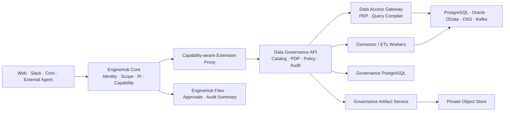
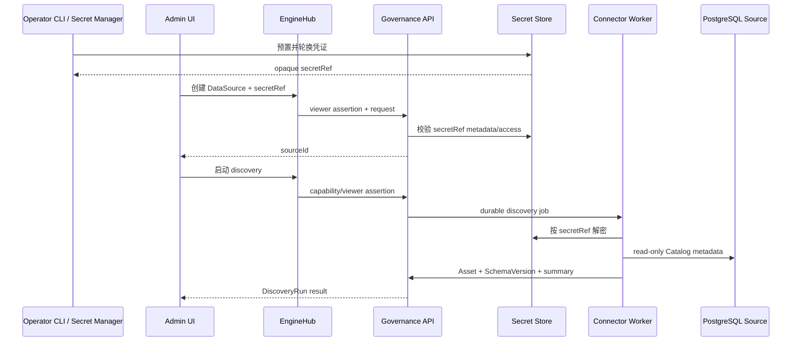
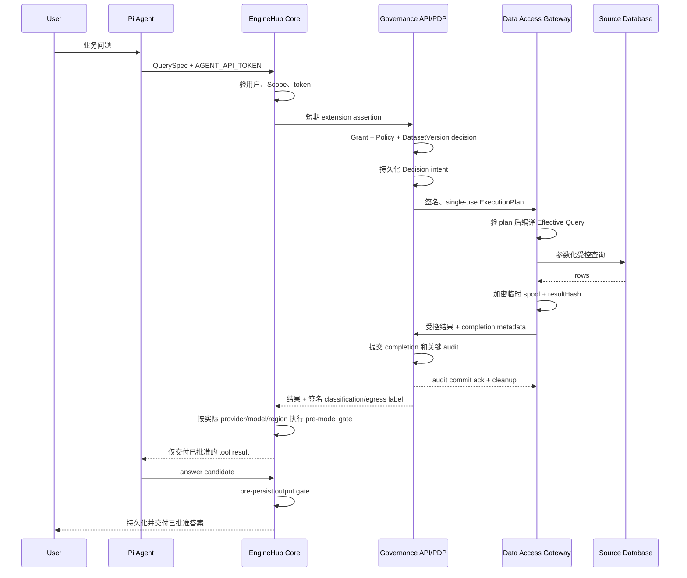
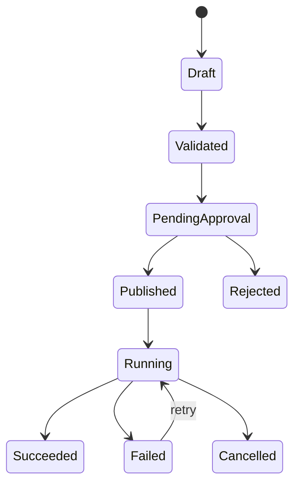

# EngineHub AIE 数据治理技术架构

- 状态：已版本化的设计提案，尚未进入功能实现或初始化 deployment layer
- 目标分支：`aie`
- 基线日期：2026-08-13
- EngineHub 基线：`5ac6f94c3537f9ac29e8e363c0bb4614da47fd32`
- AIE 基线：`317652a20250b29a7c57ad5bd2408c367fb83876`
- 来源系统：`/Users/wtong/git/gongs-claw`
- 目标系统：`/Users/wtong/git/enginehub`

本文保存在 `deploy/layers/aie/docs/` 便于评审；`aie` 仍是待最终确认的 organization slug，当前目录还不是有效 deployment layer。确认 slug 和部署目标后，必须先用 EngineHub CLI 初始化 layer，再开始功能实现，并保留本文及其评审历史。

本文的目标架构决策高于旧 AIE 设计文档；当前实现代码是 as-built 事实来源。后续实现若改变本文契约，必须同步更新本文或建立新的 ADR，不能再次把蓝图和已落地能力混写。

## 1. 架构结论

AIE 数据治理采用渐进式 EngineHub-native 演进：保留 AIE 已验证的数据治理领域模型、产品流程、连接器探测逻辑和回归案例，使用 EngineHub 替换其身份、Agent、Scope、能力令牌、文件、审批、审计和多入口运行基座。

目标不是把 `gongs-claw` 整体嵌入 EngineHub，也不是继续维护两套平台，而是在同一个 EngineHub 产品中逐个增加治理能力，并以 Strangler 模式逐域替代旧 AIE。

产品上一体、进程上分层：

- EngineHub Core 是身份和 Agent 控制面。
- Data Governance API 是治理领域控制面和策略决策点。
- Data Access Gateway 是唯一业务数据访问执行点。
- Connector/ETL Worker 执行发现、Profile 和数据工程任务；受控查询只由 Data Access Gateway 执行。
- EngineHub Web/Admin/Portal 提供统一产品入口。
- `gongs-claw` 在迁移期间只作为旧实现、交互参考和回归基线。



## 2. 已确定的架构决策

| 编号  | 决策                                                  | 原因                                                            |
| ----- | ----------------------------------------------------- | --------------------------------------------------------------- |
| AD-01 | 采用 Strangler 渐进迁移，不做整体重写切换             | 可以按领域验证并执行回退或 forward recovery，避免同时切换       |
| AD-02 | `main` 只同步 upstream，AIE 开发在 `aie`              | 保持私有开发与 upstream 同步边界                                |
| AD-03 | AIE 专属实现放在 `deploy/layers/<org>/`               | 私有 fork 的 Core 必须与 upstream 保持一致；当前 `aie` 待确认   |
| AD-04 | 通用扩展契约提交 upstream                             | capability 代理和 UI 挂载是通用平台能力，不应成为 AIE 特例      |
| AD-05 | 数据治理作为独立领域服务接入 EngineHub                | 连接器依赖、数据库协议、策略和 ETL 生命周期不适合进入 Core 进程 |
| AD-06 | Agent 不获得数据源或平台数据库凭证                    | 防止绕过授权、事务、不变量和审计                                |
| AD-07 | 所有业务数据读取经过 typed governed query             | 形成可验证的资源、行、列、聚合、预算和导出边界                  |
| AD-08 | 确定性授权决定最大权限，LLM 只能收紧                  | LLM 语义判断不能成为唯一 allow authority                        |
| AD-09 | 每个迁移领域始终只有一个权威写入方                    | 禁止长期双向双写造成冲突和不可恢复漂移                          |
| AD-10 | 首个里程碑只支持 PostgreSQL Catalog，随后增加受控查询 | 先验证身份、凭证和目录主干，再把业务数据引入 Agent 链路         |
| AD-11 | 开发可共用 PostgreSQL 实例，但使用独立 Schema 和账号  | 方便本地运行，同时保持数据所有权和迁移隔离                      |
| AD-12 | 控制面管理员不自动拥有业务数据读取权限                | 平台运维权限与数据消费权限必须分离                              |

## 3. 文档状态和术语

本文同时描述现有能力与拟新增能力，使用以下标记：

- **现有**：当前 EngineHub 或 AIE 代码已经实现。
- **新增**：需要实现的目标能力。
- **迁移期**：只为逐步替换旧 AIE 存在，完成后删除。
- **后续**：不属于当前里程碑，但目标架构预留边界。

核心术语：

- **DataSource**：企业数据连接登记，不包含明文凭证。
- **Asset**：数据源内部的技术治理节点，例如表、视图、文件、Topic 或 API Endpoint。
- **Dataset**：经过发布、允许用户或 Agent 消费的数据产品入口。
- **Connector**：服务端连接数据系统的适配器和执行实现。
- **PDP**：Policy Decision Point，计算是否允许及必须施加的约束。
- **PEP**：Policy Enforcement Point，在访问数据前强制执行 PDP 决策。
- **Pipeline**：版本化、可审批、可重复执行的数据转换计划。
- **Run**：一次发现、查询或 Pipeline 执行实例。
- **Scope**：EngineHub 的 `personal/channel/team/org/group` 所有权和协作上下文。

## 4. 现状基线

### 4.1 EngineHub 可直接复用的能力

EngineHub 当前已经具备：

- Principal 和 internal/guest 身份分类。
- `personal/channel/team/org/group` Scope 标识；当前 Core 对受管 group 有实时成员资格校验，其他 Scope 类型尚未形成同等强度的通用实时撤权契约。
- Pi Agent 和 Web、Slack、cron、background 等运行入口。
- 每轮 `AGENT_API_TOKEN`，包含 actor、scope、scope version、live/triggered 和 thread 信息。
- 持久化 Session、Run、Task、Cron、Approval、File 和 Audit。
- 基于 PostgreSQL 的 durable store、advisory lock、lease、retry 和 idempotency 基础。
- 文件及分享能力。
- 加密 Keychain 和 HTTP Service Credential Broker。
- 组织 deployment layer 中的 plugin、tool 和 skill 部署能力。

当前还不具备：

- 普通 plugin 无法验证 `AGENT_API_TOKEN`，也不应获得 `CAPABILITY_SECRET`。
- Core API 和 `/v1/apis` 目前静态注册，plugin 不能动态注册 capability-aware API。
- Portal/Web/Admin 没有动态页面、路由和导航挂载契约。
- ACL 资源类型是封闭集合，权限只有 `read/write`，不足以表达数据查询、导出和策略发布。
- 身份属性不包含部门、区域、岗位、数据域和敏感级别。
- 当前 HTTP Credential Broker 不支持 PostgreSQL、Oracle、JDBC、Kafka 等多字段协议凭证。
- 普通 plugin 当前会获得 `CORE_SIGNING_SECRET`；它只能证明受信服务来源，不能代表最终用户授权，也不应作为治理 extension 的宽权限客户端身份。
- EngineHub Security Screen 处理提示词注入和外泄风险，不是数据授权器。
- Agent turn、会话 Task 和命令审批不等价于 ETL 工作流或长期数据访问审批。
- 当前 Core 的通用 Scope 校验在部分 Scope 类型上仍可能只验证格式或静态可达性；治理查询不得把它描述或使用为完整实时撤权能力。

### 4.2 AIE 可迁移的产品能力

AIE 当前有以下值得保留的领域能力：

- `EnterpriseDataSource → DataAsset → Dataset` 三层治理模型。
- 数据源发现、Schema 记录、变化统计和失联资产标记。
- Dataset 发布、权限、预览、摘要、导出和删除审计。
- Streaming Source、Raw Event、Schema Version 和 Ingestion 状态。
- ETL Job、Run、Plan、Transform Spec 和 Lineage。
- PRE/POST 治理、shadow/enforce、决策日志、申诉和复核工作流。
- 用户文件、治理文档库和图像库的产品流程。
- 外部 Agent 的设备授权、API Key、Skill bundle freshness 和短期任务令牌思路。
- OData service document 与 `$metadata` 实时 Schema 发现。
- PostgreSQL、Oracle、目录和 OSS 等连接器中的纯探测逻辑。

### 4.3 不应原样迁移的实现

- `EnterpriseDataSource.credentialJson` 和 `DatasetSource.secret` 保存普通字段。
- Agent Skill 获得 `DATASET_DATABASE_URL` 后直接执行 `psql`。
- ETL Skill 可直接修改平台数据库中的 Job、Run、Asset、Dataset 和 Lineage。
- Dataset 授权主要停留在 Role 到 Dataset 的表级关系。
- PRE/POST 主要位于 WebSocket proxy，不能天然覆盖所有 EngineHub surface。
- judge 或相关内部调用失败时存在 fail-open。
- 管理员存在硬编码治理绕过。
- POST 拒绝时，原回答可能已经写入 OpenClaw 历史。
- system-management 使用长期管理员凭据执行高风险写操作。
- 大量领域状态由自由字符串和非版本化 JSON 表达。
- 核心治理逻辑集中在超大文件中，不适合直接复制。

### 4.4 已知文档与实现漂移

迁移必须以运行代码和验证结果为准，不能把旧文档当作已实现契约：

- 外部 Agent 文档仍描述带 `allowed_tables` 的 JWT；当前 AIE 代码签发的是 `subject/expiry/HMAC` 短令牌，权限由 OData 服务实时查询。
- OData 权限执行位于兄弟仓库 `demo-odata-service`，AIE 仓库内没有完整实现。
- 用户上传文档仍描述 import-to-Dataset 路径，但该实现已删除。
- 数据源页面展示的连接器类型多于真正可运行的连接器。
- 策略描述和管理员硬编码 bypass 存在冲突。
- 结构化访问指纹、行列权限和查询形态尚未成为当前主要执行路径。
- Webhook streaming 有部分实现，Kafka 等尚未形成完整 durable worker。
- system-management 和文档库增加后，威胁模型与审批设计尚未同步。

### 4.5 私有 fork 基线偏差

当前 checkout 是私有 fork。设计基线时，私有 `main` 与 `aie` 同在 `5ac6f94`，但 `upstream/main` 在 `d719f54`；私有 `main` 还包含 7 个额外提交和 14 个 Core 文件差异，主要是 custom provider 支持。这与“`main` 只同步 upstream、私有功能只放 deployment layer”的目标边界不一致。

任何 AIE 功能实现开始前，Phase 0 必须先审计这些差异：通用修复提交 upstream，组织专属内容迁入 `deploy/layers/<org>/`，再同步私有 `main`。在该偏差消除前，不把当前 `main` 当作可持续的 upstream 镜像。

## 5. 目标和非目标

### 5.1 目标

- 在 EngineHub 中形成统一的数据目录、受控查询、策略、审计、Pipeline 和血缘能力。
- Web、Slack、cron、background、外部 Agent 和 UI 直接查询使用同一授权入口。
- 让身份、Scope 撤销和数据授权变更及时生效。
- 让数据源凭证只在受信任 Connector/Worker 中短暂可见。
- 让 Dataset、Policy、Pipeline 和 Run 成为版本化、可审计、可恢复对象。
- 支持从 `gongs-claw` 按领域迁移，并在权威写入前回退、写入后 forward recovery。
- 保持 EngineHub Core 与 upstream 的清晰边界。

### 5.2 非目标

- M1 不迁移全部 AIE UI。
- M1 不支持全部二十类数据源。
- 首个 Query 里程碑不允许 Agent 提交任意 SQL。
- M1 不实现 Kafka/CDC、Oracle、图像库或完整 AI-ETL。
- 不用 LLM 替代数据库权限、行列策略或审批。
- 不把 EngineHub ACL 当前的 `read/write` 强行扩展成全部治理语义。
- 不默认迁移聊天全文、Raw Event payload 或数据样本。
- 不长期维持 AIE 与 EngineHub 双向同步。

## 6. 组件架构

### 6.1 EngineHub Core

职责：

- 认证用户并生成可信 Principal。
- 解析和实时验证 Scope 成员资格。
- 为 Pi turn 和 background 工作签发 capability。
- 承载统一 surface、Session、File、Approval 和审计摘要。
- 通过通用 extension proxy 将最小身份上下文传给治理服务。

禁止承担：

- 数据库驱动和连接池。
- 数据源元数据发现。
- SQL 编译和业务数据查询。
- 数据治理领域表和 ETL 状态机。
- AIE 特定的页面和 API 分支。

### 6.2 Capability-aware Extension Proxy

这是需要提交 upstream 的通用能力。

职责：

- 将 extension id 映射到明确的内部服务和允许的路径。
- 验证 `AGENT_API_TOKEN`、audience、有效期、当前用户状态和当前 Scope 成员资格。
- 对所有可撤销 Scope 类型执行同一实时成员资格契约；可撤销 Scope 必须带 `scopeVersion`，Core 无法验证时拒绝。
- 计算请求体 hash，并签发 extension 专用的短期 downstream assertion。
- 对 method、规范化 path/query、body hash、content type、`Idempotency-Key`、extension audience 和 correlation id 做绑定。
- 将 extension API 加入 `/v1/apis` 的 capability-aware 发现结果。
- 记录调用摘要，但不记录数据内容。

治理服务不得获得 EngineHub `CAPABILITY_SECRET` 或全局 `CORE_SIGNING_SECRET`。目标实现使用 Core 私钥签名，治理服务只持有 extension 专用验证公钥。Phase 1 必须同时让 plugin 可以明确退出全局 Core secret 注入；治理 API、Query Gateway 和 Worker 都不能借共享服务身份调用无关 Core 路由。

建议 assertion claims：

```json
{
  "iss": "enginehub-core",
  "aud": "data-governance",
  "sub": "principal-id",
  "org_id": "org-id",
  "scope_id": "team:analytics",
  "scope_version": "version",
  "live_actor": true,
  "live_author": true,
  "triggered": false,
  "thread_ref": "surface-thread",
  "surface": "web",
  "impersonator": null,
  "model_dispatch": {
    "provider": "deepseek",
    "model": "model-id",
    "region": "approved-region",
    "config_revision": "revision"
  },
  "method": "POST",
  "path": "/internal/v1/query",
  "request_hash": "sha256",
  "content_type": "application/json",
  "idempotency_key_hash": "sha256",
  "correlation_id": "uuid",
  "jti": "uuid",
  "iat": 0,
  "nbf": 0,
  "exp": 0
}
```

约束：

- TTL 不超过 60 秒，敏感查询建议 30 秒。
- 服务端验证 `iss`、`aud`、`org_id`、时钟窗口、method、path/query、content type、body hash 和关键 header hash。
- mutation 和数据查询要求 `Idempotency-Key`，并把它纳入 assertion 的规范化请求 hash。
- 治理服务在 durable replay store 中原子消费 `jti`。Mutation 的相同 idempotency key 返回持久化的同一响应。查询 key 永久绑定同一 QueryExecution：短期 result buffer 仍存在时返回相同结果，清理后只返回稳定 completion metadata 和 `RESULT_EXPIRED`，绝不重新访问源端；其他重复使用拒绝。
- 高风险 mutation 要求 `live_actor=true`，必要时引用 durable approval。
- assertion 只证明调用者上下文，不代替治理服务的资源授权。
- Agent 查询必须带 Core 当时的模型 dispatch 上下文；它只用于 PDP 预判，结果真正进入模型前仍由 Core 按实际 dispatch 重新执行 egress 校验。

### 6.3 Portal/Surface Extension Manifest

这是第二个需要提交 upstream 的通用能力。

Manifest 至少声明：

- extension id 和服务名。
- Portal 路径前缀与 upstream base path。
- 用户端、管理员端导航项。
- 页面所需身份模式和管理员条件。
- CSP、上传大小、超时和健康检查。
- 是否允许 WebSocket 或 streaming response。

浏览器只把登录会话交给 Portal；Portal 将请求送到 Core extension gateway，Core 重新验证用户、管理员条件和实时 Scope 后，签发 request-bound 的短期 viewer assertion。它与 Agent assertion 使用相同的 extension 专用非对称信任边界，治理服务只持有验证公钥，不获得 Portal 或 Core 的共享 HMAC secret。

不能把浏览器提交的用户 ID 当身份，不能仅依赖普通 cookie 转发，也不能复用当前全局 Portal identity/`CORE_SIGNING_SECRET` 作为治理用户授权。

### 6.4 Data Governance API

职责：

- Catalog、Dataset、Policy、Grant、Access Request、Pipeline 和 Lineage 的领域 API。
- 验证 extension assertion。
- 将 EngineHub Principal/Scope 映射到治理主体。
- 执行领域级管理权限和数据权限判断。
- 维护版本、不变量、幂等和结构化审计。
- 向 Connector/Worker 投递 durable job。

它是治理控制面和 PDP，不直接向 Agent 暴露数据库连接，也不允许 Agent 写领域表。

治理用户页面挂载在 `/data/*`，治理管理员页面挂载在 `/admin/data/*`。浏览器只访问 Portal 公开入口，不直接访问内部 API 或 Worker。

### 6.5 Data Access Gateway

Data Access Gateway 部署为独立 `data-governance-query` workload。Governance API 只做控制面和 PDP；只有 Query Gateway 能使用受限 query-execution identity 到达已登记的只读数据源，且不能获得 ETL target writer。

职责：

- 接受 Governance API 签名的单次 ExecutionPlan，不直接接受 Agent/UI 的 QuerySpec，也不自行调用 PDP。
- 验证 plan audience、短期有效期、single-use jti、Decision id、DatasetVersion/source binding、normalized query hash 和全部 revision。
- 编译参数化 SQL 或连接器协议请求。
- 强制行过滤、列掩码、聚合、Limit、超时和结果预算。
- 要求 ExecutionPlan 携带 Governance API 已提交 Decision intent 的签名证明。
- 将结果保存在受控内存或加密临时 spool，把 completion metadata 和受控结果送回 Governance API；收到 audit commit ack 前不销毁或对外暴露结果。
- 不访问治理数据库，也不持久化 Decision、QueryExecution 或 audit；这些提交职责只属于 Governance API。

首个 Query 里程碑禁止任意 SQL，也不开放 export 或 streaming。后续若开放高级 SQL，必须进行 AST 解析、对象解析和查询重写；无法证明安全时拒绝。Export 必须等 Governance Artifact Service 上线，并在每次读取、分享、fork 和 delivery 时在线重验 Grant/Policy。

唯一 handoff 协议是：Governance API 规范化 QuerySpec、执行 PDP、提交 Decision intent，再签发不可变的 ExecutionPlan；Query Gateway 只校验、编译和执行该 plan。Gateway 不接受调用方补充字段，plan 中的 source/schema/object、强制谓词和 limits 全部绑定 Decision 与版本，避免两边重复求值和 TOCTOU 漂移。

临时 spool 不是业务持久层：优先使用受限内存；落盘时每个 query 使用独立 ephemeral DEK 和受限 tmpfs/临时卷，设置容量与最长 TTL，禁止进入备份、snapshot、swap、日志或 trace。成功、拒绝、超时和失败都删除 ciphertext 并销毁 DEK；进程重启、lease 丢失或主机崩溃后的 orphan 由 durable sweeper 清理并审计。Phase 3 必须包含 crash/timeout/orphan 清理测试。

### 6.6 Connector Worker

职责：

- 测试连接和健康检查。
- Schema、表、列和约束发现。
- Schema diff 和失联资产判断。
- 在服务端使用 secretRef 解密短期连接信息。
- 使用最小权限源端账号和网络 allowlist。
- 通过 durable job、lease、heartbeat、retry 和 idempotency 运行。

首个 Catalog 里程碑仅实现 PostgreSQL metadata-only connector；不读取样本，不运行统计 Profile。

### 6.7 Governance Artifact Service

Phase 5 新增独立 `data-governance-artifact` workload：

- 管理加密 GovernedArtifact 的对象 I/O；Dataset/Decision/Grant provenance、状态和 retention metadata 由 Governance API 持久化并绑定对象 hash。
- 下载只接受 Portal/Core extension gateway 的 request-bound viewer/Agent assertion，并在每次访问时向 Governance API 在线重验 entitlement。
- 写入只接受 Query Gateway 专用 mTLS/service identity 和 Governance API 签名、single-use 的 `ArtifactWritePlan`，绑定 artifactId、Decision、QueryExecution、DatasetVersion、classification、media type、max bytes、retention、audience、expiry 和 jti。
- Phase 5 的 Query Gateway 可凭该 plan 将查询结果直接流向内部 ingest endpoint；Artifact Service 边接收边加密，计算 size/hash，未提交对象保持不可读 quarantine 状态。
- Artifact Service 以幂等 completion key 把 metadata 送回 Governance API；API 在同一事务提交 QueryExecution completion、Artifact active metadata、audit 和 outbox。重复 completion 若已 active，返回相同 committed ack；Artifact Service 收到 ack 后才开放兑换。
- Ack 丢失时对象保持 quarantine，Artifact Service 重试 completion 或查询 API 的权威状态，不能按本地超时删除。只有 API 以 expected revision 将 pending 状态 CAS 为 `aborted/expired` 并返回签名 abort authorization 后，Artifact Service 才删除对象。Orphan sweeper 使用同一 reconciliation 协议；API 不可用时保留 quarantine 并告警。
- 用户可见下载地址指向 Artifact Service 的单次兑换 endpoint，不直接暴露对象存储 presigned URL；服务在兑换时验证 jti、actor、scope、artifact、method 和 expiry，成功后代理流式读取 private object。
- 对象存储 URL 即使内部使用也只发给 Artifact Service，不能交给浏览器；Grant 撤销会使下一次兑换失败。
- 只访问 Governance API 和专用 private object bucket，不可访问数据源、Core 私有 API 或治理数据库。

当前 EngineHub File/Blob 没有动态 DataGrant 回调，因此不用于受治理导出。若未来要统一，先通过 upstream 增加 read-time provenance/authorization hook。

### 6.8 Pipeline Worker

后续职责：

- 执行已发布的 PipelineVersion。
- 分离源端只读账号和目标端最小写账号。
- 记录 checkpoint、输入输出版本、质量结果和 lineage evidence。
- 支持取消、重试、backfill 和幂等写入。

Agent 只能起草 Pipeline plan；发布与执行必须经过有类型的 API 和审批。

## 7. 仓库和部署边界

目标布局：

```text
deploy/layers/aie/
  docs/
    ENGINEHUB_AIE_DATA_GOVERNANCE_ARCHITECTURE.md
  plugins/
    data-governance-api/
      Dockerfile
      src/
      migrations/
      web/
    data-governance-query/
      Dockerfile
      src/
    data-governance-worker/
      Dockerfile
      src/
    data-governance-artifact/
      Dockerfile
      src/
  sandbox/
    tools/
      data-governance/
        tool.json
    skills/
      aie-data-analysis/
        SKILL.md
      aie-data-governance/
        SKILL.md
```

本文档所在目录当前只是设计资料，不表示 deployment layer 已完成初始化。进入实现阶段时，必须使用 EngineHub CLI 正式生成 deployment layer，再把设计资料和实现迁入生成的目录，确保 `.gitignore`、secret contract 和部署配置完整。

网络边界：

- `data-governance-api` 只访问治理数据库、EngineHub、Secret Manager 的加密接口和 Phase 5 Artifact Service 的内部 control endpoint，不可达企业数据源网段。
- `data-governance-query` 只接受治理 API 的内部授权调用，可访问 Secret Store、已登记的只读数据源，以及 Phase 5 Artifact Service 的内部 ingest endpoint；不可直连 Core 或治理数据库。
- `data-governance-worker` 以最小数据库角色访问治理 queue、lease 和 discovery/run result 表，以执行身份访问 Secret Store 和已登记目标；不可访问 Core API 或无关治理表，也不暴露公开业务 API。
- Phase 5 的 `data-governance-artifact` 只访问 Governance API 和专用 private object bucket，不直连数据源或治理数据库。
- 各 workload 使用独立服务身份和独立 secret allowlist；Query Gateway 不复用 ETL target writer，Artifact Service 不获得 connector secret。

通用 Core 变更：

- `qm.config` 中版本化的 extension manifest contract。
- CLI 对 extension id、保留前缀、路由冲突、service 引用和 secret contract 的校验。
- Docker、Fly 和 AWS 后端一致的 service discovery、route、health check、secret wiring 和 workload network policy。
- Portal reverse proxy、导航挂载，以及 Core 的 Agent/viewer identity gateway。
- extension API catalog registration 和 capability-aware discovery。
- extension 专用服务身份、验证公钥，以及 plugin 退出全局 `CORE_SIGNING_SECRET` 注入的能力。
- 必要的 pre-model egress 和 pre-persist output policy hook。

以上变更不包含 AIE 名称、业务 Schema、企业连接信息或策略，应通过 upstream PR 进入 qm。只有当这些通用能力已经合并、发布、同步到私有 fork，并由所有目标后端的契约测试验证后，私有 layer 才能依赖它们。

## 8. 身份、Scope 和授权模型

### 8.1 身份根

所有治理调用以 EngineHub 验证后的上下文为准：

- `actorId`
- `scopeId`
- `scopeVersion`
- `liveActor/liveAuthor`
- `triggered`
- `threadRef`
- `surface`
- `correlationId`

治理服务不得相信请求 body 中的 user、role、scope 或 admin 字段。管理员代入用户时必须同时保留真实 `impersonator`，不能让审计只显示被代入身份。

### 8.2 三层授权

第一层是 EngineHub 身份与 Scope：

- 用户是否仍为 active。
- 用户是否仍可到达当前 Scope；所有可撤销 Scope 类型必须实时验证，无法验证或缺少所需 revision 时拒绝。
- 请求是否来自实时用户或自动触发。

第二层是治理资源授权：

- Resource owner Scope。
- Principal/Scope 到 Resource Action 的显式 grant。
- Data Owner、Steward、Operator 等治理职责。

第三层是数据策略：

- 数据分类和数据域。
- 字段和敏感级别。
- 行谓词。
- 聚合粒度和最小分组阈值。
- 查询用途。
- export、transform 和 model egress 限制。

最终权限是三层约束的交集。

### 8.3 Typed actions

治理服务内部使用明确 action，不直接套用 EngineHub `read/write`：

- `source.read`
- `source.manage`
- `source.test`
- `source.discover`
- `asset.read`
- `asset.profile`
- `asset.classify`
- `governance.role.assign`
- `grant.manage`
- `dataset.read`
- `dataset.query`
- `dataset.export`
- `dataset.manage`
- `dataset.publish`
- `policy.read`
- `policy.draft`
- `policy.publish`
- `access.approve`
- `pipeline.draft`
- `pipeline.publish`
- `pipeline.run`
- `lineage.read`

EngineHub ACL 可用于 deployment、file 和粗粒度共享。数据治理的 typed grant 在治理库中持久化，但统一使用 EngineHub Scope ID。

Dataset 创建时必须指定 Data Owner principal/scope。M1 的 bootstrap `org_admin` 只能通过 `governance.role.assign` 指定或更换首批 Data Owner，不能因此读取数据，也不能创建授予自己的查询权限。

Bootstrap assignment 要求目标 Owner 是不同的实时主体并在独立会话中接受；发起管理员、impersonator 及其个人 Scope 不能成为目标。Data Owner 可以给其他主体创建有限 DataGrant，但任何让签发者本人、其 personal Scope 或包含签发者的 Scope 受益的 grant 都要求另一名独立 Data Owner/Steward 批准。系统不得通过“先自任 Owner、再自授 Grant”绕过职责分离。

Phase 3 开始前，Data Owner 可用 `asset.classify` 和 `grant.manage` 完成低敏分类与首批有限 DataGrant；这些 mutation 要求 `liveActor`、expected revision 和结构化审计。AccessRequest、完整多方审批和动态 Policy 在 Phase 4 完善。

### 8.4 决策规则

- 显式 deny 优先。
- 没有 allow 不代表默认允许。
- 临时 grant 不能突破组织级不可覆盖规则。
- 管理员必须持有数据 action 或显式 break-glass grant。
- break-glass 必须限时、说明用途、产生高优先级审计并通知 Data Owner。
- LLM 的 allow 不能扩大确定性策略计算出的最大权限。
- LLM uncertain 在敏感域转为 deny 或 approval；只有明确低敏且处于 shadow rollout 时可以继续。
- 身份、Scope、Policy、Credential 或关键 Audit 不可用时，敏感操作 fail closed。

## 9. 核心领域模型

所有治理对象必须包含：

- 稳定 ID。
- `orgScopeId` 和 `ownerScopeId`。
- `createdBy`、`updatedBy`。
- `revision` 或显式版本。
- 明确状态枚举。
- 创建和更新时间。
- 可选的 `sourceSystem`、`legacyId`。

### 9.1 Catalog

| 对象               | 核心字段                                                     | 不变量                                           |
| ------------------ | ------------------------------------------------------------ | ------------------------------------------------ |
| DataSource         | connectorType、config、secretRef、status、health             | 不保存凭证明文；connectorType 创建后不可任意改变 |
| DiscoveryRun       | sourceId、trigger、status、counts、schemaHash、error         | 一次 Run 的输入和结果不可覆盖                    |
| Asset              | sourceId、nativeKey、type、status、classification            | 同一 source + nativeKey 唯一                     |
| AssetSchemaVersion | assetId、version、schema、hash、observedAt                   | append-only，hash 相同不创建重复版本             |
| AssetProfile       | assetVersion、statistics、classification、profileHash        | 默认不保存原始样本                               |
| Dataset            | ownerScopeId、name、kind、status、currentVersion             | 只有 published/active Dataset 可查询             |
| DatasetVersion     | datasetId、asset bindings、contract、schema、policy bindings | 发布后不可原地修改                               |

Dataset 是用户和 Agent 的消费入口；Asset 是技术治理图节点。发现到的表不会自动成为 Dataset，必须经过显式发布。

### 9.2 Access Governance

| 对象           | 核心字段                                                                  | 不变量                                   |
| -------------- | ------------------------------------------------------------------------- | ---------------------------------------- |
| DataGrant      | subject principal/scope、resource、actions、constraints、expiry           | 可撤销、可过期、不能表达无限制隐式 admin |
| Policy         | owner、domain、status、currentVersion                                     | Policy 本身是稳定容器                    |
| PolicyVersion  | rules、tests、hash、author、approval                                      | 发布版本不可修改                         |
| PolicyTestCase | input fixture、expected decision/constraints、status                      | 与 PolicyVersion 一起回归并保留结果      |
| PolicyBinding  | policyVersion、resource/subject selector、priority                        | selector 必须可确定性求值                |
| AccessRequest  | requester、resource、action、purpose、constraints、expiry                 | 批准必须生成有限 DataGrant               |
| Decision       | actor、scope、resource/version、action、queryHash、policyVersions、result | append-only，不保存原始业务数据          |
| QueryExecution | decisionId、connector、timing、rows、bytes、resultHash                    | 每次物理访问有唯一关联决策               |

查询域还包含 QueryRequest、NormalizedQueryPlan 和 ResultArtifactRef。首个 Query 里程碑只允许受预算限制的小结果 inline 返回，并持久化 completion metadata 而非 raw rows。只有 Phase 5 的 Governance Artifact Service 上线后，大结果才可保存为带授权来源的 GovernedArtifact；治理库默认不持久化原始结果。

### 9.3 Pipeline 与 Lineage

| 对象            | 核心字段                                              | 不变量                       |
| --------------- | ----------------------------------------------------- | ---------------------------- |
| Pipeline        | ownerScopeId、name、status、currentVersion            | 稳定容器                     |
| PipelineVersion | plan、input/output contracts、schedule、hash          | 发布后不可修改               |
| PipelineRun     | version、params、status、checkpoint、attempt          | 幂等 key 防止重复执行        |
| QualityResult   | runId、check、threshold、actual、status               | 与运行和数据版本绑定         |
| LineageEdge     | runId、input/output asset version、transform evidence | 不用推测结果冒充精确列级血缘 |

### 9.4 文件与文档

- 非数据治理文件可继续使用 EngineHub File/Blob；业务数据导出和受治理文档使用 Governance Artifact Service 或受控外部 URI。
- 文件默认 private，不使用 `public-read`。
- 文档集合是 Dataset 的一种，不把单个任意文件自动发布为 Dataset。
- DocumentCollection、DocumentAsset 和 ParseVersion 保存治理元数据。只有不需要动态 DataGrant 的原始文件引用 EngineHub File/Blob；需要动态撤权的对象引用 GovernedArtifact。
- Catalog 默认只保存 schema、hash 和 metadata-only discovery 结果；Profile、统计和受控预览必须在 Query Gateway 上线后经 `asset.profile` 授权。
- 样本必须限量、脱敏、分类、加密并具有 retention。
- Raw Event headers 必须去除 authorization、cookie 和 webhook secret。

## 10. Governed Query 契约

### 10.1 QuerySpec

首个 Query 里程碑只接受结构化查询：

```json
{
  "datasetId": "ds_sales_daily",
  "datasetVersion": 12,
  "operation": "aggregate",
  "select": ["region", "sales_amount"],
  "filters": [{ "field": "business_date", "op": "gte", "value": "2026-08-01" }],
  "groupBy": ["region"],
  "aggregates": [{ "field": "sales_amount", "fn": "sum", "as": "sales_total" }],
  "orderBy": [{ "field": "sales_total", "direction": "desc" }],
  "limit": 100,
  "purpose": "monthly management review"
}
```

字段使用 Dataset contract 中的稳定 field id，不能由调用方传物理 Schema 或任意 SQL identifier。

### 10.2 PDP 输入

```json
{
  "principal": {
    "actorId": "user-id",
    "scopeId": "team:analytics",
    "scopeVersion": "version",
    "liveActor": true,
    "triggered": false
  },
  "resource": {
    "datasetId": "ds_sales_daily",
    "datasetVersion": 12,
    "classification": "confidential",
    "domain": "sales"
  },
  "request": {
    "action": "dataset.query",
    "queryHash": "sha256",
    "purpose": "monthly management review"
  }
}
```

### 10.3 PDP 输出

```json
{
  "decision": "allow",
  "policyVersionIds": ["pol_sales_v7"],
  "allowedFields": ["region", "sales_amount"],
  "maskedFields": [],
  "mandatoryFilters": [{ "field": "region", "op": "in", "value": ["ON"] }],
  "minimumGroupSize": 10,
  "maxRows": 100,
  "maxBytes": 1048576,
  "timeoutMs": 10000,
  "exportAllowed": false,
  "modelEgress": "approved-providers-only",
  "reasonCodes": ["DATASET_GRANT", "REGION_BOUNDARY"]
}
```

Governance API 对原 QuerySpec 应用 PDP 约束，生成并签名不可变 ExecutionPlan；Query Gateway 只能编译和执行其中的 Effective Query。不能由 Agent 自行解释或执行 `mandatoryFilters`。

首个 Query 里程碑只使用显式 Principal/Scope DataGrant 中的常量约束。部门、区域、岗位等动态 ABAC 必须等权威属性源、属性 revision、撤销和故障语义落地后才可启用；属性缺失或不可验证时拒绝。

### 10.4 查询限制

- 默认最大行数、字节数和执行时间。
- 禁止 DDL/DML、多语句和未登记对象。
- 禁止跨 Dataset join，除非 Dataset contract 显式声明允许的关系。
- 过滤、排序、聚合函数使用 allowlist。
- 参数必须绑定，不拼接用户值。
- 高基数明细、PII 和 export 使用独立 action。
- 查询发送到源端前完成全部授权。
- 结果返回后记录行数、字节数和 hash，不记录原始数据。
- 文件导出和 streaming 在 Governance Artifact Service 上线前关闭；上线后 GovernedArtifact 保留 Dataset/Decision provenance，且每次读取在线重验授权。

## 11. Connector 和凭证架构

### 11.1 Secret 生命周期

DataSource 只保存 `secretRef`。实际 secret 使用 envelope encryption：

- 开发环境使用独立的 `DATA_GOVERNANCE_CONNECTOR_KEY`。
- 生产使用 KMS/Secrets Manager 管理数据密钥或凭证版本。
- M1 由运维通过 CLI 或云 Secret Manager 的受控入口预置凭证，Admin UI 只选择或提交 opaque `secretRef`，Portal、Core 和 Governance API 都不代理源凭证明文。
- Governance API 只能校验引用和发起操作；Connector Worker 或 Query Gateway 的专用执行身份才能按 source/action 短暂解密。
- 凭证不得进入浏览器、Agent 环境、prompt、workspace、日志、trace、测试 token、普通数据库字段或 API response。
- 后续若要求 UI 直接录入凭证，必须另建一次性 credential-ingest 契约和威胁模型，保证明文绕过 Portal/Core/Governance API、不可回显或持久化；它不属于 M1。
- 旧 AIE 凭证不复制，必须重新登记并轮换。

### 11.2 PostgreSQL Connector 首个里程碑约束

- 源端使用专用 read-only 用户。
- DataSource API 接受结构化的单 host、port、database 和 schema allowlist，不接受任意 DSN、URI 参数、多 host failover、Unix socket、service file 或任意 driver options。
- 目标必须命中组织批准的 hostname/CIDR allowlist；默认拒绝 Core、治理库、审计库、Secret Manager、云 metadata、control plane、loopback、link-local 和未登记私网。
- DNS 在保存、job 领取和实际 connect 时解析并重验；连接使用经校验的目标并防止 DNS rebinding，地址变化触发重新审批或拒绝。
- 强制 TLS `verify-full` 和受信 CA；只有隔离的本地开发环境可以显式例外并留审计。
- 设置 statement timeout、lock timeout 和连接上限。
- Catalog discovery 只访问系统 Catalog 元数据，不读取样本或运行 Profile。
- Profile 只能在 Query 里程碑后以独立 `asset.profile` action 经过 PDP/PEP。
- Query 只访问已发布 Dataset 绑定的对象。
- Query workload 只允许 Secret Store 和批准的数据源，不能路由到 EngineHub 控制面或治理持久层；Worker 另允许以最小角色访问治理 queue/result 表，但不能访问无关治理表。
- 连接测试不返回可解码的凭证载荷。

### 11.3 ETL 凭证

后续 Pipeline 使用不同的 source-read 和 target-write secretRef。目标写账号只拥有明确 Schema 和操作权限。任何平台治理表都不属于 ETL 写账号权限范围。

## 12. API 边界

以下路径是目标契约示例，不表示当前已经存在。

### 12.1 EngineHub Agent API

```text
GET  /v1/extensions/data-governance/catalog/datasets
GET  /v1/extensions/data-governance/catalog/datasets/:id
POST /v1/extensions/data-governance/query
GET  /v1/extensions/data-governance/decisions/:id
POST /v1/extensions/data-governance/access-requests
```

这些路由先由 Core 验证 `AGENT_API_TOKEN`，再转发给治理服务。

`POST /exports` 在 Phase 5 Governance Artifact Service 完成前不注册；查询 streaming 同样关闭。

### 12.2 管理 API

```text
POST /internal/v1/sources
POST /internal/v1/sources/:id/test
POST /internal/v1/sources/:id/discovery-runs
GET  /internal/v1/sources/:id/assets
POST /internal/v1/datasets
POST /internal/v1/datasets/:id/versions
POST /internal/v1/datasets/:id/publish
POST /internal/v1/policies/:id/versions
POST /internal/v1/policies/:id/versions/:version/test
POST /internal/v1/policies/:id/versions/:version/publish
POST /internal/v1/access-requests/:id/decisions
```

管理调用仍需 EngineHub viewer/admin assertion，并在领域层检查 Data Owner、Steward 或具体 action。Portal admin 身份本身不授予数据读取权。

### 12.3 Worker API/Queue

- M1 使用治理 PostgreSQL durable queue，Worker 通过 `FOR UPDATE SKIP LOCKED`、lease 和 heartbeat 领取任务，不开放公网 Worker API。
- API 只投递 durable job id。
- Worker 领取 lease 后读取版本化输入。
- heartbeat 和 checkpoint 持久化。
- completion 使用 compare-and-set 或幂等事务。
- 结果事件携带 correlation id、job id、attempt 和 input revision。

### 12.4 领域事件

M1 起事件保存于治理库 durable outbox，消费者幂等处理：

- `source.created`
- `discovery.started`
- `asset.discovered`
- `asset.schema_changed`
- `dataset.published`
- `policy.published`
- `query.completed`
- `pipeline.run_completed`

事件不是领域事实的唯一存储；事实仍由版本化领域表负责。发布到其他基础设施属于后续部署选择。

## 13. 关键运行流程

### 13.1 注册和发现 PostgreSQL 数据源



发现具有幂等性。相同 Schema hash 不创建重复版本；已不存在对象标记 missing，不静默删除。

### 13.2 Pi 查询 Dataset



数据授权的主边界发生在访问数据前。POST/DLP 是第二层保护，不能替代 Query Gateway。只有 classification-aware pre-model egress 和 pre-persist hook 已覆盖该 surface 时，结果才可进入 Pi；在此之前只允许 UI/API 消费经批准的低敏聚合结果，不对 Pi 开放查询工具。

### 13.3 Pipeline



Agent 可以创建 Draft；校验、审批、发布和执行由服务端状态机控制。

### 13.4 Policy 发布

PolicyVersion 必须经过：

1. 创建 draft。
2. 静态校验 selector、字段和 action。
3. 运行历史回归和负向安全用例。
4. 生成 decision flip diff。
5. Data Owner/Steward 审批。
6. 发布为不可变版本。
7. 先 shadow，再按数据域进入 enforce。

一次申诉不能直接变成对所有用户立即生效的自然语言规则。临时例外生成有主体、资源、action、约束和期限的 DataGrant；规则缺陷走新的 PolicyVersion。

## 14. 模型使用和输出安全

### 14.1 数据进入模型前

治理服务必须根据 `classification × model provider` 计算模型出境策略：

- 高敏和 PII 默认不发送给未批准的外部模型。
- 优先在 Gateway 完成聚合、掩码、过滤和采样。
- 语义 judge 只接收最小必要上下文。
- 审计记录实际 provider、model、region 和 policy version。
- EngineHub Security Screen 不得被当作数据授权器。
- 敏感 tool result 不应默认再次发送给外部安全筛查服务。

当前 EngineHub 默认可使用 DeepSeek，这不等于所有分类的数据都允许发送给 DeepSeek。具体 provider 许可需要由组织策略明确配置。

任何 Dataset 结果进入 Pi 前，必须先有可执行的 classification-to-provider 策略；未分类数据、高敏数据或 provider/region/retention 状态不可验证时拒绝进入模型。首个 Query 里程碑可以先服务治理 UI/API，但不能先把数据工具接给 Pi 再补出境控制。

Core 必须提供 pre-model tool-result hook。治理结果携带不可由 Agent 修改的 classification/egress label；Core 在每次实际模型 dispatch 前，将它与最终 `provider/model/region/configRevision` 比对。模型 fallback、重试、路由切换或配置 revision 变化都必须重新授权；无法确认实际地域、retention 或 provider 时 fail closed。pre-persist 只能防止落盘，不能替代这个发送前闸门。

### 14.2 Answer/Artifact 交付

目标需要一个覆盖所有 surface 的 pre-persist output policy hook：

- 在 assistant 文本、tool result、文件或 delivery 进入持久层前执行。
- 被拒内容只在受控内存中存在并及时销毁。
- Web、Slack、cron、background 和外部 API 使用同一规则。
- 文件分享、会话 fork 和历史读取重新检查 entitlement。

访问前的确定性 Query Gateway 是主边界，pre-persist hook 是 Pi 和多 surface 交付的必备第二边界。该 hook 未完成并通过持久化泄漏测试前，查询能力不得向 Pi、Slack、cron、background 或 external Agent 开放；只允许治理 UI/API 返回明确批准的低敏、聚合、非 streaming 小结果。

## 15. 持久化、并发和可恢复性

### 15.1 数据库隔离

本地开发可继续使用 `localhost` 的 `qm_deepseek_pi_dev` PostgreSQL 数据库，但治理服务使用独立 Schema，例如 `aie_governance`，并使用独立角色：

- migration role：仅迁移时使用。
- API role：读写治理控制面表，不读取 connector secret 明文。
- worker role：领取 job、写 Run/Discovery 结果。
- audit writer：只追加结构化审计。

生产允许独立数据库。无论物理部署方式如何，EngineHub Core 不跨 Schema 直接读取治理表，治理服务也不直接读取 Core 私有表。

### 15.2 Durable state

以下状态必须持久化，不能仅存在进程内存：

- Discovery、Query、Pipeline job 和 lease。
- Policy/Grant/Decision/AccessRequest。
- SchemaVersion、DatasetVersion 和 Lineage。
- 幂等键、checkpoint、attempt 和 dead-letter。
- Connector health 和 credential rotation metadata。

### 15.3 并发规则

- 所有 mutation 带 expected revision 或 `If-Match`。
- 同一 source 的 discovery 串行化或使用 advisory lock。
- Dataset/Policy/Pipeline 发布使用事务和唯一 current version。
- Worker 通过 lease + heartbeat 防止重复执行。
- 查询本身不重试非幂等外部操作；read-only 查询只在明确可安全重试时重试。

## 16. 审计与可观测性

治理服务保存结构化详细审计，EngineHub Audit 只保存摘要和关联链接。

审计顺序属于授权协议的一部分：

1. 在源端访问前追加 Decision intent，并提交授权输入、约束和 query hash。
2. Query Gateway 执行后只把结果放在受控内存或加密临时 spool。
3. QueryExecution completion、rows/bytes/result hash 和关键 audit 提交成功后才允许交付。
4. mutation 的领域状态、详细 audit 和 outbox 必须在同一事务提交。
5. 关键 audit 失败时销毁未交付结果并 fail closed；不允许在审计前开始 streaming。

Decision 至少记录：

- correlation/task/run id。
- actor、scope、scope version、surface、live/triggered。
- Dataset 和 DatasetVersion。
- action、purpose、normalized query hash。
- 请求字段、实际字段、强制行谓词和聚合约束。
- Grant、PolicyVersion、model/provider/version。
- decision、enforced、reason code、approval。
- rows、bytes、duration、result hash。

默认不保存原始问题、完整答案、样本行或 PII。确需证据时使用脱敏、加密和独立 retention。

主要指标：

- allow/deny/approval/error 数量与延迟。
- policy version 和 decision flip。
- 查询行数、字节、超时、预算拒绝。
- discovery 成功率、资产变化和 connector health。
- Pipeline 成功率、重试、重复和 checkpoint age。
- secret 读取、轮换和失败。
- 迁移实体对账、checksum、dead-letter 和同步 lag。

`authorization_fail_open_total` 必须始终为零。关键 audit 无法持久化时，敏感操作拒绝并告警。

## 17. 渐进迁移计划

### Phase 0：基线、仓库边界和旧系统围栏

范围：

- 盘点 AIE 表、JSON、对象路径、凭证、外部服务和全部数据访问入口。
- 区分代码已实现、文档声称实现和仅 UI 暴露，建立 legacy id 映射和 Northstar 回归集。
- 审计私有 `main` 相对 upstream 的 7 个提交和 14 个 Core 文件差异；通用修复回 upstream，组织内容回 layer，再同步 `main`。
- 冻结旧 AIE 新增敏感数据源、长期凭证和新直连 ETL；收紧旧网络路径、数据库角色并轮换已暴露风险的凭证。
- 为数据库和对象存储创建可恢复快照，并为每个迁移域定义单一 writer、切换 fence 和回退时限。

退出标准：

- 选定 upstream SHA 后，私有 `main` 在 `deploy/layers/**` 之外与该 SHA 的 tree diff 必须为空，并由 CI 机械验证；AIE 开发只在 `aie` 和 organization layer。
- 每个领域有权威写入方、切换顺序和数据库级写入 fence。
- 文档漂移、旁路入口和凭证清单全部登记。
- 备份恢复和切换前回退完成演练。

### Phase 1 / M0：通用平台基础

范围：

- upstream 实现 capability-aware Agent/viewer extension gateway、版本化 manifest 和 `/v1/apis` 发现。
- upstream 实现所有 Scope 类型的实时成员资格/revision 契约、request-bound assertion、durable replay 防护、pre-model egress hook 和 pre-persist hook。
- upstream 实现 plugin 退出全局 `CORE_SIGNING_SECRET`、extension 专用非对称身份，以及 Docker/Fly/AWS 一致的 route、health、secret 和 network policy。
- 合并并发布 upstream 版本，私有 fork 同步该版本；确认 organization slug 和部署目标后，用 CLI 初始化 layer。
- 建立 Governance API/Query/Worker skeleton、独立治理 Schema、correlation id、事务 audit/outbox 和 workload 网络隔离。

退出标准：

- M0 的 API/Query/Worker 三个治理 workload 均不持有 `CAPABILITY_SECRET` 或全局 `CORE_SIGNING_SECRET`，不能调用无关 Core 路由。
- Agent/viewer assertion 的 path/body/header 绑定、单次消费、幂等重放和跨 organization 拒绝有集成测试。
- personal/channel/team/org/group 的撤权在下一请求生效；无法实时验证时 fail closed。
- 所有目标部署后端能够挂载 UI/API，路由无冲突，Query/Worker 网络策略可验证。
- 该阶段不登记企业数据源，也不读取业务数据。

### Phase 2 / M1：PostgreSQL Metadata Catalog

目标：管理员能在 EngineHub 中登记 PostgreSQL 数据源，安全保存凭证，发现 metadata-only Asset，并将表定义发布为 Dataset；不预览、Profile、查询或导出业务数据。

范围：

- DataSource、DiscoveryRun、Asset、AssetSchemaVersion、Dataset、DatasetVersion 和发布状态机。
- secretRef、结构化 endpoint 校验、PostgreSQL metadata-only connector、管理 UI 和 extension navigation。
- Schema diff、missing 标记、幂等发现和结构化审计。
- 过渡期 bootstrap policy：仅实时、非 triggered、非 impersonated 的 EngineHub `org_admin` 可执行 `source.manage/test/discover`、`asset.read`、`dataset.manage/publish` 和 `governance.role.assign`；最后一项只能给 Dataset 指定真实 Data Owner，不产生数据读取 grant。Assertion 必须保留真实 impersonator，任何代入请求拒绝这些动作。

退出标准：

- bootstrap policy 不授予 `asset.classify`、`asset.profile`、`grant.manage`、preview、`dataset.query` 或 `dataset.export`；M1 结束时每个待查询 Dataset 必须已有 Data Owner。
- Agent、浏览器、Portal/Core/Governance API、日志、trace、token 和普通表中无数据源凭证明文；M1 只接收预置的 opaque `secretRef`。
- SSRF、DNS rebinding、TLS、未批准网段和 control-plane target 拒绝测试通过。
- 重复发现幂等，Schema change 和 missing 行为有集成测试。
- 连接器 UI 只显示真正支持的 PostgreSQL。

### Phase 3：Governed Query

范围：

- typed QuerySpec、PDP、PEP、参数化 SQL compiler 和独立 Query Gateway。
- Data Owner 的 `asset.classify`、`grant.manage` API，以及创建首批低敏分类和有限 DataGrant 的审计流程。
- 显式 Principal/Scope DataGrant 的字段、常量行约束、聚合、预算和 `asset.profile` policy；不做动态 ABAC。
- Decision-before-access、加密临时 spool、audit-before-delivery 和故障时销毁结果。
- 先向治理 UI/API 开放低敏聚合查询；classification-to-provider 策略和 pre-model/pre-persist hook 通过后，再注册 Pi Skill 和 `/v1/apis`。
- Pi 开放后让 Web、Slack、cron、background 走同一 Core gateway 和 PDP/PEP。

退出标准：

- Sandbox 中无 `DATASET_DATABASE_URL`，网络无法直连源数据库。
- 未授权字段、行、join、CTE、subquery 和聚合在 SQL 发送前拒绝。
- 所有物理查询可追溯到已提交的 Decision 和 DatasetVersion，audit 失败时结果不交付。
- Scope/Grant 撤销后下一次查询立即拒绝。
- export 和 streaming 仍关闭；未经批准的 provider 不接收结果，被拒内容不进入任何持久层。
- 首个合法查询可从已登记 Data Owner、低敏 classification 和有限 DataGrant 完整追溯，且 bootstrap `org_admin` 本身仍无数据访问权。

### Phase 4：Policy、审批和灰度执行

范围：

- PolicyVersion、测试、decision flip、发布审批和有期限的 AccessRequest/DataGrant。
- 完善 Data Owner/Steward 职责、引入多方审批，并让 bootstrap `org_admin` policy 退役。
- 接入有 revision 的权威属性源后，增加部门/区域/岗位动态 ABAC。
- shadow 到单数据域 enforce，以及更细的 provider/model egress policy。

退出标准：

- Policy 未经测试和 Owner 审批不能发布。
- judge、属性源、policy 或 audit 故障不会使敏感访问放行。
- 控制面管理员无 DataGrant 时仍被拒绝。
- Web、Slack、cron 和 background 调用得到一致决策。

### Phase 5：目录所有权切换、文件治理和 Export

范围：

- 从 AIE 快照并单向同步 Source、Asset、Dataset 和文档引用。
- 对每个 pilot Dataset 先关闭旧访问路径和旧 writer，再让 EngineHub 成为唯一权威写入方。
- 新增 Governance Artifact Service：加密 private object、Dataset/Decision/Grant provenance，以及指向服务自身的一次性短期兑换 endpoint；不向浏览器暴露对象存储 URL。
- 下载、分享、fork、delivery 每次先经 Core viewer/Agent gateway，再由治理服务在线重验 entitlement；当前 EngineHub File/Blob 不承载需要动态 DataGrant 的导出。
- 在该服务上开放受控 export；AIE 降为只读兼容层。未来若要统一为 EngineHub File，必须先 upstream 增加 read-time provenance/authorization hook。

退出标准：

- 数量、引用、Schema hash、对象大小和 checksum 对账一致。
- 不存在从 AIE 到新领域的反向写入或可绕过 Query Gateway 的 pilot 数据入口。
- 明文旧凭证、API key 和 webhook secret 已轮换。
- Grant/Policy 撤销后已生成 Artifact 的下一次访问立即失败。

### Phase 6：Pipeline、Quality 和 Lineage

范围：

- Agent Draft、服务端校验、审批发布、Worker 执行。
- Run、checkpoint、QualityResult 和 versioned Lineage。
- 代表性旧 ETL 作业迁移和新旧结果对账。

退出标准：

- Agent 无平台数据库写权限和仓库直连凭证。
- retry/backfill/cancel/recovery 不产生重复数据。
- 每个输出可追溯到 PipelineVersion、输入版本和质量结果。

### Phase 7：外部 Agent、OData 和旧基座退役

范围：

- 将 device flow 和 bundle freshness 接到 EngineHub identity/capability。
- 定义版本化 OData adapter 契约。
- 短期令牌绑定 actor、task、resource、action、purpose、request hash 和 nonce。
- 迁移治理 UI、文档库等剩余功能，归档并退役 OpenClaw/AIE 控制面。

退出标准：

- 外部 token 不能跨问题、跨资源、跨操作或超期重放。
- 连续观察期无旧写入、绕过调用和未解释对账差异。
- 审计归档、密钥轮换和恢复演练完成。

## 18. 数据迁移策略

- 使用全量快照、单向增量同步、领域所有权切换。
- 保留 `sourceSystem` 和 `legacyId`，新系统使用自己的稳定 ID。
- 连接器特有配置和 evidence 可保留版本化 JSON，核心关系使用规范化字段。
- AccessDecisionLog、删除审计和旧 Run 作为历史归档，不作为新授权事实。
- 旧自然语言规则导入 draft，不能直接进入 enforce。
- 旧 Lineage 标记为 `legacy_job_level`，不推测列级细节。
- Chat/OpenClaw 历史不默认迁入治理业务库。
- OSS 初期可引用旧 URI，之后按 checksum 搬迁并保留回滚映射。
- 明文凭证不迁值，只迁逻辑引用并强制重新登记和轮换。
- 无法解析或不符合新契约的 JSON 进入 quarantine，不静默丢弃。
- 权威写入切换前可以用快照恢复到旧系统；新系统完成该领域第一次权威写入后，默认只做 forward recovery，不重新开放旧 writer。
- 只有已演练的 reverse-sync、冲突检测和数据库写入 fence 同时存在时，才允许把“回切旧 writer”列为正式回滚方案。

## 19. 安全红线

- Agent 不得获得源库、仓库、平台数据库或对象存储长期凭证。
- Agent 不得直接写 EngineHub Core 或 Governance 数据库。
- 所有业务数据访问必须经过统一 PDP/PEP。
- 不能只在 WebSocket、UI 或 Prompt 中实施治理。
- LLM 不得成为唯一 allow authority。
- enforce 模式下身份、Scope、Policy、Credential 和 Audit 故障不得全局放行。
- 控制面管理员不得自动读取全部业务数据。
- 被拒答案或 tool result 不得先持久化再遮蔽。
- 审计默认不得记录敏感原文。
- Webhook secret 不得出现在 URL query。
- 临时批准必须有主体、资源、action、约束、用途和期限。
- Skill 中的“请用户确认”不能代替服务端审批。
- Schema 命名和“只用 curated”的 prompt 不能代替数据库权限。
- 高敏结果不得发送给未批准的模型或 Security Screen provider。

## 20. 测试和上线验收

### 20.1 必测矩阵

- Principal、全部 Scope 类型、资源、action、行列、聚合和 export 的授权矩阵。
- Web、Slack、API、cron、background、OData 和直接 gateway 绕过测试。
- SQL injection、字段逃逸、join、CTE、subquery、超预算，以及 assertion 跨路径、跨 body、跨 organization 和并发重放。
- Connector 发现幂等、Schema 演进、断连、凭证轮换、SSRF、DNS rebinding、TLS 和网络隔离。
- Policy 回归、decision flip、版本回滚和审批过期。
- Pipeline retry、recovery、backfill、质量失败和 Lineage 一致性。
- 数据迁移数量、外键、Schema hash、对象 checksum 和增量 lag。
- 文件分享、会话 fork、附件/报告转发和权限撤销。
- 故障注入：identity、policy、audit、secret store、source database、worker lease。
- 审计时序：Decision 未提交不访问源端，completion 未提交不交付，audit 失败不 streaming，mutation 状态/audit/outbox 原子提交。
- Artifact reconciliation：completion commit 成功但 ack 丢失、重复 completion、API 暂时不可用、pending 过期和 abort/delete CAS。

### 20.2 上线前安全验收

1. 未授权字段、行、join 和聚合在访问源端前被拒绝；Phase 5 前 export/streaming 路由不存在。
2. 控制面管理员无 DataGrant 时被拒绝，break-glass 到期立即失效。
3. Scope 或 Grant 撤销后下一请求立即失败。
4. 敏感域在 judge、policy 或 audit 故障时 deny 或 approval。
5. 同一请求从不同 surface 得到一致结果。
6. Sandbox 无数据库 URL，网络无法直连源数据库。
7. 浏览器、日志、trace 和 token 中无源凭证。
8. 被拒内容不在 Session、Run、Delivery、File 或 History 中出现。
9. 未授权 Scope 不能获得分享的报告或附件。
10. Policy 发布显示 decision flip 并由 Data Owner 审批。
11. 高敏结果不发送给未批准的模型 provider。
12. 审计能从结果追到 actor、scope、DatasetVersion、query hash、PolicyVersion 和 approval，且不含原始 PII。
13. assertion 只能消费一次；mutation 幂等重试返回同一响应，查询在 buffer 期返回同一结果、过期后返回稳定 `RESULT_EXPIRED`，两者都不重复访问源端。
14. 数据源无法指向 control plane、metadata、loopback、link-local、治理库或未批准地址，DNS 变化在连接前被拦截。
15. Decision intent 和 completion/audit 未按顺序持久化时，源端访问或结果交付分别被阻断。

## 21. 风险和待确认项

| 风险或决策                   | 当前建议                                   | 确认时点                   |
| ---------------------------- | ------------------------------------------ | -------------------------- |
| 正式 organization layer slug | 暂用 `aie`                                 | 初始化 deployment layer 前 |
| 私有 `main` Core 偏差        | Phase 0 先回 upstream 或移入 layer         | 任何实现前                 |
| Extension assertion 签名     | 优先非对称签名、每 extension 独立 audience | upstream contract 设计时   |
| 本地治理 Schema 名称         | `aie_governance`                           | Catalog migration 前       |
| 生产治理数据库               | 独立逻辑数据库或至少独立 Schema/role       | 部署设计时                 |
| ABAC 属性权威源              | 对接组织目录，不由 Agent 自报              | Policy Phase 前            |
| 高敏数据可用模型             | 默认拒绝外部 provider，按组织白名单放行    | Governed Query 上线前      |
| 任意 SQL 支持                | 首个 Query 里程碑禁止，后续单独 ADR        | QuerySpec 稳定后           |
| OData 服务归属               | 作为 versioned adapter 纳入相同发布治理    | 外部 Agent Phase 前        |
| Pre-model/pre-persist hooks  | 做成通用 upstream 能力                     | 任何 Pi 数据查询前         |
| 切换后回滚                   | 第一次权威写入后默认 forward recovery      | 每个领域切换前             |
| 旧决策日志保留期             | 加密归档，不作为授权事实                   | 数据迁移前                 |

后续应把以下决策拆成独立 ADR：

- 治理域作为独立服务而非 Core 模块。
- EngineHub Principal/Scope 作为唯一身份与归属来源。
- Typed governed query 与禁止 Agent 直连数据源。
- 确定性策略作为安全边界，LLM 只辅助。
- secretRef 和服务端 connector execution。
- 治理库与 EngineHub Core 的持久化边界。
- Portal/capability extension contract。
- 垂直切片迁移与禁止长期双写。

## 22. 最初两个实施边界

架构批准后先做 M0，不能把平台契约设计和可用 Catalog 合并成一个里程碑。

### M0：平台基础

- 完成 Phase 0 的私有 `main` Core 偏差处置。
- upstream 实现并合并 extension manifest、Agent/viewer gateway、实时 Scope 撤权、replay protection、plugin secret opt-out、pre-model/pre-persist hook 和各部署后端契约。
- 发布 qm 版本并同步私有 fork。
- 确认 organization slug 和部署目标，用 CLI 正式初始化 `deploy/layers/<org>`。
- 创建 Governance API/Query/Worker 空骨架和独立数据库/网络边界，但不登记企业数据源。

M0 完成标准是：一个不包含 AIE 业务语义的示例 extension 能从 Agent 和 Portal 经过 Core 身份网关到达私有服务；撤权、防重放、路由、secret 和网络隔离测试在 Docker/Fly/AWS 目标契约上通过。

### M1：PostgreSQL Metadata Catalog

- `aie_governance` Schema 和 Catalog 核心表。
- 运维预置的 opaque secretRef、结构化 endpoint 和 PostgreSQL read-only connection test。
- metadata-only discovery，以及 DataSource、Asset、SchemaVersion、Dataset 管理 API/UI。
- 过渡 `org_admin` bootstrap policy、结构化审计、幂等和集成测试。

M1 不包含 Pi 数据查询、Profile、预览、行列策略、export、ETL、OData、Oracle/Kafka/OSS、system-management Agent 或旧 AIE 正式切换。

M1 完成标准是：运维先通过 CLI/Secret Manager 预置凭证，实时 `org_admin` 再在 EngineHub 用 opaque `secretRef` 登记 PostgreSQL 数据源；源凭证不经过浏览器、Portal、Core 或 Governance API；Worker 只发现 Catalog metadata，管理员可以将表定义发布为 Dataset，所有操作有可信身份和结构化审计，且没有业务数据进入平台或模型。

## 23. 参考实现位置

EngineHub：

- `src/auth/capability-token.ts`
- `src/api/server.ts`
- `src/core/orchestrator.ts`
- `src/acl/`
- `src/api/credential-broker.ts`
- `src/deployment/`
- `plugins/portal/`
- `plugins/web-ui/`
- `plugins/admin/`
- `docs/deploy-directory.md`

AIE：

- `web/prisma/schema.prisma`
- `web/src/lib/data-platform.ts`
- `web/src/lib/dataset-catalog.ts`
- `web/src/lib/streaming-datasets.ts`
- `web/src/lib/document-library.ts`
- `web/src/lib/governance/`
- `web/ws-proxy-core.mjs`
- `web/src/lib/analysis-task-token.ts`
- `web/src/lib/data-platform/etl-skills.ts`
- `web/src/lib/skills/builtin-skills.ts`

## 24. 架构批准门槛

进入实现前需要确认：

- 接受“EngineHub 产品内一体、治理服务独立进程”的边界。
- 接受 Agent 不再直连数据库。
- 接受 M0 先完成 upstream 通用平台契约，M1 才做 PostgreSQL metadata-only Catalog。
- 接受 Query、Profile、Pi 接入和 export 分别在后续安全前置条件满足后开放。
- 接受通用 extension 能力以 upstream-compatible 方式实现，并让治理 workload 不获得全局 Core secret。
- 接受旧 AIE 按领域单写切换，不做长期双向双写。
- 接受第一次新系统权威写入后默认 forward recovery，不随意重开旧 writer。
- 接受平台管理员不自动获得业务数据权限。
- 确认正式 organization slug 和部署目标；确认前不得把当前文档目录当作可部署 layer。

在以上决策确认前，不开始功能代码和数据库迁移。
